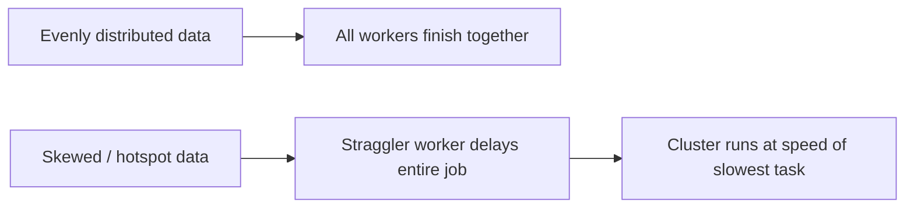

# Advanced Data Partitioning: Optimisation and Skew

## 1. Why Partitioning Optimisation Matters

Distributed systems promise parallelism: add more workers, finish faster. That promise only holds when work is **evenly distributed**. Real-world data is rarely uniform — a few keys dominate volume (e.g., one country code with millions of transactions, others with dozens). When distribution is skewed, one or two workers carry most of the load while the rest sit idle. Jobs that should finish in minutes stretch to hours, and cloud spend buys idle capacity instead of throughput.

This module moves beyond default partitioning settings to address **optimisation** and **skew** — the advanced challenges that separate operators who merely run jobs from engineers who tune production pipelines.

## 2. Five Core Competencies

### 2.1 Identifying Data Skew and Hotspots

Skew is diagnosed like a detective investigates a crime scene — through logs and the Spark UI.

**Telltale signs:**
- Job reaches 99% completion quickly, then stalls on the final task for many minutes
- Uneven CPU/memory across cluster nodes (one node at 100%, others at 5–15%)
- Large gap between **max task time** and **median task time** in stage metrics

### 2.2 Salting (Key Redistribution)

When a single key (e.g., `USA` in a country-code join) concentrates all records in one partition, **salting** appends random suffixes (`USA_1`, `USA_2`, …) to artificially split the key across partitions. The small table must be replicated/exploded to match salted keys so the join still produces correct results.

### 2.3 Broadcast Joins

Standard joins trigger expensive **shuffles** — moving data across the network so matching keys land on the same node. When one table is small enough to fit in executor memory, a **broadcast join** sends a copy of the small table to every worker. The large table stays put; the join runs locally at memory speed.

### 2.4 Data Co-location

Reactive fixes (salting, broadcasting) help after the fact. **Co-location** is proactive: related datasets that are frequently joined are stored with the **same partitioner and partition count** from the start, so matching keys land on the same node without a network shuffle.

### 2.5 Analysing Shuffle Performance

Shuffle is often the slowest phase of a pipeline. Key metrics:
- **Shuffle read/write bytes** — volume of data moved
- **Shuffle read fetch wait time** — time tasks wait for remote data
- **Remote bytes read** — network traffic indicator; should be low when co-location or broadcast strategies work

## 3. Module Roadmap

| Topic | Problem addressed | Strategy |
|-------|-------------------|----------|
| Uniform distribution | Why balance matters | Foundation for all tuning |
| Skew detection | Hotspots, stragglers | Spark UI, cluster monitoring |
| Salting | Heavy keys | Artificial key splitting |
| Broadcast join | Expensive shuffle on asymmetric joins | Replicate small table locally |
| Co-location | Repeated shuffle on related tables | Harmonised partitioners at ingest |
| Shuffle metrics | Partition count tuning | Iterative performance engineering |

## Common Pitfalls / Exam Traps

- **Assuming more workers always means faster jobs** — skew means the cluster runs at the speed of the slowest partition, not the average.
- **Confusing salting with random partitioning** — salting is targeted at known heavy keys and requires join logic on both sides; it is not a blanket random shuffle.
- **Broadcasting large tables** — exceeding executor memory causes OOM; broadcast is for genuinely small lookup/reference tables.
- **Treating co-location as automatic** — it requires upfront ETL design with matching partitioners; you cannot co-locate after the fact without reshuffling.
- **Ignoring the 99%-stuck symptom** — this is almost always skew or a straggler, not a "normal" long tail.

## Quick Revision Summary

- Real data is skewed; default hash partitioning creates hotspots on dominant keys.
- Five competencies: detect skew, salt heavy keys, broadcast small tables, co-locate related data, analyse shuffle metrics.
- Hotspots = one worker overloaded; stragglers delay the entire stage.
- Salting breaks up heavy keys; broadcast eliminates shuffle for small-table joins.
- Co-location replaces shuffle joins with local joins when partitioners match.
- Shuffle metrics (bytes, fetch wait, remote reads) guide partition-count tuning.
- Performance tuning is iterative — adjust, measure, refine.
