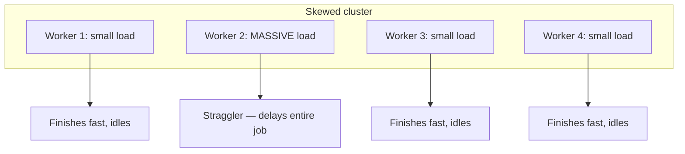
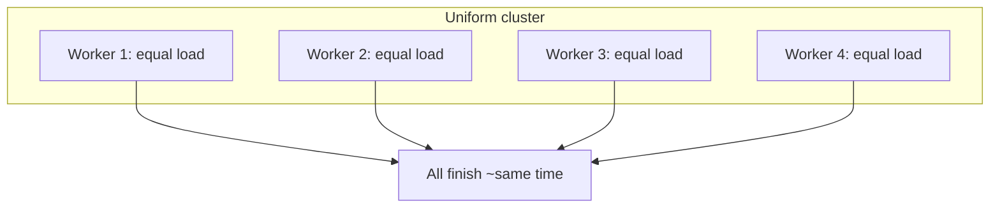

# Uniform Distribution versus Data Skew in Distributed Clusters

## 1. The Promise and the Reality of Parallelism

The core value proposition of distributed computing is **parallelism**: divide work across $N$ workers and finish in roughly $1/N$ the time. With 10 workers and a 10-minute sequential task, a perfectly balanced job finishes in about 1 minute.

That ideal requires **uniform distribution** — each worker receives roughly the same number of rows or the same computational load. When distribution is skewed, parallelism collapses.

## 2. Skewed Distribution: The Hotspot Problem

In a skewed scenario, one partition holds vastly more data than the others.

**Critical principle:** The speed of the entire job is limited by the **slowest task** (Amdahl's law applied to data partitions). Workers 1, 3, and 4 finish quickly and sit idle while Worker 2 processes a mountain of data. You pay for a large cluster but get the throughput of a single machine.

**Consequences:**
- Jobs delayed from minutes to hours
- Expensive cloud resources wasted on idle CPU cycles
- Pipeline hits a performance wall instead of scaling linearly with added nodes

## 3. Uniform Distribution: The Target State

In a balanced cluster, work is sliced evenly. Every worker processes a comparable volume.

**Benefits:**
- Hardware utilisation approaches 100%
- No idle CPU cycles between fast and slow workers
- Job finishes as fast as physically possible for the given data volume
- Pipeline scales linearly as nodes are added

## 4. Comparison: Skewed vs Uniform

| Aspect | Skewed distribution | Uniform distribution |
|--------|---------------------|----------------------|
| Partition sizes | Few partitions much larger than rest | All partitions roughly equal |
| Worker utilisation | One hotspot; others idle | All workers active until completion |
| Job completion time | Bounded by slowest partition | Bounded by average partition time |
| Cluster scaling | Adding nodes may not help | Linear speedup with more nodes |
| Cost efficiency | Pay for idle capacity | Pay for productive compute |
| Visual signature | One tall bar in task histogram | Balanced bar chart |

## 5. Why This Matters for Big Data Engineering

Partitioning decisions made at ingest or transformation time propagate through every downstream join, aggregation, and shuffle. A single dominant key — a popular user ID, a default null value, a large-market country code — can negate the power of a thousand-node cluster.

The objective throughout advanced partitioning work is to **move data from the skewed hotspot state to the uniform balanced state**, using detection, mitigation (salting, broadcast), and proactive design (co-location).

## Common Pitfalls / Exam Traps

- **Believing "I have 100 executors so I'm 100× faster"** — with skew, effective parallelism may be 1.
- **Optimising average task time instead of max task time** — the max (straggler) determines stage completion.
- **Assuming re-partitioning always fixes skew** — if the skew is in the key itself, default hash partitioning reproduces the hotspot.
- **Ignoring null or default keys** — `NULL` or `unknown` often concentrate in one partition and are a common hidden source of skew.

## Quick Revision Summary

- Parallelism only works when work is evenly distributed across partitions.
- Skew = a few partitions much larger than others; creates hotspots and stragglers.
- Entire job speed = speed of slowest task, not fastest or average.
- Uniform distribution = all workers finish together; maximum cluster utilisation.
- Skewed clusters waste money — idle workers while one node struggles.
- Goal: move from skewed hotspot state to balanced uniform state.
- This principle underpins all subsequent skew mitigation techniques.
