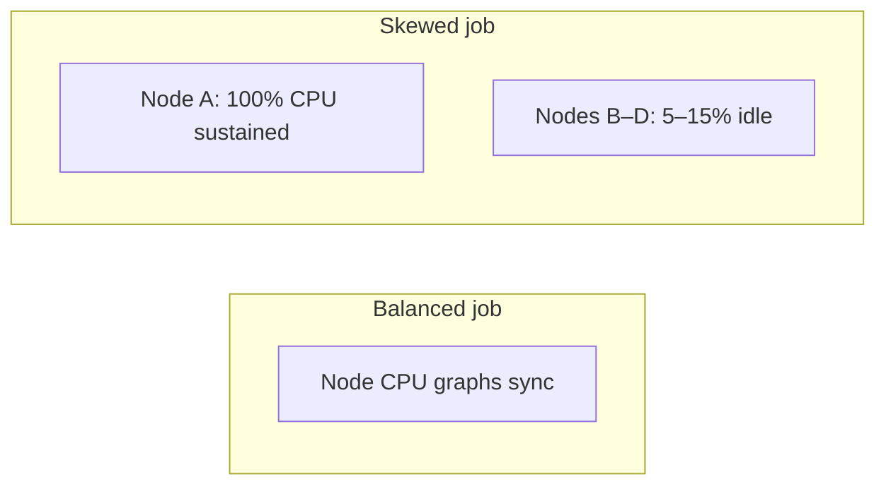
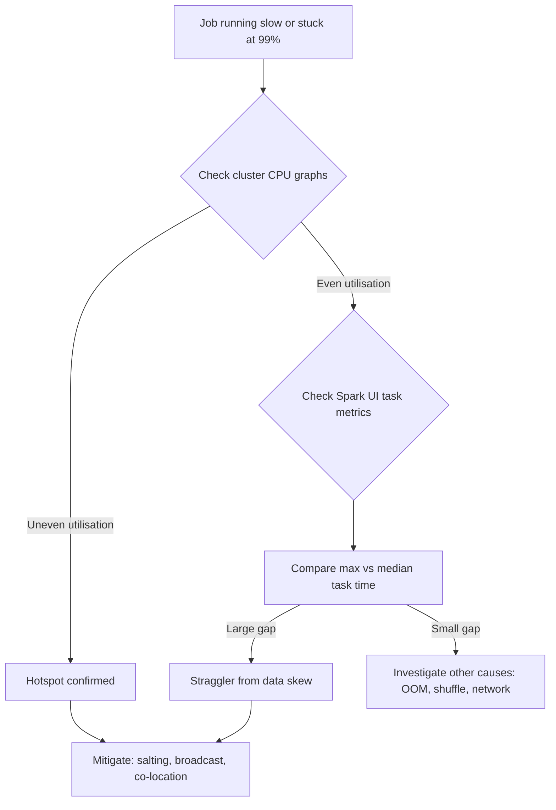

# Identifying Data Skew and Hotspots in Production Pipelines

## 1. What Is Data Skew?

**Data skew** is a condition where a small number of data partitions are significantly larger than the rest. Distributed engines like Spark process one partition per core at a time; an oversized partition leaves one worker processing a mountain of data while others finish small hills and go idle.

Skew is a **silent killer** of big data performance — jobs appear healthy until the final straggler task reveals the imbalance.

## 2. Symptom 1: Hotspots in Cluster Monitoring

Monitor resource usage through tools like Ganglia, CloudWatch, or the Spark UI executors tab.

**Healthy job:** CPU and memory graphs across nodes move together like a synchronised heartbeat — all rise and fall in unison.

**Hotspot signature:**
- Specific nodes at 100% CPU or maxed memory
- Other nodes in the same cluster at 5–15% utilisation
- One spike stays high while others drop off

## 3. Symptom 2: Tail Latency (The 99% Problem)

A classic user-facing symptom: the Spark progress bar shoots to 99% in 2 minutes, then stays on the last 1% for another 10+ minutes.

This is **tail latency** — the final straggler task holding up the entire stage.

### Diagnosis in the Spark UI

Navigate to the stage's **Summary Metrics** for tasks:

| Metric | Balanced job | Skewed job |
|--------|--------------|------------|
| Median task duration | ~2 seconds | ~2 seconds |
| Max task duration | ~3 seconds | ~5 minutes |
| Max vs median ratio | Close (e.g., 1.5×) | Very large (e.g., 150×) |

A large gap between **max** and **median** task time identifies the straggler. This single slow task almost always traces back to a skewed partition containing a disproportionate share of data for one key.

## 4. Diagnostic Workflow

## 5. Formal Definition and Root Cause

Because Spark assigns all records with the same hash-partition key to the same partition, a **heavy key** — one value appearing millions of times — creates a single massive partition. Common sources:

- Geographic concentration (e.g., `country = USA`)
- Popular entities (celebrity user IDs, bestselling product SKUs)
- Default/null values (`unknown`, `NULL`, `0`)
- Log data dominated by one service or endpoint

## 6. What to Do After Detection

Identification is step one. Mitigation strategies include:

1. **Salting** — split heavy keys with random suffixes
2. **Broadcast join** — when one join table is small
3. **Custom partitioning** — explicit partition assignment for known skew
4. **Co-location** — proactive design for frequently joined tables

## Common Pitfalls / Exam Traps

- **Blaming network or disk when max/median gap is huge** — skew is the most common cause of the 99%-stuck pattern.
- **Looking only at stage duration, not per-task distribution** — stage averages hide a single outlier task.
- **Assuming even partition count means even data distribution** — 200 partitions with one holding 90% of rows is still severe skew.
- **Restarting the job without investigating** — skew is deterministic; rerunning reproduces the same straggler.
- **Monitoring only driver logs** — skew manifests on executors; driver progress bar alone is insufficient.

## Quick Revision Summary

- Data skew = few partitions much larger than others; silent performance killer.
- Hotspot = uneven CPU/memory across nodes; one node overloaded, others idle.
- Tail latency = job stuck at 99%; caused by a straggler task on a skewed partition.
- Spark UI: compare max vs median task time — large gap confirms skew.
- Healthy jobs show synchronised resource graphs across all nodes.
- Heavy keys (popular values, nulls, defaults) are the usual root cause.
- Detection precedes mitigation: salting, broadcast, custom partitioning, co-location.
