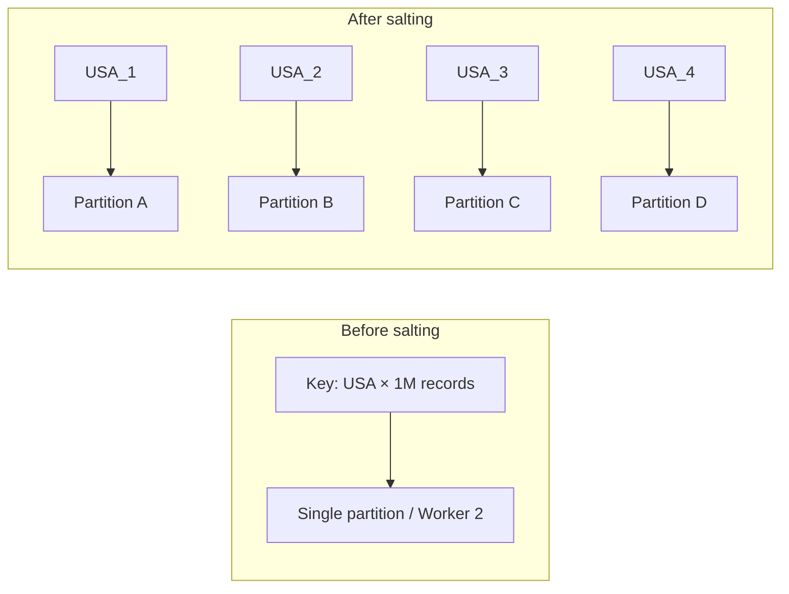
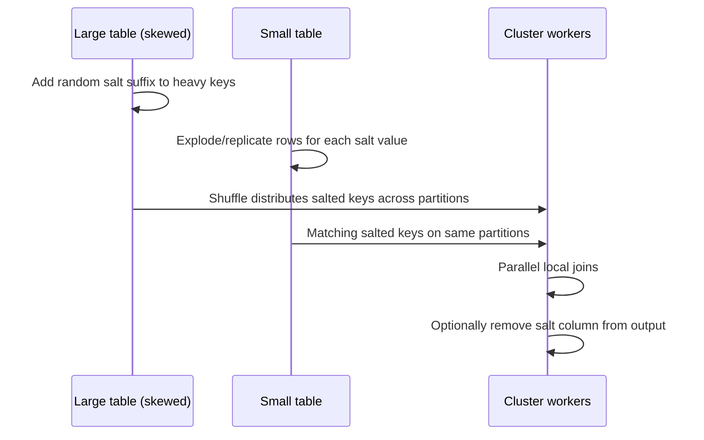

# Salting: Breaking Up Skewed Partitions for Balanced Execution

## 1. Why Salting Exists

Real-world data is naturally imbalanced. One city may have millions of users while others have hundreds; one country code may dominate transaction logs. You cannot change the data — but you can change how the processing engine **sees** the keys.

**Salting** is an engineering technique that artificially breaks up large skewed partitions by appending a random element to the key, forcing redistribution across more workers.

## 2. The Problem Salting Solves

Consider a join on `country_code`. If key `USA` appears in millions of records, Spark's default hash partitioner sends every `USA` record to the **same partition**. One worker processes all USA data; others finish quickly and wait.



## 3. Three-Step Salting Process

### Step 1: Identify the Skewed Key

Recognise the heavy key causing the hotspot (e.g., `USA` in a country-code join).

### Step 2: Add Salt

During processing, append a random suffix to the key on the **large (skewed) table**:

```
USA  →  USA_1, USA_2, USA_3, USA_4  (random suffix in range [0, N-1])
```

Choose salt range $N$ based on how many workers/partitions you want to spread across. One key becomes $N$ distinct keys, tricking the partitioner into treating them as separate entities.

### Step 3: Redistribute and Re-join

After salting, the shuffle sends `USA_1`, `USA_2`, etc. to different partitions. Work that crushed one node is now distributed across $N$ nodes processing in parallel.

**Critical join requirement:** The **small table** must be **exploded/replicated** to match every salt value:

| Original small table | Exploded small table |
|---------------------|----------------------|
| `USA, metadata` | `USA_1, metadata` |
| | `USA_2, metadata` |
| | `USA_3, metadata` |
| | `USA_4, metadata` |

Without this, salted keys on the large table will not find matches on the small table.

## 4. Salting Workflow



## 5. Trade-offs

| Advantage | Disadvantage |
|-----------|--------------|
| Balanced execution across workers | Increased code complexity |
| Faster completion on skewed keys | Must salt large table AND explode small table |
| Stable pipeline vs crash/OOM | More rows in small table after explosion |
| Primary manual tool for hotspots | Wrong salt range → still partial skew |

**Salt range selection:** Too few salts → residual skew. Too many → overhead from explosion and many small partitions. A practical starting point: match salt count to the number of cores or partitions you want to utilise for the heavy key.

## 6. When to Use Salting vs Alternatives

| Scenario | Best strategy |
|----------|---------------|
| Heavy key on large table, both tables large | Salting |
| One table small enough for memory | Broadcast join (simpler) |
| Tables frequently joined, known upfront | Co-location (proactive) |
| Skew only in aggregation, not join | Two-phase aggregation with random prefix |

## Common Pitfalls / Exam Traps

- **Salting only the large table** — the join fails or returns incomplete results without exploding the small table.
- **Using the same salt value for all rows** — salt must be random per row (or per group) to achieve distribution.
- **Forgetting to remove or handle salt in downstream logic** — duplicate semantics if not deduplicated where needed.
- **Choosing salting when broadcast would suffice** — unnecessary complexity if the small table fits in memory.
- **Assuming salting reduces total data volume** — it increases logical key cardinality; it redistributes work, not data.

## Quick Revision Summary

- Salting appends random suffixes to skewed keys to force redistribution across partitions.
- Three steps: identify heavy key → add salt on large table → explode small table to match.
- One heavy key becomes N distinct keys; shuffle spreads work across N workers.
- Trade-off: more code complexity for balanced execution and pipeline stability.
- Salt range should align with desired parallelism for the heavy key.
- Always replicate/explode the small table — salting is a two-sided join fix.
- Prefer broadcast join when one table is genuinely small.
