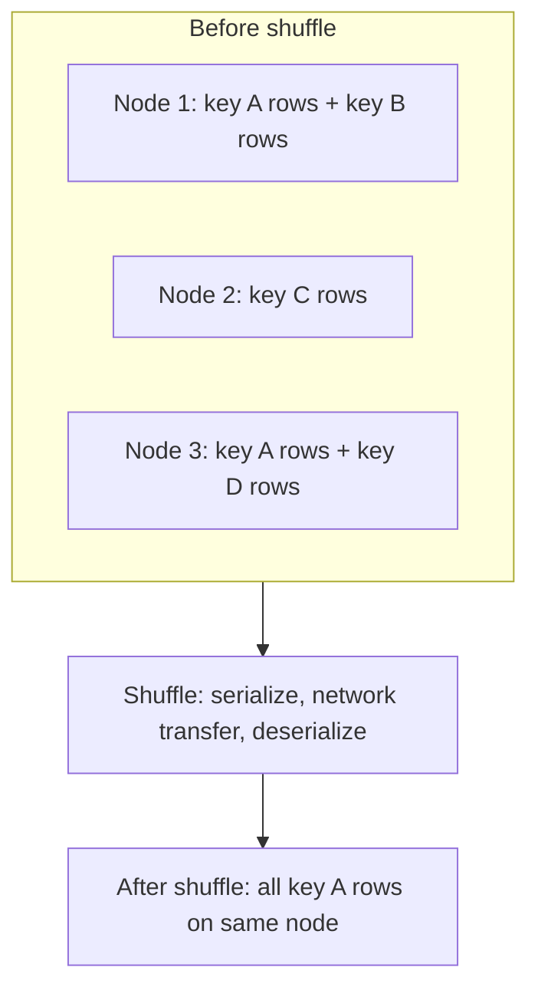
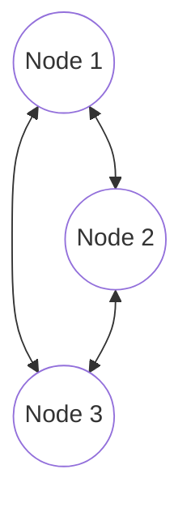

# The Shuffle Problem in Large-Scale Joins

## 1. Shuffle: The Performance Killer Beyond Skew

Even with perfectly balanced data, **shuffle** remains a major bottleneck. In distributed systems like Spark, joining two large datasets almost always triggers a **shuffle join** — a wide dependency that reorganises data across the cluster.

Skew makes shuffles worse; but shuffles are expensive even when data is uniform.

## 2. Why Joins Require Data Movement

A join requires all rows with matching keys to reside on the **same physical node**. Data is initially partitioned independently across nodes. Node 1 may hold some rows with key `A`; Node 3 holds the rest.

During the shuffle phase, Spark must:
1. **Serialise** partition data
2. **Send** it over the network (all-to-all communication)
3. **Deserialise** on target nodes
4. Optionally **spill to disk** if data exceeds RAM

Every network arrow represents latency, serialisation overhead, and potential disk I/O.

## 3. Why Network I/O Dominates

| Component | Relative speed |
|-----------|----------------|
| CPU | Millions of instructions per second |
| RAM / local memory | Very fast |
| Network (inter-node) | **Slowest bottleneck** |
| Disk (spill) | Slower than RAM, often involved in large shuffles |

Modern hardware can compute far faster than the network can move data. A job may spend **80% of its time shuffling** — waiting for data to travel across the data centre rather than processing locally.

**Physical reality:** The cable connecting Node A to Node B is the constraint. Shuffle joins are necessary for large-scale joins but rely on the slowest cluster component.

## 4. The All-to-All Communication Pattern

Shuffle creates an **all-to-all** pattern: every node sends data to every other node. As data volume grows:

- Network bandwidth saturates
- Serialisation/deserialisation CPU overhead increases
- Memory pressure causes disk spills
- Fetch wait times rise (workers idle waiting for remote data)

## 5. When Shuffle Is Unavoidable vs Avoidable

| Situation | Shuffle required? |
|-----------|-------------------|
| Two large tables, no co-location | Yes — shuffle join |
| One table small, fits in memory | No — broadcast join |
| Tables co-located with same partitioner | No — local join |
| Aggregation with wide dependency (`groupBy`, `reduceByKey`) | Yes — shuffle |

## 6. The Key Insight: Move Less Data

The optimisation hierarchy for joins:

1. **Avoid the shuffle entirely** — broadcast (small table) or co-location (proactive design)
2. **Reduce shuffle volume** — filter before join, select only needed columns, partition pruning
3. **Make shuffle cheaper** — right partition count, salting for skew, fast network (NVLink, InfiniBand)

> What if we didn't have to move both tables? What if one table was small enough to give a copy to everyone?

That question leads to **broadcast joins** — the most effective quick win for asymmetric joins.

## Common Pitfalls / Exam Traps

- **Assuming a join on indexed data avoids shuffle in Spark** — Spark's default join strategy still shuffles unless broadcast or co-location applies.
- **Ignoring shuffle when data looks balanced** — uniformity fixes skew but not the fundamental cost of moving terabytes across the network.
- **Joining before filtering** — shuffling unnecessary columns and rows multiplies network cost.
- **Confusing map-side join with broadcast join** — both avoid full shuffle, but broadcast is Spark's explicit mechanism for replicating a small table.
- **Underestimating disk spill during shuffle** — large shuffles with insufficient memory turn a network problem into a network + disk problem.

## Quick Revision Summary

- Shuffle join reorganises data so matching keys land on the same node.
- Network I/O is typically the slowest part of a big data pipeline — often 80% of job time.
- Shuffle involves serialise → network transfer → deserialise; may spill to disk.
- All-to-all communication pattern saturates bandwidth on large joins.
- Shuffle is necessary for two large unco-located tables but should be avoided when possible.
- Optimisation priority: avoid shuffle (broadcast/co-location) → reduce volume → tune shuffle.
- Broadcast join is the shortcut when one table is small enough to replicate.
