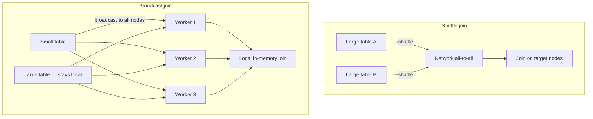

# Broadcast Joins: Eliminating Network Shuffle for Asymmetric Joins

## 1. The Opportunity in Asymmetric Joins

An **asymmetric join** pairs one very large table with one relatively small table — a pattern ubiquitous in analytics:

- Billions of transactions joined to a product lookup table
- User event logs joined to a metadata dimension table
- Clickstream data joined to category codes

Instead of moving **both** datasets across the network (shuffle join), a **broadcast join** sends a complete copy of the small table to every node. The large table never moves.

## 2. Shuffle Join vs Broadcast Join



| Aspect | Shuffle join | Broadcast join |
|--------|--------------|----------------|
| Data movement | Both tables shuffled | Only small table broadcast |
| Network pattern | All-to-all | One-to-all (small table) |
| Large table | Moves across network | Stays on original partitions |
| Join location | After shuffle on target nodes | Locally on each worker |
| Speed | Network-bound | Memory-bound |
| Best for | Two large tables | One small + one large table |

## 3. How Broadcast Join Works

1. Spark identifies the smaller table (or the table is explicitly hinted with `broadcast()`)
2. The small table is collected and **broadcast** to every executor's local memory
3. Each executor joins its local partition of the large table with the in-memory copy of the small table
4. No shuffle of the large table occurs

The join runs at **memory speed** rather than network speed — often turning minutes into seconds.

## 4. Conditions and Constraints

**When to use:**
- One table is small enough to fit entirely in executor RAM
- Typical default threshold in Spark: ~10 MB (`spark.sql.autoBroadcastJoinThreshold`), tunable upward
- Ideal for lookup tables: product names, category codes, user metadata, country mappings

**When NOT to use:**
- Small table exceeds executor memory → **OutOfMemoryError**
- Both tables are large → use shuffle join, salting, or co-location instead

**Trade-off:** A small amount of memory replicated on every node buys a massive reduction in network traffic and execution time. With 100 executors, a 10 MB table uses ~1 GB total cluster memory — usually a excellent trade.

## 5. Real-World Examples

| Large table | Small table (broadcast) | Use case |
|-------------|------------------------|----------|
| Transaction fact table (TB) | Product dimension (KB) | Enrich transactions with product names |
| Web click logs (GB) | Country code lookup (bytes) | Geo enrichment |
| Sensor readings (GB) | Device metadata (MB) | Attach device configuration |

## 6. Implementation Notes (Spark)

```python
from pyspark.sql.functions import broadcast

# Explicit broadcast hint
result = large_df.join(broadcast(small_df), on="product_id")
```

Spark SQL may auto-detect small tables below the broadcast threshold. Explicit hints are recommended when auto-detection fails due to statistics or threshold settings.

## Common Pitfalls / Exam Traps

- **Broadcasting a table that only looks small** — compressed on disk but expands in memory; always consider deserialized size.
- **Setting threshold too high** — broadcasting a 500 MB table to 200 executors causes OOM across the cluster.
- **Using broadcast when both tables are large** — no shortcut; need salting, co-location, or bucketed joins.
- **Assuming broadcast works across different join keys with skew** — broadcast eliminates shuffle but large-table skew in downstream aggregation still matters.
- **Forgetting broadcast is per-executor memory** — each executor holds a full copy; total memory = table size × number of executors.

## Quick Revision Summary

- Broadcast join replicates the small table to every node; large table stays local.
- Eliminates all-to-all shuffle; join runs at memory speed.
- Best for asymmetric joins: large fact + small dimension/lookup table.
- Small table must fit in executor RAM; default threshold ~10 MB (tunable).
- Trade memory on each node for massive network and time savings.
- Can achieve 10×+ speedup vs shuffle join for suitable workloads.
- Use `broadcast()` hint when auto-detection does not trigger.
