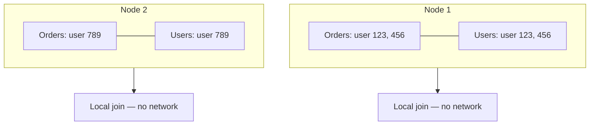

# Data Co-location: Proactive Shuffle-Free Join Architecture

## 1. From Reactive to Proactive Optimisation

Salting and broadcast joins fix problems after data has landed in suboptimal locations. **Data co-location** is a proactive architectural strategy: design the system so that datasets frequently joined together are **physically stored or partitioned on the same nodes from the start**.

If related data is already in the same place, no shuffle is needed.

## 2. The Core Idea

Two massive datasets — e.g., `orders` and `users` — are normally partitioned independently. Their partition files may differ in count and hash distribution. A join forces a shuffle to co-locate matching keys.

Co-location ensures both datasets use:
- The **exact same partitioner** (e.g., hash on `user_id`)
- The **exact same number of partitions**

When both conditions hold, Spark's hash logic becomes **predictable**: `user_id = 123` in the orders table and `user_id = 123` in the users table always land in **partition X on the same machine**.



## 3. How Co-location Works at Join Time

When `orders.join(users, on="user_id")` is called:

1. Spark examines the execution plan
2. Detects both datasets share partitioning on `user_id` with equal partition count
3. Recognises matching keys are already co-located on the same nodes
4. Executes a **shuffle-free (or local-only) join** — no network transfer required

This is the **holy grail** of join optimisation: a shuffle join replaced by a shuffle-less join.

## 4. Implementation Strategy: Harmonising Partitioners

| Step | Action |
|------|--------|
| 1 | Identify tables frequently joined together |
| 2 | Choose a common partition key (the join key) |
| 3 | Write both datasets with `partitionBy(join_key)` and identical partition count |
| 4 | Use the same hash partitioner (Spark default `HashPartitioner`) |
| 5 | Maintain partition count consistency in downstream ETL |

**During ETL/ingest:**
```python
# Both written with same partitions and partition key
orders_df.write.partitionBy("user_id").parquet("orders/")
users_df.repartition(200, "user_id").write.parquet("users/")
```

Both must use the same partition count (e.g., 200) and partition on the same key.

## 5. Benefits

- **Drastically reduced network traffic** — no cross-node data movement for joins
- **No serialisation/deserialisation overhead** from shuffle
- **Lower risk of the 99%-stuck problem** — no shuffle stragglers from join
- **Predictable performance** for recurring join patterns in analytics pipelines

## 6. Trade-offs and Requirements

| Advantage | Requirement / cost |
|-----------|-------------------|
| Shuffle-free joins | Must know join patterns **ahead of time** |
| Best downstream analytics performance | Planning during ETL/ingest phase |
| Reduced network and I/O | Less flexible if join keys change later |
| Stable production pipelines | Both tables must maintain compatible partitioning over time |

Co-location is an **advanced technique** — it demands upfront knowledge of data access patterns and disciplined ETL design.

## 7. Co-location vs Other Strategies

| Strategy | Timing | Shuffle avoided? | Flexibility |
|----------|--------|------------------|-------------|
| Co-location | Proactive (at ingest) | Yes, for designed joins | Low — fixed join key |
| Broadcast join | Reactive (at query time) | Yes, for small table | Medium — any small table |
| Salting | Reactive (at query time) | No — still shuffles, but balanced | High — handles skew |
| Default shuffle join | None | No | High — works for any join |

## Common Pitfalls / Exam Traps

- **Different partition counts** — even with the same key, mismatched counts break co-location guarantees.
- **Repartitioning one table differently downstream** — destroys co-location; maintain consistent partitioning through the pipeline.
- **Assuming co-location works for any join key** — only works for the key used during initial partitioning.
- **Choosing co-location for rarely joined tables** — upfront cost not justified; reserve for high-frequency join pairs.
- **Confusing HDFS block locality with Spark partition co-location** — HDFS block placement and Spark partition hashing are related but distinct concepts.

## Quick Revision Summary

- Co-location = related datasets stored on same nodes via matching partitioner and partition count.
- Proactive strategy: design at ETL time, not fix at query time.
- Same join key + same partition count → predictable hash placement.
- Spark detects co-location and executes shuffle-free local joins.
- Eliminates network traffic, serialisation overhead, and shuffle stragglers for designed joins.
- Requires knowing data access patterns upfront; less flexible if join keys change.
- Holy grail of join optimisation: shuffle join → shuffle-less join.
