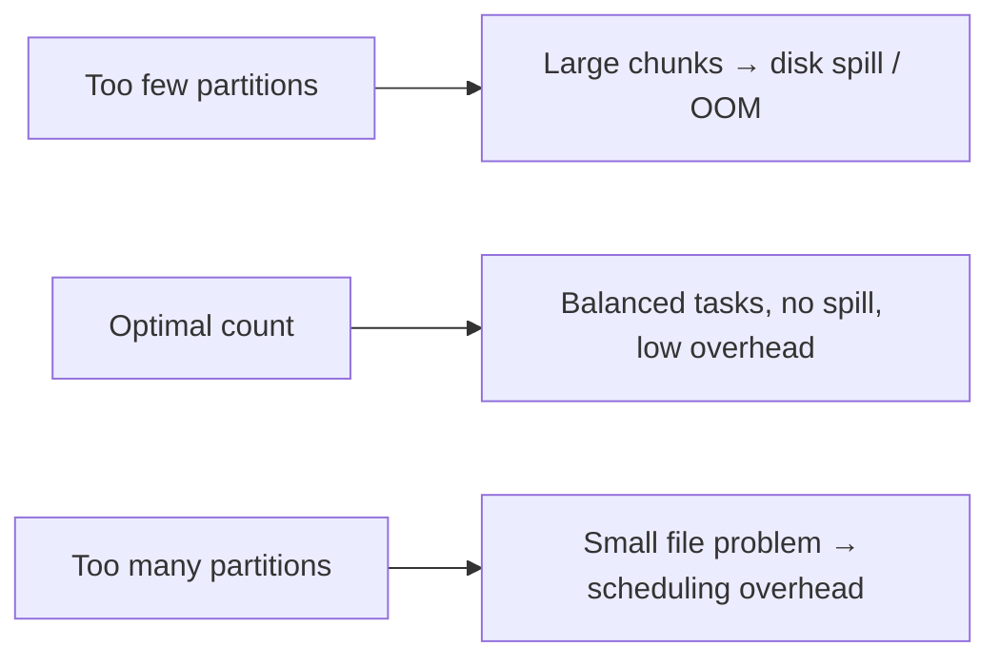
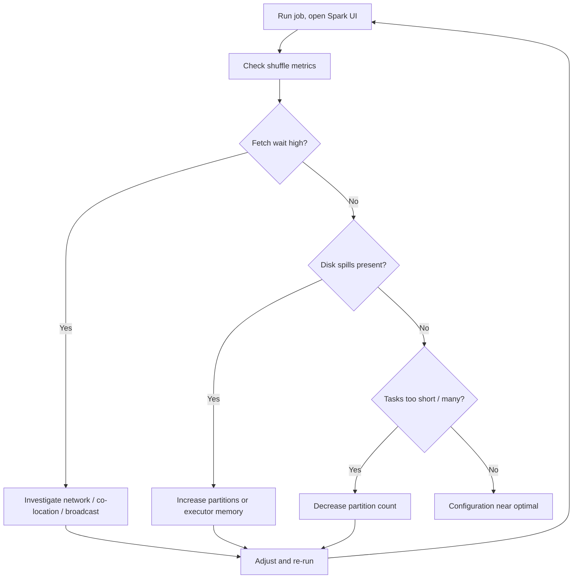

# Analysing Shuffle Performance and the Partition Count Dilemma

## 1. The Partition Count Dilemma

"How many partitions should I have?" has no universal answer. Partition count is a **key tuning parameter** that depends on data volume, cluster size, and workload type. Getting it wrong in either direction degrades performance.

## 2. Too Few Partitions

When partition count is too low, each partition holds a large data chunk.

**Problems:**
- **Disk spill** — if a single partition exceeds available executor RAM, Spark writes temporary data to disk; disk I/O is orders of magnitude slower than memory
- **Out-of-memory errors** — partitions too massive for the worker to handle even with spill
- **Underutilised cluster** — fewer tasks than available cores; workers sit idle
- **Residual skew amplified** — fewer partitions means heavier keys concentrate even more

**Rule of thumb:** Target partition sizes of roughly 128 MB–200 MB for HDFS-aligned workloads, adjusted for memory constraints.

## 3. Too Many Partitions

Counterintuitively, thousands of tiny partitions also hurt performance.

**Problems:**
- **Small file problem** — each partition is a file; thousands of tiny files burden metadata management (NameNode in HDFS, catalog in cloud storage)
- **Task scheduling overhead** — if tasks run for milliseconds but take seconds to schedule, most cluster time is administrative overhead, not computation
- **Shuffle overhead** — more partitions = more shuffle files and network connections

**Symptom:** High task count, low task duration, poor overall throughput.

## 4. Three Key Shuffle Metrics in the Spark UI

### 4.1 Shuffle Read / Write Bytes

Measures the **sheer volume** of data moved during shuffle operations.

- Compare against input data size
- If shuffle bytes are massive relative to input, investigate:
  - Unnecessary shuffles (missing broadcast opportunity)
  - Inefficient joins (large-large shuffle when co-location possible)
  - Wide transformations on unfiltered data

### 4.2 Shuffle Read Fetch Wait Time

Measures how long tasks sit **idle waiting for remote shuffle data** to arrive over the network.

- **High fetch wait** = network bottleneck
- Workers are ready to compute but the "highway is congested"
- Indicates: saturated network, poor co-location, or oversized shuffle

### 4.3 Remote Bytes Read

Direct measure of **network traffic** for data reads. Compare against local bytes read.

- In a perfectly co-located join: remote bytes should be **very low**
- In a broadcast join: remote bytes for the large table should be minimal
- High remote bytes confirm data is travelling across the network unnecessarily

| Metric | What it reveals | Red flag |
|--------|-----------------|----------|
| Shuffle read/write bytes | Volume of data moved | Massive vs input size |
| Fetch wait time | Network congestion | High wait, low compute |
| Remote bytes read | Cross-node traffic | High when co-location expected |

## 5. Iterative Tuning Workflow

Performance tuning is **iterative**: adjust partition count → check metrics → refine until fetch wait is low and disk spills disappear.

## 6. Practical Partition Count Guidelines

| Factor | Guidance |
|--------|----------|
| Cluster cores | Start with 2–4× total cores across executors |
| Data volume | Aim for ~128–200 MB per partition |
| Shuffle-heavy jobs | Enough partitions to parallelise shuffle, not so many that overhead dominates |
| Skew present | Salting/custom partitioning matters more than raw count |
| Growing data | Re-tune as volume and cluster change — no permanent "magic number" |

## Common Pitfalls / Exam Traps

- **Setting partition count once and never revisiting** — optimal count changes with data growth and cluster resizing.
- **Using default 200 partitions for all workloads** — may be too few for TB-scale or too many for MB-scale.
- **Ignoring fetch wait while optimising compute** — a fast CPU waiting on network is still a slow job.
- **Increasing partitions to fix skew without salting** — more partitions do not help if one key still hashes to one partition.
- **Confusing shuffle read bytes with input size** — shuffle bytes can be much larger than input due to duplication during join/aggregation.

## Quick Revision Summary

- Partition count is a tuning parameter — no one-size-fits-all answer.
- Too few partitions → disk spill, OOM, underutilised cluster.
- Too many partitions → small file problem, scheduling overhead.
- Three key metrics: shuffle read/write bytes, fetch wait time, remote bytes read.
- High fetch wait = network bottleneck; high remote bytes = unnecessary cross-node traffic.
- Co-located/broadcast joins should show very low remote bytes.
- Tuning is iterative: adjust partitions, measure metrics, refine.
- Re-tune as data volume and cluster configuration evolve.
