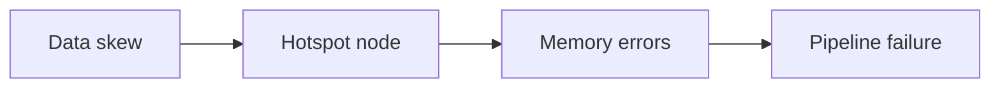

# Data Partitioning Optimisation: Module Synthesis

## 1. Four Commandments of Data Partitioning

This module progressed from identifying distribution problems to mastering production-grade optimisation. Four principles govern effective partitioning strategy.

## 2. Commandment 1: Data Skew Is a Silent Killer

A single straggler task can negate the power of a thousand-node cluster. Skew leads to hotspots, hotspots lead to memory errors, and memory errors lead to downtime.

**Detection is non-negotiable:**
- Spark UI: gap between median and max task time
- Cluster monitoring: uneven CPU/memory (synchronised heartbeat vs isolated spike)
- Symptom: job stuck at 99% completion

## 3. Commandment 2: Salting Is the Primary Manual Intervention

Real-world data is skewed by nature. When heavy keys cause hotspots, **salting** artificially forces redistribution by appending random suffixes to keys.

- Add salt to the large (skewed) table
- Explode/replicate the small table to match
- Trade code complexity for balanced execution and on-time job completion

## 4. Commandment 3: Broadcast Joins Eliminate Expensive Shuffles

Network I/O is the slowest cluster component. For asymmetric joins where one table fits in memory: **do not shuffle — broadcast**.

- Send small table to every executor
- Large table stays local
- Achieve 10×+ speedups for lookup/dimension joins
- Most effective shortcut in the Spark developer's toolkit

## 5. Commandment 4: Performance Tuning Is Iterative

There is no permanent magic number for partitions. As data grows and clusters change, partitioning strategy must evolve.

**Guide decisions with metrics, not guesses:**

| Metric | What it tells you |
|--------|-------------------|
| Shuffle read/write bytes | Volume of data movement |
| Fetch wait time | Network congestion |
| Remote bytes read | Whether co-location/broadcast is working |

## 6. Strategy Selection Matrix

| Problem | Symptom | Solution |
|---------|---------|----------|
| Heavy key concentration | Hotspot, straggler | Salting |
| Large + small table join | Expensive shuffle | Broadcast join |
| Recurring joins on same key | Repeated shuffle cost | Co-location at ETL |
| Wrong partition count | Disk spill or scheduling overhead | Tune partition count |
| General shuffle cost | High fetch wait, remote bytes | Co-location, broadcast, or filter early |

## 7. Competency Checklist

By the end of this module, a practitioner should be able to:

1. **Identify** data skew from logs and Spark UI (hotspots, tail latency, max vs median)
2. **Apply** salting with correct salt range and two-sided join logic
3. **Evaluate** broadcast join eligibility based on table size and memory
4. **Implement** co-location via harmonised partitioners at ingest
5. **Analyse** shuffle metrics to tune partition count iteratively

## Common Pitfalls / Exam Traps

- **Treating the four commandments as independent** — they work together: detect skew, choose the right join strategy, then verify with metrics.
- **Skipping detection and jumping to salting** — confirm skew first; shuffle without skew may be the real bottleneck.
- **Broadcasting without checking memory** — the third commandment has a hard memory constraint.
- **Expecting co-location to fix skew** — co-location avoids shuffle but does not split heavy keys within a partition.
- **Static partition count across environments** — dev (small data) and production (TB-scale) need different tuning.

## Quick Revision Summary

- Skew is the silent killer: one straggler negates massive clusters; detect via Spark UI and monitoring.
- Salting = primary manual fix for heavy keys; requires two-sided join logic.
- Broadcast join = most effective shuffle elimination for small-table joins; 10×+ speedups possible.
- Co-location = proactive shuffle-free joins via matching partitioners at ETL time.
- Partition count has no magic number; tune iteratively with shuffle metrics.
- Four commandments: detect skew, salt when needed, broadcast when possible, measure and tune.
- Move from running jobs to engineering optimised production pipelines.
