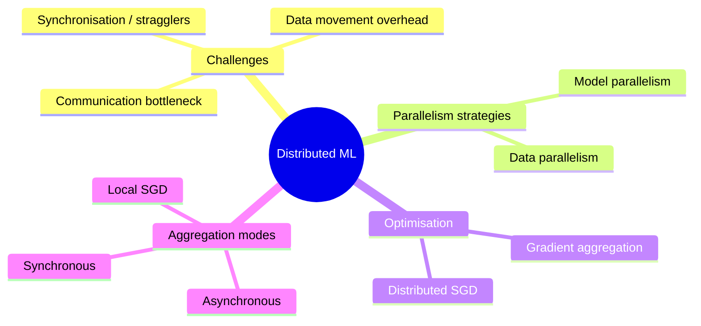
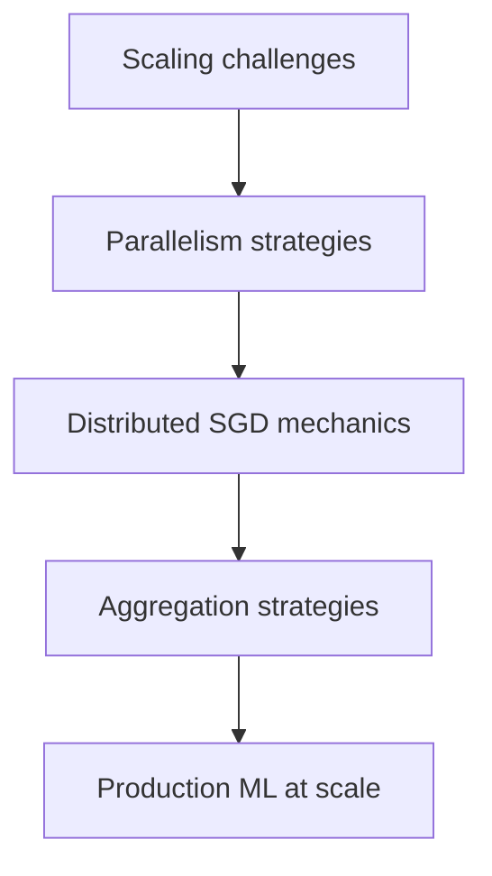

# Distributed Machine Learning: Concepts and Algorithms Overview

## 1. Why Distributed Machine Learning?

Machine learning models — from deep neural networks to advanced classifiers — have been trained largely on single machines. Real-world constraints break that assumption:

- **Datasets** too massive to fit on one disk (petabytes of logs, images, transactions)
- **Models** too complex to fit in even the most powerful GPU memory (LLMs with hundreds of billions of parameters)

**Distributed machine learning** breaks massive tasks into coordinated pieces across multiple machines that work as a single powerful unit.

## 2. The Scaling Challenge

Adding hardware does not automatically halve training time. Distribution introduces overhead in **communication**, **data movement**, and **synchronisation** that can slow training if unmanaged. Up to 70% of training time in large clusters may be spent on communication rather than computation.

## 3. Four Key Learning Areas

### 3.1 Primary Challenges in Scaling ML

Scaling is not just adding computers. It introduces:
- Constant gradient and parameter movement across nodes every training iteration
- Network latency and bandwidth limits
- Coordination timing (stragglers, convergence)

### 3.2 Data Parallelism vs Model Parallelism

Two primary blueprints for distribution:

| Strategy | What is split | When to use |
|----------|---------------|-------------|
| Data parallelism | Dataset (shards) | Model fits in one GPU; data is huge |
| Model parallelism | Model layers/tensors | Model too large for one device |

### 3.3 Distributed Stochastic Gradient Descent (SGD)

SGD is the heartbeat of modern ML training. The mathematics of optimisation changes when gradients are calculated across a cluster of workers rather than on a single machine.

Update rule on one machine:

$\theta_{t+1} = \theta_t - \eta \cdot \nabla L(\theta_t)$

In distributed settings, $\nabla L$ must be aggregated from multiple workers before the global update.

### 3.4 Gradient Aggregation Strategies

Once workers compute local gradients, they must be combined. Strategies differ in timing:

- **Synchronous** — wait for all workers; mathematically pure, straggler-sensitive
- **Asynchronous** — update immediately; fast but stale gradients
- **Local SGD** — many local steps before synchronising; reduces communication

## 4. Module Architecture

## Common Pitfalls / Exam Traps

- **Assuming 2× hardware = 2× speed** — communication overhead often dominates; can even slow training.
- **Confusing data parallelism with model parallelism** — data parallelism duplicates the model; model parallelism splits it.
- **Ignoring network when sizing clusters** — fast GPUs with slow interconnects waste money.
- **Treating aggregation as an implementation detail** — sync vs async fundamentally changes convergence behaviour.
- **Applying single-machine hyperparameters to distributed training** — effective batch size changes with data parallelism.

## Quick Revision Summary

- Distributed ML coordinates multiple machines when data or models exceed single-node capacity.
- Four areas: scaling challenges, parallelism strategies, distributed SGD, aggregation methods.
- Data parallelism splits data; model parallelism splits the model.
- SGD remains the core optimiser; gradients are computed locally and aggregated globally.
- Communication, not computation, often dominates training time (up to 70%).
- Aggregation strategy (sync/async/local) trades speed against convergence stability.
- Foundation for understanding how modern AI is trained at scale.
