# Communication Overhead and Data Movement in Distributed ML

## 1. The Hidden Costs of Distribution

Doubling hardware rarely halves training time. Distributed machine learning introduces three hidden costs that often become the **speed limit** of ML infrastructure:

1. **Communication bottleneck**
2. **Data movement overhead**
3. **Synchronisation delays**

Understanding these costs is prerequisite to designing systems that actually benefit from scale.

## 2. The Communication Bottleneck

On a single node, the GPU/CPU accesses data via high-speed local memory buses (NVLink, PCIe). Once work is distributed, the **network** enters the picture — and the network is orders of magnitude slower than local memory.

```mermaid
gantt
    title Typical distributed training iteration timeline
    dateFormat X
    axisFormat %s

    section GPU
    Forward/backward compute    :a1, 0, 30
    section Network
    Gradient push (notify)      :a2, 30, 50
    Synchronisation wait        :a3, 50, 70
    Weight pull                 :a4, 70, 85
    section GPU
    Next iteration compute      :a5, 85, 115
```

GPU processing may be a small fraction of total iteration time; the rest is consumed by notify and synchronise phases.

## 3. Data Movement Overhead

In distributed ML, data is not moved once — it is **continuously moved** every training iteration:

- Workers push **local gradients** to a central or collective point
- Updated **parameters** are pulled/broadcast back to all workers

This creates persistent overhead driven by three factors:

### 3.1 Network Latency

The delay in sending a message, even for tiny packets. Time to traverse wires and switches adds up across thousands of workers communicating every iteration.

### 3.2 Bandwidth Limits

Network pipes have maximum capacity. Syncing a model with billions of parameters across 100 nodes can **saturate network bandwidth**, causing everything to grind to a halt.

### 3.3 Shuffle Cost

Some algorithms require reorganising data across the cluster (all-to-all communication) so each node gets a representative sample. Shuffle in ML training mirrors the expensive shuffle in Spark — often the slowest pipeline phase.

## 4. The Compute-Communication Crossover

| Condition | Outcome |
|-----------|---------|
| Communication time < compute time | Adding GPUs helps |
| Communication time > compute time | Adding GPUs **does not help** — may slow training |
| Network saturated | All workers wait; GPUs idle |

**Key insight:** If communication takes longer than computation, more GPUs waste money on idle hardware waiting for gradients.

## 5. Comparison: Single-Node vs Distributed

| Aspect | Single node | Distributed cluster |
|--------|-------------|---------------------|
| Data access | Local memory bus (fast) | Network (slow) |
| Gradient sync | Not needed | Every iteration |
| Bandwidth | Internal bus (high) | Shared network (limited) |
| Scaling law | Linear with local GPUs | Sub-linear due to communication |
| Dominant cost | Compute | Often communication |

## 6. Implications for System Design

- **Prioritise fast interconnects** — InfiniBand, NVLink, high-bandwidth Ethernet for multi-node training
- **Reduce communication frequency** — local SGD, gradient compression, larger mini-batches before sync
- **Choose aggregation strategy wisely** — async avoids sync waits but introduces staleness
- **Right-size clusters** — more nodes is not always better; find the point where communication dominates

## Common Pitfalls / Exam Traps

- **Benchmarking only compute FLOPs when selecting hardware** — interconnect speed matters equally.
- **Scaling to 100 nodes without measuring communication ratio** — may get slower than 10 nodes.
- **Ignoring gradient size** — large dense models generate large gradient payloads every step.
- **Assuming cloud network is uniform** — cross-AZ traffic is slower and costlier than within-AZ.
- **Treating shuffle as a one-time ETL cost in training** — some distributed algorithms shuffle every epoch.

## Quick Revision Summary

- Distribution introduces communication, data movement, and synchronisation overhead.
- Network is much slower than local memory — the primary bottleneck in multi-node training.
- Gradients and parameters move every iteration, not just once.
- Three drivers: latency (per-message delay), bandwidth (pipe capacity), shuffle (all-to-all cost).
- If communication > compute, adding GPUs does not speed up training.
- GPU time may be minority of iteration; notify/sync phases dominate.
- Design for interconnect speed and minimise communication frequency.
