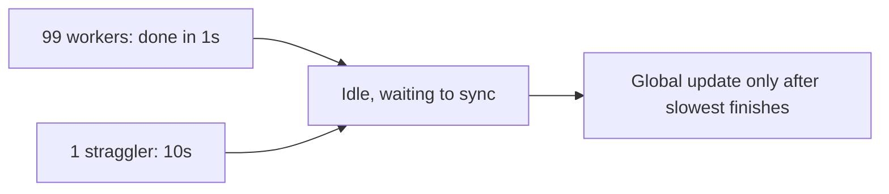
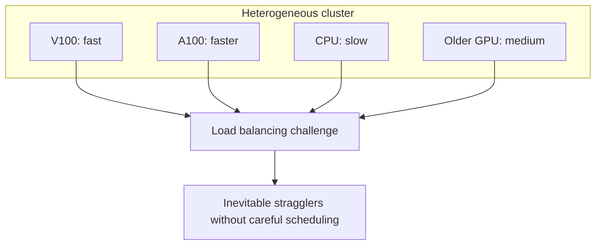
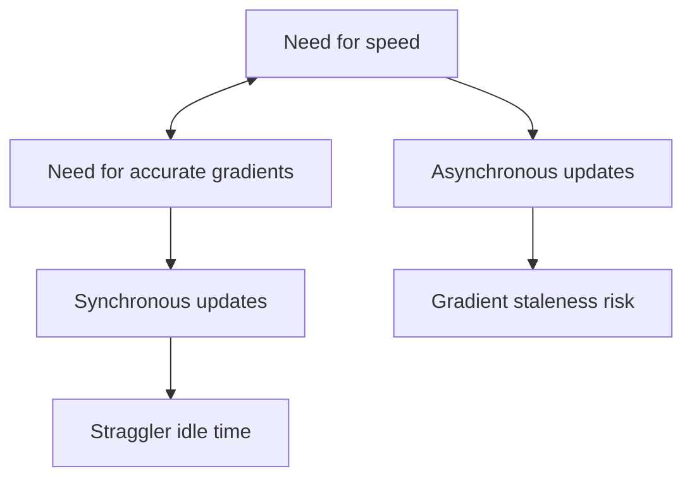

# Synchronisation, Stragglers, and Convergence in Distributed Training

## 1. Coordination: The Logical Challenge

Even with infinite network bandwidth, distributed training faces a **logical** challenge: coordinating workers that finish at different times. Scaling is not just a networking problem — it is a **timing and mathematical** problem.

## 2. The Straggler Problem

The speed of the entire cluster is dictated by its **slowest member**.

**Scenario:** 100 GPUs work in parallel. 99 finish in 1 second; one takes 10 seconds due to a network glitch, background OS process, or hardware variance.

In synchronous training, the 99 fast GPUs sit **idle** — paying for power and hardware that performs no useful work. This is massive compute resource waste.

**Connection to data skew:** The straggler problem in ML training mirrors the straggler task in Spark — the slowest unit determines overall completion time.

## 3. Convergence Issues: Gradient Staleness

To avoid waiting for stragglers, some systems use **asynchronous updates** — workers push results as soon as they are ready, without waiting for peers.

**New problem: gradient staleness.** A slow worker's gradient may arrive after the model has been updated 10 times by faster workers. Using this old (stale) gradient can cause:

- **Numerical instability** — optimisation steps based on outdated loss landscape
- **Failed convergence** — model may not reach optimal loss
- **Oscillation** — conflicting gradient directions from workers at different model versions

| Mode | Straggler impact | Gradient freshness |
|------|------------------|--------------------|
| Synchronous | All wait for slowest | Always fresh |
| Asynchronous | No waiting | Potentially stale |

## 4. Hardware Heterogeneity

Real clusters are rarely uniform:

- Mix of older and newer GPU generations
- Combination of CPUs and GPUs in the same cluster
- Different memory capacities per node
- Variable network paths (rack topology, cross-AZ latency)

**Load balancing** — giving each node the right amount of work so all finish simultaneously — becomes extremely difficult with heterogeneous hardware.

## 5. The Fundamental Trade-off

Distributed training must balance:
- **Speed** — keep all hardware productive (favours async)
- **Accuracy** — use up-to-date gradients for correct convergence (favours sync)

No strategy eliminates both problems; the choice depends on hardware uniformity, network reliability, and model sensitivity.

## 6. Mitigation Strategies

| Problem | Mitigation |
|---------|------------|
| Stragglers (sync) | Backup workers, speculative execution, bounded wait timeouts |
| Stale gradients (async) | Staleness-aware learning rates, gradient clipping, periodic sync |
| Heterogeneity | Work partitioning by device capability, dedicated GPU pools |
| Both | Local SGD — many steps locally, sync less frequently |

## Common Pitfalls / Exam Traps

- **Assuming async is always faster AND equally accurate** — speed comes at convergence cost.
- **Ignoring stragglers in synchronous benchmarks** — reported speed assumes uniform hardware.
- **Confusing straggler with slow convergence** — straggler is per-iteration idle time; slow convergence is optimisation difficulty.
- **Treating heterogeneity as edge case** — most production clusters mix hardware generations.
- **Using synchronous training on unreliable networks** — straggler frequency makes sync impractical.

## Quick Revision Summary

- Cluster speed = speed of slowest worker (straggler problem).
- Synchronous training: all wait → idle GPUs, but fresh gradients.
- Asynchronous training: no waiting → high utilisation, but stale gradients.
- Stale gradients cause instability and convergence failure.
- Hardware heterogeneity makes load balancing extremely difficult.
- Scaling is a timing AND mathematical problem, not just networking.
- Trade-off: speed (async) vs gradient accuracy (sync); Local SGD is middle ground.
