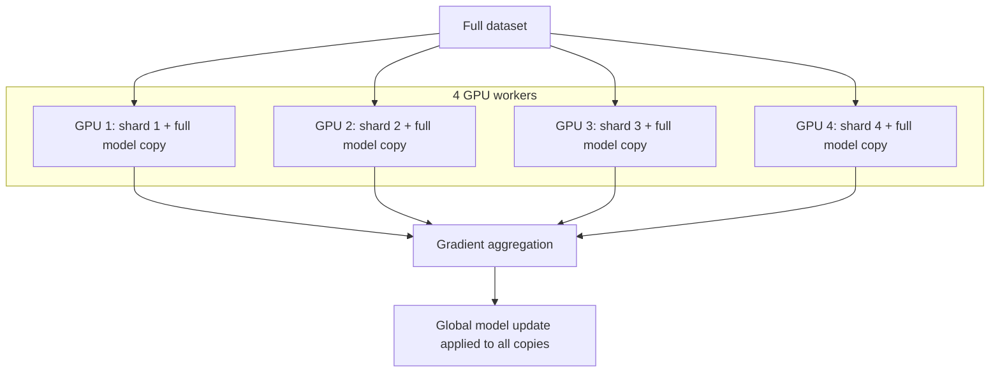

# Data Parallelism: Sharding the Dataset Across Workers

## 1. The Most Common Scaling Strategy

**Data parallelism** is the industry-standard approach when the model fits in a single GPU's memory but the dataset is so large that single-machine training would take weeks or months.

The core concept: **shard the dataset** — split it into partitions, assign each partition to a different worker.

## 2. Architecture: Duplicate Model, Split Data

**Critical distinction:** Every worker maintains a **full copy** of the model architecture — same layers, same weights, same configuration. Only the **data** is split, not the model.

## 3. Training Cycle in Data Parallelism

| Step | What happens |
|------|--------------|
| 1. Local forward pass | Each worker processes a mini-batch from its shard |
| 2. Local backward pass | Each worker computes gradients on its local data |
| 3. Independent compute | Workers operate in parallel — no communication yet |
| 4. Gradient aggregation | Local gradients are averaged (or summed) into one global gradient |
| 5. Global update | Aggregated gradient applied to model on every worker |
| 6. Synchronise weights | All workers now have identical updated weights |
| 7. Next iteration | Repeat with next mini-batch from each shard |

## 4. Why Data Parallelism Works

- **Effective batch size scales with workers** — 4 workers × batch size 32 = effective batch of 128
- Larger effective batch can **speed up convergence** on massive datasets
- Straightforward to implement — same model code, different data shards
- Most robust and widely supported strategy in frameworks (TensorFlow, PyTorch)

## 5. Effective Batch Size

With $W$ workers each processing mini-batch size $B$:

$\text{Effective batch size} = W \times B$

Larger effective batch sizes generally provide more stable gradient estimates but may require learning rate adjustment (often linear scaling rule: scale $\eta$ with batch size).

## 6. When Data Parallelism Applies

| Condition | Data parallelism suitable? |
|-----------|---------------------------|
| Model fits in one GPU RAM | Yes |
| Dataset too large for one machine | Yes |
| Model has hundreds of billions of parameters | No — need model parallelism |
| Communication bandwidth is high | Yes — aggregation is affordable |
| Communication bandwidth is low | Challenging — consider local SGD |

## 7. Data Parallelism vs Model Parallelism Preview

| Aspect | Data parallelism | Model parallelism |
|--------|------------------|-------------------|
| What is split | Dataset | Model layers/tensors |
| Model per worker | Full copy | Partial (subset of layers) |
| Communication | At end of batch (gradient sync) | During forward/backward pass |
| Best for | Big data, small-to-medium models | Models too large for one GPU |
| Complexity | Lower | Higher (pipeline/tensor parallelism) |

## Common Pitfalls / Exam Traps

- **Claiming data parallelism splits the model** — it splits data; model is replicated on every worker.
- **Ignoring communication at aggregation step** — data parallelism still requires gradient sync every step (in sync mode).
- **Not adjusting learning rate for larger effective batch** — can cause divergence or slow convergence.
- **Assuming data parallelism works for LLM-scale models** — model won't fit in one GPU; need model parallelism.
- **Uneven data shards** — if shards are not representative or balanced, aggregated gradient is biased.

## Quick Revision Summary

- Data parallelism: shard dataset, replicate full model on every worker.
- Each worker computes local gradients on its data shard independently.
- Gradients are aggregated (averaged) and applied globally to all model copies.
- Effective batch size = workers × per-worker batch size.
- Industry standard for big datasets where model fits in one GPU.
- Communication happens at gradient aggregation step (sync mode).
- Does not work when model itself exceeds single-device memory.
