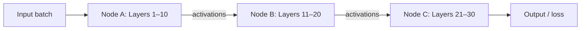
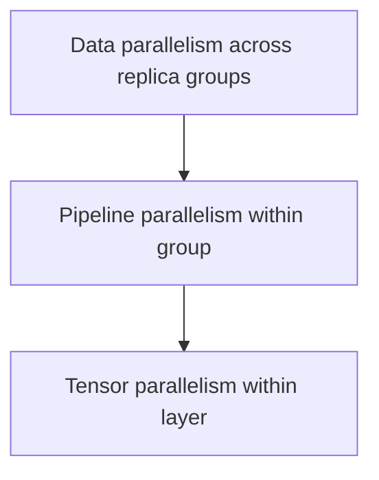

# Model Parallelism: Splitting the Network Across Devices

## 1. When the Model Is the Bottleneck

Data parallelism fails when the model itself is too large for a single GPU. Modern LLMs with hundreds of billions of parameters require hundreds of gigabytes of memory for a single copy — far exceeding any one device's capacity.

**Model parallelism** splits the actual layers (or tensor operations) of the network across multiple devices.

## 2. Pipeline Parallelism (Layer Splitting)

Instead of every GPU holding the full model, the architecture is divided across nodes:

- Node A handles layers 1–10
- Node B handles layers 11–20
- Node C handles final layers

Data flows **sequentially** through the split — layer 11 cannot start until layer 10 finishes. This is **pipeline parallelism**.

## 3. Tensor Parallelism (Operation Splitting)

A more granular approach: instead of splitting by layer, split the **large matrix operations (tensors)** themselves across GPUs.

- Multiple GPUs compute a **single layer** simultaneously
- Each GPU holds a portion of the weight matrix
- Partial results are combined via communication within the layer

Useful when individual layers are too large for one device, even if the layer count could fit.

## 4. Communication Complexity

| Aspect | Data parallelism | Model parallelism |
|--------|------------------|-------------------|
| When communication occurs | End of batch (gradient sync) | During forward AND backward pass |
| Communication pattern | All-reduce gradients | Pass activations/gradients between stages |
| Idle risk | Stragglers at sync | Pipeline bubbles (stages waiting) |
| Complexity | Lower | Higher — timeline management critical |

In model parallelism, nodes must communicate **during** the forward and backward passes because layer $N+1$ depends on layer $N$'s output. Managing the timeline and data transfer between stages is critical to avoid leaving GPUs idle.

## 5. Pipeline Bubbles

In naive pipeline parallelism, GPUs spend time idle waiting for upstream layers:

```mermaid
gantt
    title Pipeline parallelism (naive)
    dateFormat X
    axisFormat %s
    section GPU A
    Forward L1-10     :a1, 0, 10
    Idle              :a2, 10, 30
    Backward L1-10    :a3, 30, 40
    section GPU B
    Idle              :b1, 0, 10
    Forward L11-20    :b2, 10, 20
    Idle              :b3, 20, 40
```

Advanced techniques (micro-batching, GPipe, PipeDream) reduce pipeline bubbles by overlapping forward/backward passes across micro-batches.

## 6. Combined Strategies in Practice

State-of-the-art systems (training GPT-class models) combine both:

| Strategy | Role |
|----------|------|
| Data parallelism | Different data shards across replica groups |
| Pipeline parallelism | Layers split across GPUs within a group |
| Tensor parallelism | Large layers split across GPUs |

## 7. Decision Guide

| Scenario | Strategy |
|----------|----------|
| Huge dataset, model fits one GPU | Data parallelism |
| Model too large for one GPU | Model parallelism |
| Both huge data and huge model | Combined data + model parallelism |
| Single layer too large | Tensor parallelism |

## Common Pitfalls / Exam Traps

- **Using data parallelism for LLM-scale models** — model won't fit; need model parallelism.
- **Assuming model parallelism has less communication** — it has more frequent communication, just smaller messages per step.
- **Ignoring pipeline bubbles** — naive layer splitting leaves GPUs idle most of the time.
- **Confusing pipeline and tensor parallelism** — pipeline splits by layer; tensor splits within a layer.
- **Splitting without considering backward pass dependencies** — gradients flow in reverse; pipeline must handle both directions.

## Quick Revision Summary

- Model parallelism splits the network across devices when model exceeds single-GPU memory.
- Pipeline parallelism: layers assigned to different nodes; sequential data flow.
- Tensor parallelism: matrix operations split across GPUs within a single layer.
- Communication occurs during forward/backward passes, not just at batch end.
- Pipeline bubbles cause GPU idle time; advanced scheduling reduces this.
- LLM training combines data + pipeline + tensor parallelism.
- Use data parallelism for big data; model parallelism for big networks.
