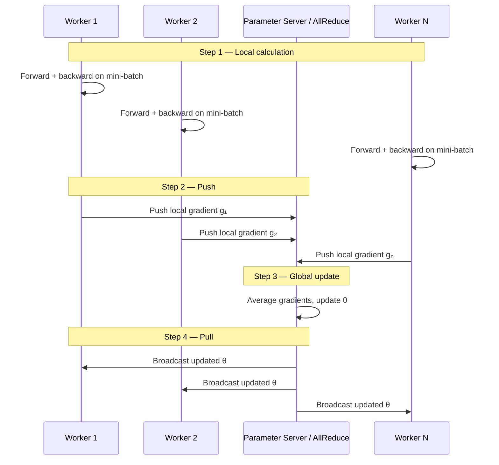

# Distributing Gradient Calculation: The Push-Update-Pull Cycle

## 1. The Lifecycle of a Distributed Training Step

In a distributed system, the gradient is not computed in one place — it is computed in **pieces** across the cluster. Every training iteration follows a four-step cycle that transforms independent local work into a synchronised global model update.

## 2. The Four-Step Cycle

### Step 1: Local Calculation

Each worker takes its own mini-batch from its data shard. Using the current model weights, it performs:
- **Forward pass** — compute predictions and loss
- **Backward pass** — compute local gradient $\nabla L_i$

This gradient represents the best improvement direction based **only** on the data that worker saw.

### Step 2: Push

Local gradients are sent to a central or collective aggregation point:
- **Parameter server architecture** — workers push to dedicated server(s)
- **AllReduce architecture** — workers exchange gradients directly in a ring or tree pattern

Goal: move local gradient data to where it can be combined.

### Step 3: Global Update

The system combines all local gradients (typically by averaging):

$\nabla L_{\text{global}} = \frac{1}{W} \sum_{i=1}^{W} \nabla L_i$

The central parameter server (or collective result) applies the SGD update:

$\theta_{t+1} = \theta_t - \eta \cdot \nabla L_{\text{global}}$

### Step 4: Pull

Updated weights are broadcast back to every worker. Workers previously held stale (old) weights; now all have identical, updated $\theta_{t+1}$. The cycle restarts with a new mini-batch.

## 3. Architecture Variants for Steps 2 and 4

| Architecture | Push mechanism | Pull mechanism |
|--------------|----------------|----------------|
| Parameter server | Workers → central server | Server → all workers |
| Ring AllReduce | Neighbour-to-neighbour exchange | Result available on all nodes after ring traversal |
| NCCL (single-node multi-GPU) | GPU-to-GPU via NVLink | Synchronous update on all replicas |

## 4. Performance Bottleneck

The cycle is only as fast as the network:

$\text{Iteration time} = t_{\text{compute}} + t_{\text{push}} + t_{\text{update}} + t_{\text{pull}}$

If $t_{\text{push}} + t_{\text{pull}} > t_{\text{compute}}$, workers spend more time **waiting** than calculating. This is why communication dominates in large clusters.

## 5. What Makes This Work

Despite the overhead, this cycle allows a distributed system to **behave like one giant computer**:

- Each worker sees different data → broader gradient estimate
- Aggregation produces a more accurate global direction than any single worker alone
- All workers stay synchronised (in sync mode) → consistent model across cluster

## 6. The Unanswered Question: Timing

The four-step cycle describes **what** happens. The next decision is **when**:

- **Synchronous** — wait for all workers before Step 3
- **Asynchronous** — update immediately when any worker pushes
- **Local SGD** — skip Steps 2–4 for many local iterations

## Common Pitfalls / Exam Traps

- **Skipping the pull step in analysis** — workers with stale weights compute wrong local gradients.
- **Assuming push and pull are instant** — they are the primary bottleneck in multi-node training.
- **Confusing parameter server with AllReduce** — different architectures, same four-step logic.
- **Averaging gradients without normalising by worker count** — leads to effectively wrong learning rate.
- **Treating one iteration as one epoch** — one iteration = one mini-batch per worker, not a full data pass.

## Quick Revision Summary

- Four steps: local calculation → push → global update → pull.
- Local gradient = improvement direction from worker's mini-batch only.
- Push sends gradients to central/collective point; pull broadcasts updated weights.
- Global gradient = average of all local gradients; then standard SGD update applied.
- Cycle speed bounded by network (push + pull), not just GPU compute.
- Parameter server and AllReduce are two architectures implementing the same cycle.
- Timing of Steps 2–4 (sync/async/local) is the next design decision.
