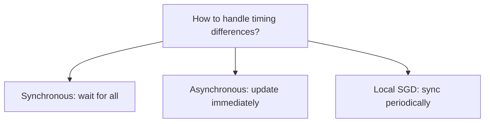
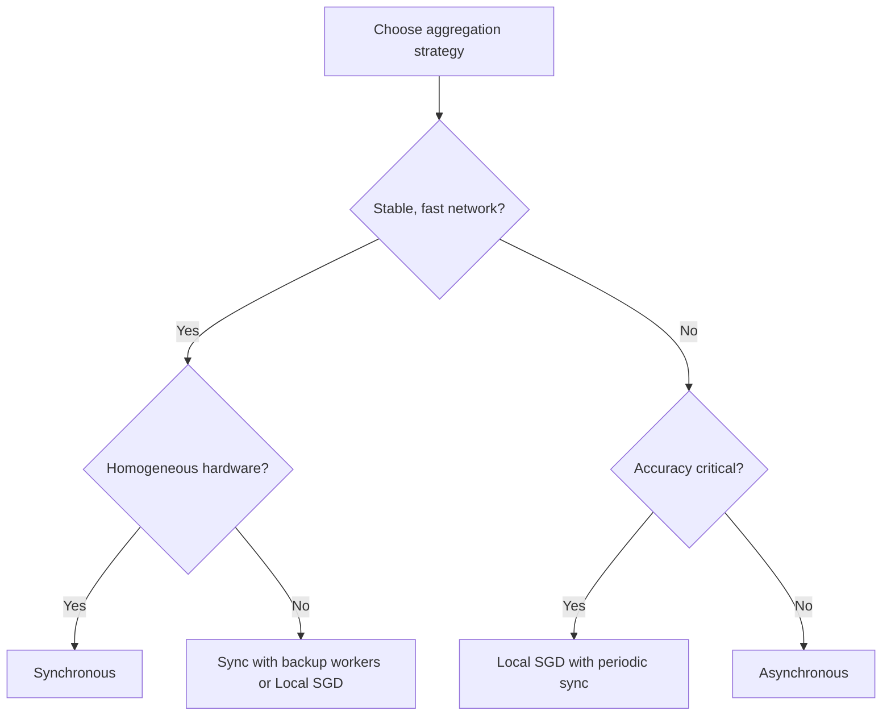

# Synchronous vs Asynchronous vs Local SGD Aggregation Strategies

## 1. The Timing Question

The four-step gradient cycle (compute → push → update → pull) works identically in structure. The critical design choice is **how strictly to enforce timing** — when to perform the global update relative to worker completion.

Not every worker finishes at the same microsecond. The aggregation strategy determines whether the system waits or proceeds.

## 2. Three Main Strategies

## 3. Synchronous Aggregation

**Rule:** Wait for every worker to finish local calculation and push its gradient before performing the global update.

| Pro | Con |
|-----|-----|
| Mathematical purity — complete picture of data | Straggler problem — slowest worker delays all |
| Guaranteed convergence (true SGD at scale) | Expensive idle time on fast workers |
| All workers use same model version | Cluster speed = slowest node |

**Best for:** Stable high-speed networks, homogeneous hardware, models where convergence quality is paramount.

## 4. Asynchronous Aggregation

**Rule:** Do not wait. As soon as any worker finishes, it pushes its gradient. The global model updates immediately. That worker pulls new weights and continues.

| Pro | Con |
|-----|-----|
| Incredible speed and throughput | Gradient staleness |
| GPUs never sit idle | Convergence issues and instability |
| ~95%+ worker utilisation | Slow worker may submit gradient 10 steps old |
| High steps per second | May fail to reach optimal loss |

**Gradient staleness:** A slow worker's gradient is computed on an outdated model version. Applying stale gradients can cause numerical instability or prevent convergence.

**Best for:** Unreliable nodes, varying hardware speeds, when raw throughput matters more than peak accuracy.

## 5. Local SGD (Middle Ground)

**Rule:** Workers perform many local training steps independently before synchronising with the cluster.

| Pro | Con |
|-----|-----|
| Drastically reduced communication cost | Model drift between sync points |
| Great for slow networks | Workers diverge in different directions |
| Balances speed and stability | Harder to reconcile at sync time |

**Model drift:** Because workers train locally for extended periods without communicating, their local models start to diverge. Reconciling them into one accurate global model at sync time is challenging.

**Best for:** Bandwidth-constrained environments, geo-distributed training, federated learning scenarios.

## 6. Comparison Table

| Strategy | Waits for all? | Communication frequency | Convergence | Speed | Staleness risk |
|----------|---------------|------------------------|-------------|-------|----------------|
| Synchronous | Yes | Every step | Best | ~70% efficiency | None |
| Asynchronous | No | Every step (per worker) | Good with tuning | ~95% efficiency | High |
| Local SGD | Periodically | Every $K$ steps | Moderate | High (low comm) | Drift, not staleness |

## 7. Benchmark Illustration

Typical cluster benchmarks (illustrative):

| Metric | Synchronous | Asynchronous |
|--------|-------------|--------------|
| Steps per second | ~70% efficiency | ~95% efficiency |
| Final accuracy | Higher (~98%) | Lower or slower to converge |
| Straggler sensitivity | High | None |
| Gradient freshness | Always current | Potentially stale |

The choice is not about finding the "best" strategy — it is about choosing the right **balance for specific hardware and network constraints**.

## 8. Decision Framework

## Common Pitfalls / Exam Traps

- **Claiming async is always better because it is faster** — convergence quality may suffer significantly.
- **Using synchronous on heterogeneous/unreliable clusters without mitigation** — stragglers destroy efficiency.
- **Confusing local SGD with federated learning** — related but federated adds data privacy constraints.
- **Ignoring learning rate when switching to async** — stale gradients often require smaller $\eta$.
- **Assuming sync guarantees same accuracy as single-machine** — large effective batch size changes optimisation dynamics.

## Quick Revision Summary

- Three strategies: synchronous (wait for all), asynchronous (update immediately), local SGD (periodic sync).
- Synchronous: best convergence, straggler-sensitive, ~70% efficiency.
- Asynchronous: highest throughput, stale gradient risk, ~95% efficiency.
- Local SGD: reduces communication, risks model drift between syncs.
- Aggregation = trade-off between speed and stability.
- Choose based on network stability, hardware uniformity, and accuracy requirements.
- No single best strategy — match to infrastructure constraints.
