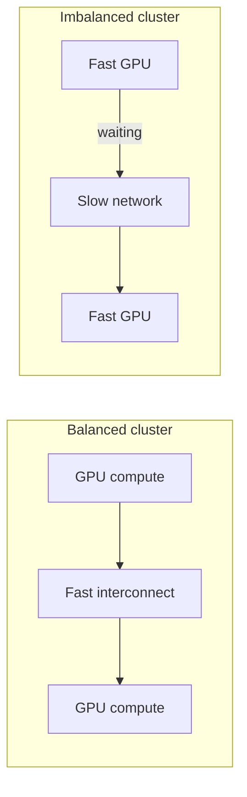
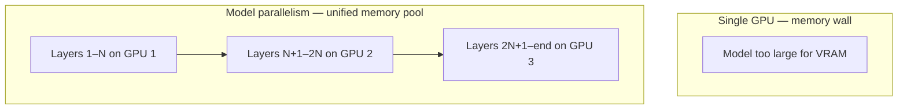

# Module Summary: Distributed Machine Learning at Scale

## 1. The Dominant Cost: Communication, Not Computation

In large-scale ML clusters, **up to 70% of total training time** is spent on communication rather than computation. This single statistic reframes how distributed training must be designed.

**Why it matters:** Training time is dominated by **data movement** — moving gradients, weights, and activations across the network — not by the underlying math. The fastest GPUs in the world become idle if the interconnect is congested.

| System design choice | Effect on training |
|---------------------|-------------------|
| Fast GPUs + slow network | GPUs idle most of the time |
| Balanced compute + interconnect | Near-linear speedup |
| High bandwidth, low latency | Communication overhead manageable |

**Real-world example:** A 64-GPU cluster training a vision model may spend more time in all-reduce gradient sync than in forward/backward passes if Ethernet links are saturated.

---

## 2. Takeaway 1: Scaling Is Limited by the Network

When designing a distributed ML system, **bandwidth, latency, and synchronisation** matter as much as FLOPs or GPU memory capacity.

A balanced system — where compute and communication are proportionally matched — is always more efficient than a cluster with fast compute and slow interconnects.

**Design checklist:**
- Measure network bandwidth between nodes (not just within a node)
- Account for synchronisation barriers in synchronous training
- Choose aggregation strategies that minimise central bottlenecks (e.g., ring all-reduce over single parameter server for dense models)

---

## 3. Takeaway 2: Data Parallelism Is the Default Strategy

**Data parallelism** remains the standard for most use cases — the most robust and straightforward way to scale.

| What happens | Detail |
|-------------|--------|
| Dataset | Sharded across workers |
| Model | Full copy on every worker |
| Compute | Each worker trains on its shard independently |
| Sync | Gradients aggregated and applied globally |

**Why it works:** By sharding the dataset while replicating the model, massive datasets can train high-performing models in a fraction of the time a single machine would require.

**Best for:** Models that fit in one GPU's memory but datasets that are too large for one machine.

---

## 4. Takeaway 3: Model Parallelism Breaks the Memory Wall

**Model parallelism** enables training of multi-billion-parameter networks — the foundation of modern large language models (LLMs).

Without strategies like **pipeline parallelism** and **tensor parallelism**, today's revolutionary LLMs would not be possible. These techniques treat a cluster of GPUs as **one massive unified memory pool**, breaking through the memory wall of a single device.

| Parallelism type | What is split | When to use |
|-----------------|---------------|-------------|
| Data parallelism | Dataset | Model fits in one GPU |
| Model parallelism | Model layers/tensors | Model exceeds single-GPU memory |
| Pipeline parallelism | Sequential layer stages | Very deep networks |
| Tensor parallelism | Individual weight matrices | Extremely wide layers |

---

## 5. The Conceptual Framework for Modern AI at Scale

Three principles govern distributed ML at any scale — from a small on-premise cluster to a massive cloud pipeline:

1. **Communication** — minimise data movement; choose bandwidth-optimal aggregation
2. **Parallelism** — data parallelism for big data; model parallelism for big models
3. **Aggregation** — synchronous for consistency; asynchronous for raw throughput

These principles apply whether managing a 4-GPU workstation or architecting a hundred-node cloud training pipeline.

---

## Common Pitfalls / Exam Traps

- **Assuming faster GPUs always mean faster training** — network congestion can dominate; 70% communication overhead is realistic.
- **Using data parallelism for LLM-scale models** — model won't fit in one GPU; model parallelism is required.
- **Ignoring synchronisation in system design** — synchronous training is mathematically equivalent to single-machine training but limited by the slowest worker (straggler).
- **Treating model and data parallelism as mutually exclusive** — large-scale LLM training typically combines both (3D parallelism).
- **Forgetting that aggregation strategy depends on model sparsity** — parameter servers suit sparse models; ring all-reduce suits dense models.

## Quick Revision Summary

- Up to **70% of training time** in large clusters is communication, not computation
- **Balanced systems** (matched compute + network) outperform fast-GPU/slow-network setups
- **Data parallelism**: shard data, replicate model — default for most workloads
- **Model parallelism**: split model across devices — required for billion-parameter LLMs
- **Pipeline and tensor parallelism** break the single-device memory wall
- Design must account for **bandwidth, latency, and synchronisation** alongside FLOPs
- Fast GPUs with congested networks spend most time **waiting**, not computing
- Principles of **communication, parallelism, and aggregation** guide all distributed ML architecture
