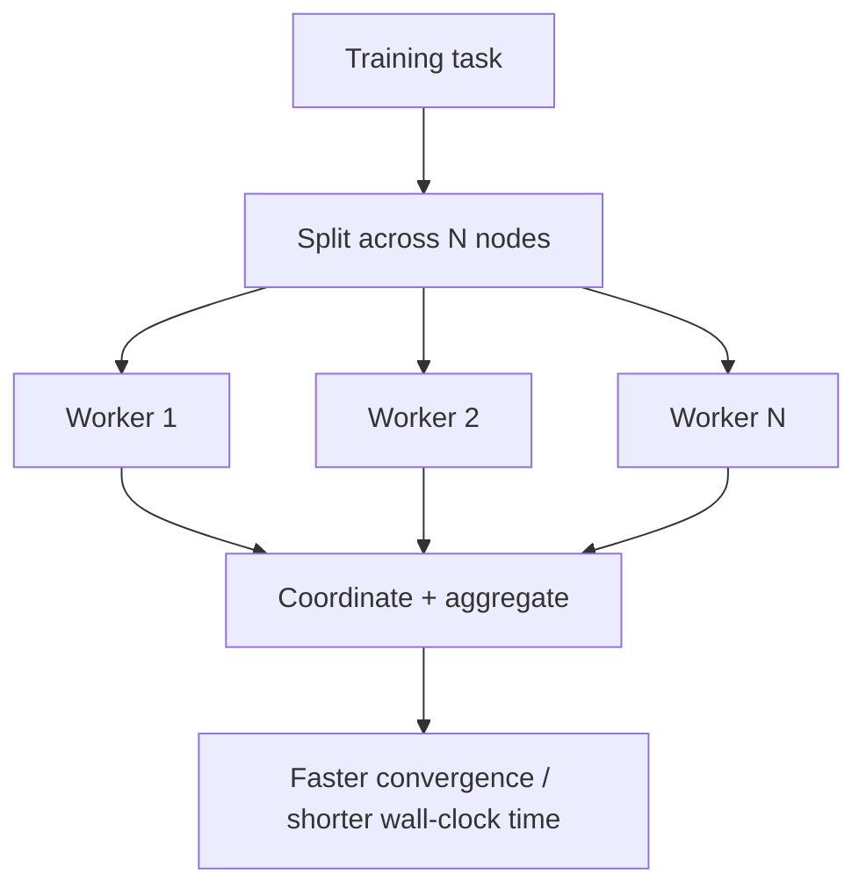
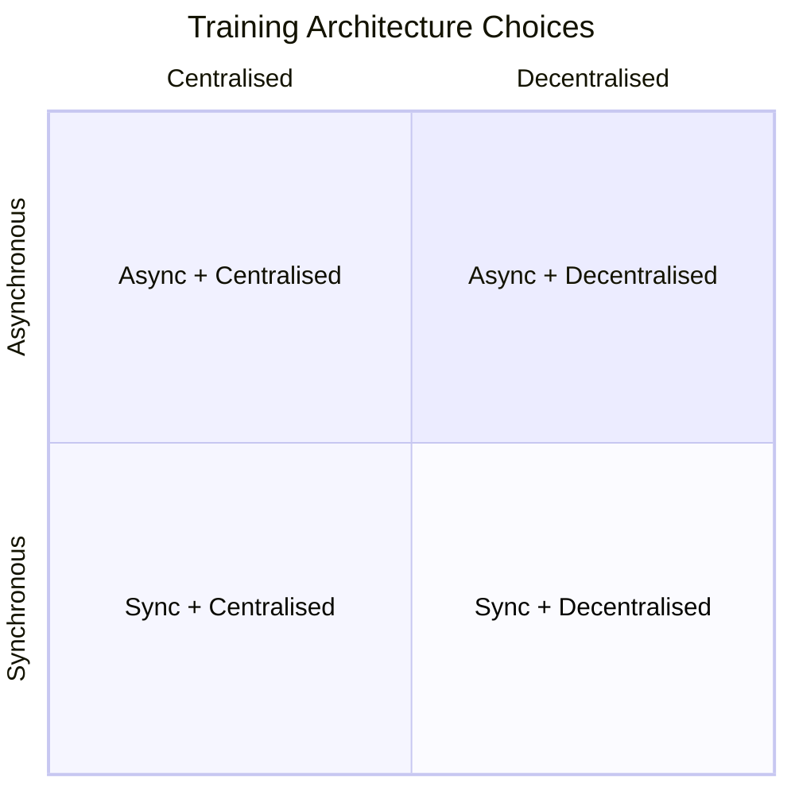

# Architecting for Distributed Intelligence

## 1. Why Single-Device Training Hits a Wall

Modern ML models — large language models, massive recommendation engines — involve **billions of parameters** operating on **petabytes of data**. No single device, regardless of power, can handle this alone.

The industry has shifted from **single-device intelligence** to **multi-node intelligence**: orchestrating dozens or hundreds of computing resources to work as one cohesive unit.

**The core challenge is orchestration:** How do you split a training task across many nodes in a way that actually speeds up the process? Done poorly, communication overhead can make distributed training **slower than a single machine**.

---

## 2. The Goal: Throughput, Not Just Scale

The ultimate objective of distributed architecture is to **increase throughput and reduce training time** — turning processes that once took weeks into tasks completed in hours.

| Metric | Single device | Well-orchestrated cluster |
|--------|--------------|--------------------------|
| Wall-clock training time | Weeks | Hours |
| Data processed per step | Limited by one GPU | Scales with worker count |
| Risk of slowdown | None | High if communication dominates |

---

## 3. Module Roadmap: Four Architectural Pillars

This module covers the practical architectures and strategies for scaling ML across nodes, centred on TensorFlow's distributed APIs.

| Pillar | Focus |
|--------|-------|
| Centralised vs decentralised learning | Parameter server vs ring all-reduce |
| Sync vs async training | Consistency vs speed trade-offs |
| TensorFlow strategies | MirroredStrategy (single node) and MultiWorkerMirroredStrategy (multi-node) |
| Computational graphs | Device placement and graph partitioning |

---

## 4. Structuring Clusters: The Design Spectrum

Distributed ML clusters can be structured along two independent axes:

**Axis 1 — Where weights live:**
- **Centralised:** Parameter server holds global model state
- **Decentralised:** Workers collectively aggregate via ring all-reduce

**Axis 2 — When weights update:**
- **Synchronous:** All workers finish before global update (barrier)
- **Asynchronous:** Each worker updates independently as it finishes

**Real-world example:** A recommendation system with sparse billion-parameter embedding tables often uses a **centralised parameter server** with **asynchronous updates**. A computer vision model on a homogeneous GPU cluster typically uses **decentralised ring all-reduce** with **synchronous training**.

---

## 5. When Distributed Architecture Pays Off

| Scenario | Distributed benefit |
|----------|-------------------|
| Petabyte-scale training data | Data parallelism shards dataset |
| Billion-parameter models | Model parallelism + multi-node |
| Iterative deep learning | Gradient sync across replicas |
| Production SLA on training time | Wall-clock reduction from parallelism |

**When it does NOT pay off:** Small datasets, models that fit comfortably on one GPU, or clusters with severely mismatched hardware and poor interconnects.

---

## Common Pitfalls / Exam Traps

- **Assuming more nodes always means faster training** — communication overhead can make it slower than single-machine training.
- **Conflating data parallelism with model parallelism** — data parallelism splits the dataset; model parallelism splits the model.
- **Ignoring cluster homogeneity** — mixed hardware speeds create stragglers in synchronous mode.
- **Choosing architecture before understanding model sparsity** — sparse models favour parameter servers; dense models favour all-reduce.
- **Treating TensorFlow strategies as interchangeable** — MirroredStrategy is single-node only; MultiWorkerMirroredStrategy requires cluster configuration.

## Quick Revision Summary

- Modern AI requires **multi-node intelligence** — single devices cannot handle billion-parameter, petabyte-scale workloads
- **Orchestration** is the core challenge: split work without communication dominating
- Goal is **throughput** — reduce wall-clock training from weeks to hours
- Four pillars: centralised/decentralised, sync/async, TF strategies, graph partitioning
- Poor orchestration can make distributed training **slower than single-machine**
- Architecture choice depends on **model sparsity, cluster topology, and consistency requirements**
- Parameter server = centralised; ring all-reduce = decentralised
- TensorFlow provides strategy APIs to implement these patterns with minimal code changes
