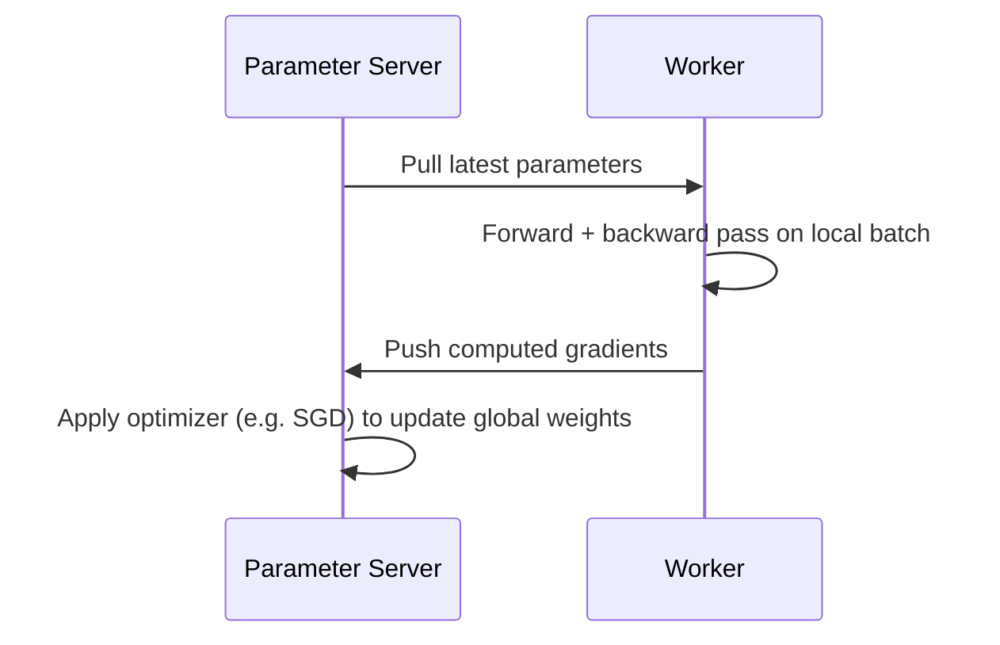
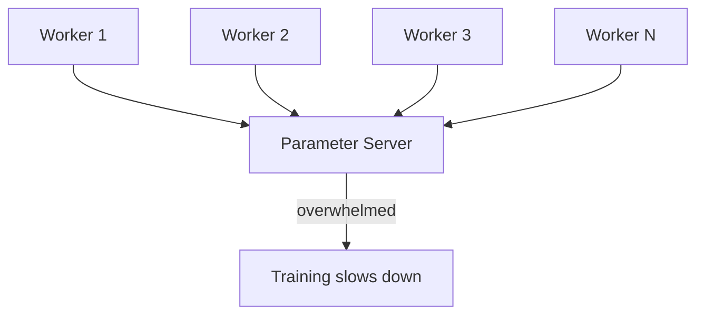

# Centralised Learning: The Parameter Server Model

## 1. The Centralised Pattern

In **centralised learning** (parameter server architecture), computing resources are divided into two distinct roles:

| Role | Function | Analogy |
|------|----------|---------|
| **Parameter server** | Stores current model weights/parameters | Brain / central repository |
| **Workers** | Process data, compute gradients | Muscles / compute engines |

The parameter server is the **single source of truth** for model state. Workers are stateless compute units that pull weights, train locally, and push gradients back.

---

## 2. A Single Training Step

| Step | Action |
|------|--------|
| 1. Pull | Worker fetches latest parameters from server |
| 2. Compute | Worker runs forward/backward pass on a data batch |
| 3. Push | Worker sends gradients back to parameter server |
| 4. Update | Server applies optimisation algorithm (SGD, Adam, etc.) to update global weights |

---

## 3. Why Choose Parameter Servers?

The parameter server model excels for **large, sparse models** with billions of parameters where only a **small fraction** of parameters are updated in any given step.

**Classic use case: large-scale recommendation systems**
- Massive embedding tables (billions of entries)
- Each training step touches only a tiny subset of embeddings
- A dedicated server efficiently manages sparse state updates

| Model characteristic | Parameter server fit |
|---------------------|---------------------|
| Sparse updates (few params touched per step) | Excellent |
| Massive embedding tables | Excellent |
| Dense updates (all params every step) | Poor — bottleneck risk |
| Few workers (< 10) | Good |
| Many workers (> 50) | Risk of server bottleneck |

---

## 4. The Bottleneck Problem

As worker count scales up, the central parameter server becomes a **communication bottleneck**.

**Why it happens:**
- All workers push gradients to **one** server simultaneously
- Server must receive, aggregate, and redistribute weights for every step
- Network bandwidth to a single node is finite

**Mitigation strategies:**
- Shard parameters across multiple parameter servers
- Use asynchronous updates to reduce barrier pressure
- Switch to decentralised aggregation (ring all-reduce) for dense models

---

## 5. Parameter Server vs Ring All-Reduce Preview

| Aspect | Parameter server | Ring all-reduce |
|--------|-----------------|-----------------|
| Architecture | Centralised | Decentralised |
| Weight storage | Dedicated server(s) | No central store |
| Best for | Sparse models, embeddings | Dense neural networks |
| Scalability limit | Server bottleneck | Bandwidth-optimal |
| Update pattern | Push/pull per worker | Neighbour-to-neighbour ring |

---

## Common Pitfalls / Exam Traps

- **Using parameter servers for dense CNN/Transformer models** — all parameters update every step; ring all-reduce is more efficient.
- **Ignoring the bottleneck at scale** — parameter servers work well with few workers but degrade with dozens pushing simultaneously.
- **Confusing parameter server with data parallelism** — parameter server is about *where weights live*; data parallelism is about *how data is split*.
- **Assuming one parameter server handles all parameters** — production systems shard across multiple servers.
- **Forgetting sparse update advantage** — the model is ideal when only a small fraction of billions of parameters change per step.

## Quick Revision Summary

- **Parameter server** = centralised architecture with dedicated weight storage
- **Workers** pull parameters, compute gradients, push gradients back
- Server applies optimizer to update **global weights**
- Ideal for **large sparse models** — recommendation systems with massive embedding tables
- Only a **small fraction of parameters** updated per step — server manages sparse state efficiently
- **Bottleneck risk** when too many workers talk to one server simultaneously
- **Decentralised alternative** (ring all-reduce) eliminates central bottleneck for dense models
- Architecture choice depends on **model sparsity**, not just dataset size
