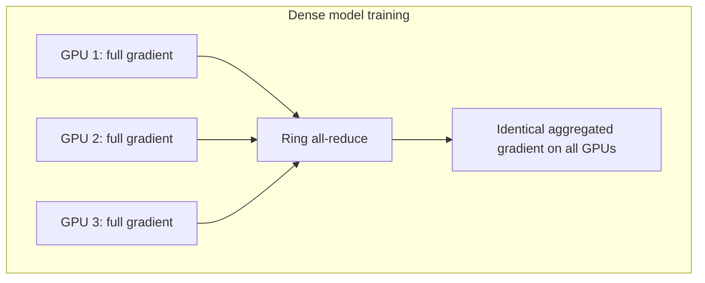

# Decentralised Learning: The Ring All-Reduce Strategy

## 1. Why Decentralise?

The parameter server model suffers a **central bottleneck** as worker count grows — all gradients flow through one server. **Ring all-reduce** solves this by eliminating the central point entirely.

In ring all-reduce, **every worker is an equal participant** in a logical ring. No dedicated server stores weights.

---

## 2. How Ring All-Reduce Works

Instead of every worker sending all data to one central point, each node communicates only with its **immediate neighbours** (predecessor and successor in the ring).

**Per-step logic at each node:**
1. Receive a chunk of gradients from predecessor
2. Add locally computed gradients to that chunk
3. Pass the accumulated result to successor

**After two complete passes around the ring**, every node holds the **exact same fully aggregated gradient vector**.

| Pass | What happens |
|------|-------------|
| Pass 1 (reduce-scatter) | Gradients are partially aggregated and scattered |
| Pass 2 (all-gather) | Fully aggregated chunks are gathered at every node |

---

## 3. Bandwidth Optimality: The Key Advantage

The amount of data each node sends and receives is **independent of the total number of nodes** in the cluster.

| Property | Parameter server | Ring all-reduce |
|----------|-----------------|-----------------|
| Data sent per node | $O(N)$ — all-to-one | $O(1)$ — neighbour only |
| Central bottleneck | Yes | No |
| Scales with workers | Degrades | Maintains efficiency |

This is why ring all-reduce is called **bandwidth optimal** — it fully utilises high-speed interconnects (NVLink, InfiniBand) without overloading any single node.

**Real-world example:** NVIDIA's NCCL library implements ring all-reduce for multi-GPU training, achieving near-linear scaling on 8-GPU DGX systems.

---

## 4. When to Use Ring All-Reduce

Ring all-reduce is highly efficient for **dense models** — deep neural networks in computer vision and NLP where **all parameters are updated every step**.

| Use case | Ring all-reduce fit |
|----------|-------------------|
| CNN image classification | Excellent |
| Transformer language models | Excellent |
| Multi-GPU clusters with fast interconnects | Excellent |
| Sparse recommendation embeddings | Poor — use parameter server |
| Heterogeneous slow networks | Challenging — sync barriers hurt |

---

## 5. Centralised vs Decentralised Summary

| Dimension | Parameter server | Ring all-reduce |
|-----------|-----------------|-----------------|
| Weight storage | Central server | Distributed across workers |
| Communication pattern | Star (hub-and-spoke) | Ring (neighbour-to-neighbour) |
| Bottleneck | Central server at scale | None (bandwidth optimal) |
| Model type | Sparse | Dense |
| Typical framework | TensorFlow PS, custom | NCCL, Horovod, PyTorch DDP |

---

## Common Pitfalls / Exam Traps

- **Claiming ring all-reduce has a central server** — there is no dedicated weight store; every worker is equal.
- **Using ring all-reduce for sparse embedding models** — parameter server is more efficient when only a fraction of parameters update per step.
- **Assuming communication volume grows with cluster size** — ring all-reduce keeps per-node traffic constant.
- **Confusing one ring pass with full aggregation** — two complete passes around the ring are required.
- **Ignoring interconnect requirements** — ring all-reduce assumes fast GPU-to-GPU links; slow Ethernet clusters see less benefit.

## Quick Revision Summary

- **Ring all-reduce** eliminates the central parameter server bottleneck
- Each worker communicates only with **immediate ring neighbours**
- **Two passes** around the ring produce identical aggregated gradients on all nodes
- **Bandwidth optimal** — per-node communication independent of cluster size
- Best for **dense models** (CV, NLP) with full parameter updates every step
- Exploits **high-speed GPU interconnects** (NVLink, InfiniBand) at maximum efficiency
- **Parameter server** for sparse models; **ring all-reduce** for dense models
- Implemented in NCCL, Horovod, PyTorch DDP, TensorFlow MultiWorkerMirroredStrategy
