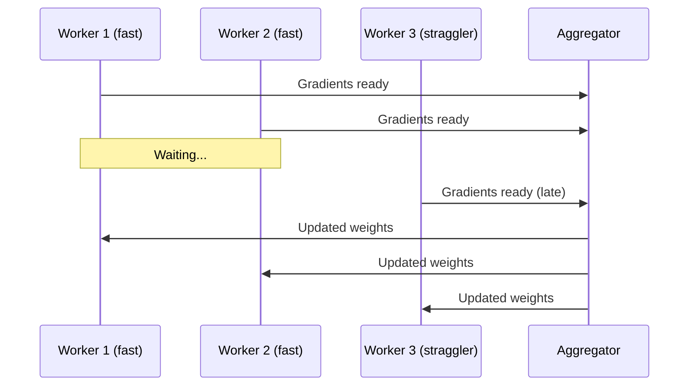
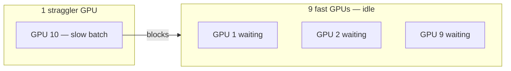

# Synchronous Training: Consistency and the Straggler Problem

## 1. Two Independent Design Axes

Distributed training architecture involves two separate decisions:
1. **Where weights live** — centralised (parameter server) vs decentralised (ring all-reduce)
2. **When weights update** — synchronous vs asynchronous

This note focuses on **synchronous training**: the consistency-first approach.

---

## 2. How Synchronous Training Works

In synchronous training, the entire cluster operates like a **well-drilled marching band**. The key rule is a **barrier (wait-all)**:

> Every worker must finish computing its batch and calculating gradients **before** model weights can be updated.

| Step | Behaviour |
|------|-----------|
| 1 | All workers compute local gradients in parallel |
| 2 | **Barrier** — fastest workers wait for slowest |
| 3 | Gradients aggregated (averaged or summed) |
| 4 | Global weight update applied to all workers |
| 5 | All workers start next batch with **identical weights** |

---

## 3. The Consistency Guarantee

Because every worker waits for the update before starting the next batch, **every worker always uses the exact same model version** for every training step.

This makes synchronous training **mathematically identical** to training on a single machine with a larger effective batch size — just faster due to parallelism.

| Property | Synchronous | Single-machine equivalent |
|----------|------------|--------------------------|
| Weight version per step | Identical across all workers | One global model |
| Gradient aggregation | Mean/sum of all local gradients | Same |
| Convergence behaviour | Stable, predictable | Baseline reference |
| Effective batch size | $W \times B$ (workers × local batch) | $B$ |

---

## 4. The Straggler Problem

The major downside of synchronous training: **the cluster is only as fast as its slowest member**.

**What causes stragglers:**
- Minor hardware differences between nodes
- Network latency spikes on one link
- Background OS tasks on one machine
- Uneven data shard sizes (some batches take longer)
- Thermal throttling on one GPU

**Cost:** 9 fast GPUs sit **idle**, wasting expensive compute while waiting for one slow worker.

---

## 5. Why Synchronous Training Remains the Default

Despite the straggler risk, synchronous training is the **most common choice** for deep learning because it provides **more stable convergence**.

| Metric | Synchronous | Asynchronous |
|--------|------------|--------------|
| Worker utilisation | ~70% (straggler overhead) | ~95%+ |
| Steps per second | Lower | Higher |
| Final accuracy | Higher (e.g. 98%) | Lower or slower to converge |
| Convergence stability | High | Lower (stale gradients) |
| Mathematical equivalence to single machine | Yes | No |

**Real-world example:** Google Brain and most production deep learning pipelines default to synchronous training on homogeneous GPU clusters with InfiniBand interconnects, where stragglers are rare.

---

## Common Pitfalls / Exam Traps

- **Claiming synchronous training is always faster** — stragglers can reduce utilisation to ~70%; async reaches ~95%.
- **Ignoring that sync = mathematically equivalent to single-machine training** — this is a key exam point.
- **Assuming stragglers only come from slow hardware** — network spikes and uneven data shards also cause stragglers.
- **Choosing async for accuracy-critical models without tuning** — stale gradients degrade convergence quality.
- **Confusing barrier with aggregation** — barrier is the wait-all step; aggregation is the gradient combination that follows.

## Quick Revision Summary

- **Synchronous training** uses a barrier: all workers must finish before global update
- Guarantees **identical model version** on every worker at every step
- **Mathematically equivalent** to single-machine training with larger effective batch
- **Straggler problem**: cluster speed = slowest worker; fast GPUs idle waiting
- Stragglers caused by hardware differences, network spikes, uneven shards
- **Most common choice** for deep learning despite straggler risk — stable convergence
- Sync achieves **higher final accuracy**; async achieves **higher steps/second**
- Best on **homogeneous clusters** with stable, high-speed networks
