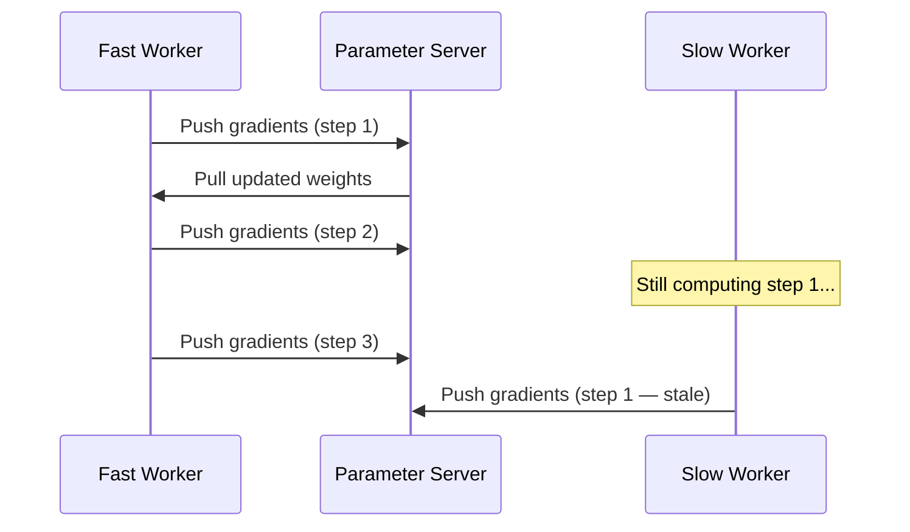

# Asynchronous Training: Speed vs Convergence Quality

## 1. The Motivation: Eliminate Idle GPUs

Synchronous training wastes compute when stragglers appear — fast GPUs sit idle at the barrier. **Asynchronous training** removes the wait-all rule entirely.

> Every worker updates global weights **independently** as soon as it finishes its batch. No waiting for peers.

If one worker is faster, it simply keeps going — pulling latest weights, pushing new gradients, never pausing.

---

## 2. How Asynchronous Training Works

| Behaviour | Synchronous | Asynchronous |
|-----------|------------|--------------|
| Wait for peers | Yes (barrier) | No |
| Update timing | All at once | Each worker independently |
| GPU utilisation | ~70% (straggler waste) | ~95%+ |
| Weight version consistency | Guaranteed identical | May differ across workers |

---

## 3. The Stale Gradient Problem

Because workers are not synchronised, a worker may compute gradients using an **older version of the weights** while other workers have already updated the master model.

This is the **stale gradient problem** — and it is the fundamental trade-off of async training.

**Why stale gradients hurt:**
- Gradient was computed for weight version $w_t$, but global model is already at $w_{t+k}$
- Applying stale gradient moves model in a direction optimised for outdated parameters
- Introduces noise into the optimisation trajectory
- Can cause instability or require more careful learning rate tuning

$\text{Staleness} = \text{number of global updates since worker pulled weights}$

---

## 4. Benchmark Comparison

| Metric | Synchronous | Asynchronous |
|--------|------------|--------------|
| Steps per second | ~70% efficiency | ~95%+ efficiency |
| Worker utilisation | Reduced by stragglers | Near 100% |
| Final accuracy | Higher (~98% in benchmarks) | Lower or slower convergence |
| Convergence stability | High | Lower (stale gradient noise) |
| Learning rate sensitivity | Standard | Requires careful tuning |

**The trade-off in plain terms:**
- Need **raw speed** and maximum hardware utilisation → asynchronous
- Need **peak accuracy** and stable convergence → synchronous

---

## 5. When to Choose Each Mode

| Cluster condition | Recommended mode |
|-------------------|-----------------|
| Homogeneous GPUs, fast InfiniBand | Synchronous |
| Stable, high-speed network | Synchronous |
| Unreliable nodes or varying hardware | Asynchronous |
| Mixed GPU generations in cluster | Asynchronous |
| Sparse models with parameter server | Asynchronous (common) |
| Accuracy-critical production model | Synchronous |
| Time-constrained experimentation | Asynchronous |

**Real-world example:** Large-scale ad recommendation systems at Meta and Google often use **asynchronous parameter server training** because embedding tables are sparse and worker speeds vary across data centre racks.

---

## 6. TensorFlow Implementation Preview

TensorFlow's `tf.distribute` strategy API abstracts these choices:
- `MirroredStrategy` / `MultiWorkerMirroredStrategy` → synchronous
- Parameter server strategy with async updates → asynchronous

The choice is often a single configuration flag, but the underlying trade-offs remain.

---

## Common Pitfalls / Exam Traps

- **Claiming async always produces better models** — it is faster per step but often achieves lower final accuracy.
- **Ignoring stale gradients** — this is the defining problem of async training, not an edge case.
- **Assuming async eliminates all waiting** — workers still wait for parameter server I/O; only peer barriers are removed.
- **Using async on homogeneous clusters without reason** — synchronous is usually better when hardware is uniform.
- **Confusing async with federated learning** — async is about update timing within one cluster; federated is about data locality across organisations.

## Quick Revision Summary

- **Asynchronous training** removes the barrier — workers update independently
- Achieves **~95%+ worker utilisation** vs ~70% for synchronous
- **Stale gradient problem**: workers compute on outdated weight versions
- Stale gradients cause **instability** and require careful learning rate tuning
- Async wins on **steps/second**; sync wins on **final accuracy**
- Choose async for **unreliable/heterogeneous** clusters; sync for **stable/homogeneous** clusters
- Common with **sparse parameter server** architectures (recommendation systems)
- TensorFlow strategy API implements both modes with minimal code changes
