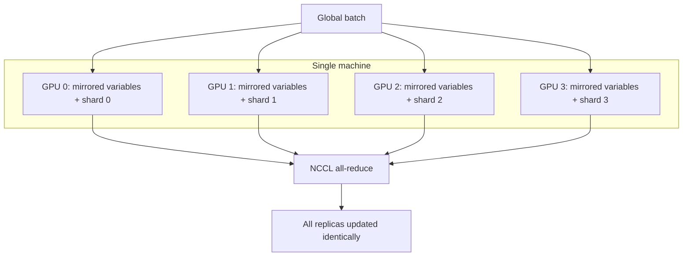

# MirroredStrategy: Single-Node Multi-GPU Training

## 1. From Theory to Practice

Up to this point, distributed training has been discussed at the architectural level. **TensorFlow's `tf.distribute` Strategy API** implements these concepts in production-ready code.

The most common entry point for scaling is **`MirroredStrategy`** — designed specifically for **single-node, multi-GPU** setups.

---

## 2. What MirroredStrategy Does

Imagine a single powerful workstation or cloud instance with 2, 4, or 8 NVIDIA GPUs. MirroredStrategy uses **all of them synchronously** for training.

The name **"mirrored"** comes from how TensorFlow handles model variables: every GPU (replica) gets its own **identical copy** of all model variables — literally mirrored across devices.



---

## 3. Execution Flow

| Step | What happens |
|------|-------------|
| 1. Data split | Each GPU receives a different portion of the batch |
| 2. Forward pass | Each GPU computes forward pass on its shard |
| 3. Backward pass | Each GPU computes local gradients |
| 4. Aggregation | TensorFlow all-reduces gradients across all GPUs (NCCL) |
| 5. Update | Aggregated gradient applied to all mirrored variables simultaneously |
| 6. Sync | Model stays perfectly in sync across every device |

This is **synchronous data parallelism** on a single machine — the barrier and aggregation happen via NCCL, not over a network.

---

## 4. Why MirroredStrategy Is the Gold Standard for Workstations

| Advantage | Detail |
|-----------|--------|
| NCCL communication | Uses NVIDIA's high-speed on-device protocol |
| No network overhead | GPUs communicate over PCIe/NVLink, not Ethernet |
| Minimal code changes | Wrap existing model in strategy scope |
| Near-linear speedup | 4 GPUs ≈ 4× throughput on homogeneous hardware |
| Synchronous by default | Stable convergence guaranteed |

**Real-world example:** A data scientist training a ResNet-50 on an AWS `p3.8xlarge` (4× V100 GPUs) uses MirroredStrategy to achieve ~3.5× speedup over single-GPU training with only a few lines of code change.

---

## 5. Basic Usage Pattern

```python
strategy = tf.distribute.MirroredStrategy()

with strategy.scope():
    model = build_model()
    model.compile(optimizer='adam', loss='sparse_categorical_crossentropy')

model.fit(train_dataset, epochs=10)
```

TensorFlow automatically:
- Creates mirrored variable replicas on each GPU
- Splits batches across GPUs
- Aggregates gradients via NCCL
- Applies updates synchronously

---

## 6. MirroredStrategy vs MultiWorkerMirroredStrategy

| Aspect | MirroredStrategy | MultiWorkerMirroredStrategy |
|--------|-----------------|---------------------------|
| Scope | Single machine | Multiple machines (cluster) |
| Communication | NCCL (on-device) | NCCL + network (gRPC/MPI) |
| Configuration | Automatic GPU detection | Requires `TF_CONFIG` env var |
| GPUs supported | 2–8 typical | Dozens to hundreds |
| Complexity | Minimal | Requires cluster topology setup |

When a single machine's GPUs are insufficient, scale out with **MultiWorkerMirroredStrategy**.

---

## Common Pitfalls / Exam Traps

- **Using MirroredStrategy for multi-node clusters** — it is single-node only; use MultiWorkerMirroredStrategy for clusters.
- **Assuming MirroredStrategy splits the model** — it mirrors (replicates) the model; only data is split.
- **Ignoring batch size scaling** — effective batch = local batch × GPU count; may need learning rate adjustment.
- **Expecting perfect linear speedup** — NCCL overhead and gradient aggregation reduce efficiency slightly below 100%.
- **Confusing mirrored variables with shared variables** — each GPU has its own copy, kept in sync after each step.

## Quick Revision Summary

- **`MirroredStrategy`** = TensorFlow's single-node multi-GPU synchronous data parallelism
- Every GPU gets **mirrored (identical) copies** of all model variables
- Each GPU processes a **different data shard** per batch
- Gradients aggregated via **NCCL** (NVIDIA's high-speed on-device protocol)
- **Gold standard** for 2–8 GPU workstations — minimal code changes, significant speedup
- Synchronous by default — model stays **perfectly in sync** across all GPUs
- Scale beyond one machine with **MultiWorkerMirroredStrategy** + `TF_CONFIG`
- Near-linear speedup on homogeneous single-node GPU setups
