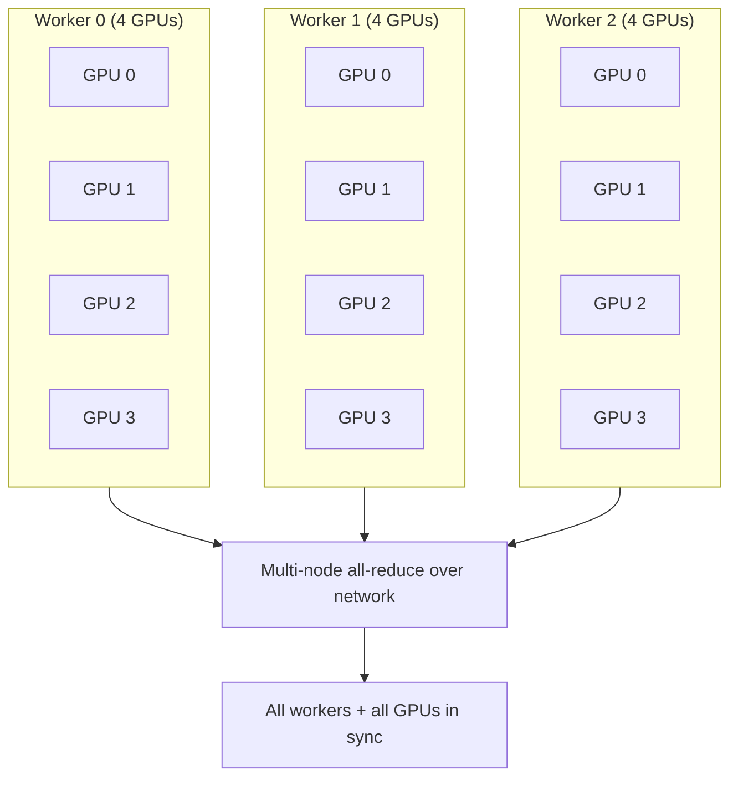
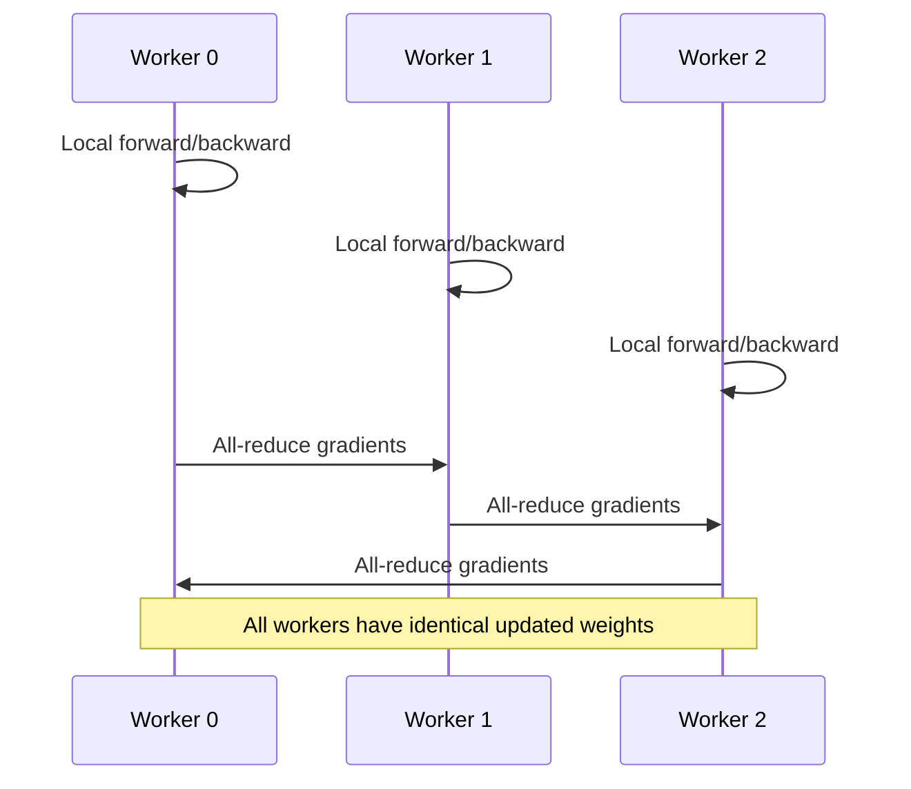

# MultiWorkerMirroredStrategy: Multi-Node Cluster Training

## 1. When One Machine Is Not Enough

MirroredStrategy handles up to ~8 GPUs on a single machine. When models or datasets demand more, training must **scale out to a cluster** of multiple worker machines.

**`MultiWorkerMirroredStrategy`** is the big-brother extension of MirroredStrategy — synchronous data parallelism across an entire network cluster.

---

## 2. Architecture: Workers with Multiple GPUs Each



| Property | Detail |
|----------|--------|
| Scope | Multiple machines, each with multiple GPUs |
| Core logic | Same as MirroredStrategy — synchronous, collective ops |
| Communication | Multi-node all-reduce over network (Ethernet, InfiniBand) |
| Key difference from MirroredStrategy | Data travels over network cables, not motherboard bus |

---

## 3. The TF_CONFIG Environment Variable

Unlike single-machine setups where TensorFlow auto-detects GPUs, **each machine in a cluster must know its role**. This is configured via the **`TF_CONFIG`** environment variable.

`TF_CONFIG` is a JSON string defining the cluster topology:

```json
{
  "cluster": {
    "worker": ["10.0.0.1:5000", "10.0.0.2:5000", "10.0.0.3:5000"]
  },
  "task": {
    "type": "worker",
    "index": 0
  }
}
```

| Field | Purpose |
|-------|---------|
| `cluster.worker` | List of all worker network addresses |
| `task.type` | Role of this machine (`worker` or `chief`) |
| `task.index` | This machine's index in the cluster (0, 1, 2, ...) |

**Critical:** `TF_CONFIG` must be set identically on every machine except for `task.index`, which is unique per machine.

---

## 4. What MultiWorkerMirroredStrategy Automates

Once `TF_CONFIG` is set on every machine, the strategy handles:

| Task | Automated by strategy |
|------|----------------------|
| Data partitioning | Splits dataset across all workers |
| Gradient synchronisation | Multi-node all-reduce across network |
| Variable mirroring | Identical model copies on every GPU of every worker |
| Chief worker coordination | One worker coordinates checkpointing |



---

## 5. Industry-Scale Deep Learning

MultiWorkerMirroredStrategy is the go-to solution for **industry-scale deep learning** — training on dozens or hundreds of GPUs simultaneously.

| Scale | Example |
|-------|---------|
| Small cluster | 3 workers × 4 GPUs = 12 GPUs |
| Medium cluster | 16 workers × 8 GPUs = 128 GPUs |
| Large cluster | 64+ workers × 8 GPUs = 512+ GPUs |

**Real-world example:** Training a BERT-large model on Google Cloud TPU pods or AWS multi-node GPU clusters uses this pattern — each VM runs the same script with a different `TF_CONFIG` index.

---

## 6. Network Requirements

Because gradients travel over network cables rather than NVLink, network quality directly impacts training speed.

| Network type | Typical bandwidth | Suitability |
|-------------|------------------|-------------|
| NVLink (within node) | 300+ GB/s | MirroredStrategy |
| InfiniBand (between nodes) | 100–200 Gb/s | MultiWorkerMirroredStrategy — excellent |
| 10 Gb Ethernet | 10 Gb/s | Workable but communication-heavy |
| 1 Gb Ethernet | 1 Gb/s | Poor — communication dominates |

---

## Common Pitfalls / Exam Traps

- **Forgetting to set TF_CONFIG on every machine** — without it, workers don't know cluster topology.
- **Using the same task.index on multiple machines** — each worker needs a unique index.
- **Assuming MultiWorkerMirroredStrategy works like MirroredStrategy without configuration** — cluster setup is mandatory.
- **Ignoring network bandwidth between nodes** — slow Ethernet can make multi-node training slower than single-node.
- **Confusing worker with chief** — chief worker handles coordination; all workers participate in training.

## Quick Revision Summary

- **`MultiWorkerMirroredStrategy`** scales synchronous data parallelism across multiple machines
- Each worker can have **multiple GPUs** — strategy handles both intra- and inter-node sync
- Uses **multi-node all-reduce** over network (not just on-device NCCL)
- **`TF_CONFIG`** JSON env var defines cluster topology and each machine's role/index
- Must be set on **every machine** with unique `task.index`
- Automates data partitioning and gradient synchronisation across the cluster
- **Industry-scale solution** for dozens to hundreds of GPUs
- Network quality (InfiniBand vs Ethernet) directly impacts training efficiency
