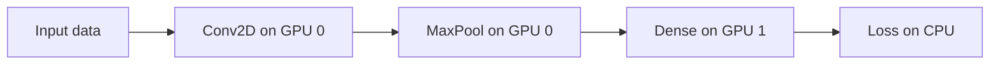
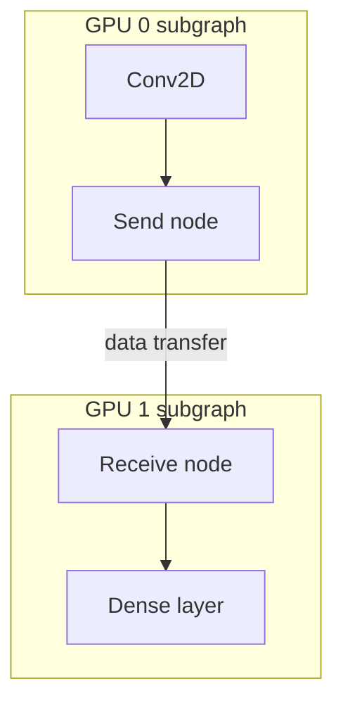

# Understanding Distributed Computational Graphs and Device Placement

## 1. What Happens Under the Hood

High-level strategies like MirroredStrategy and MultiWorkerMirroredStrategy abstract away enormous complexity. At the lowest level, TensorFlow manages **computational graphs** and **device placement** to make distributed training work.

Understanding these mechanics is essential for **debugging performance bottlenecks** in production clusters.

---

## 2. The Computational Graph (DAG)

When a model executes in TensorFlow, operations are represented as a **directed acyclic graph (DAG)** — nodes are operations (matrix multiply, activation, loss), edges are data tensors flowing between them.

In a distributed setting, this single main graph must be **managed across many hardware units** — CPUs and GPUs on multiple machines.



---

## 3. Graph Partitioning

TensorFlow's runtime is responsible for **splitting the main graph into subgraphs**, where each subgraph contains operations assigned to a specific device.

| Concept | Definition |
|---------|-----------|
| Main graph | Full model computation as one DAG |
| Subgraph | Portion of the graph assigned to one device |
| Partition boundary | Point where data must cross device boundaries |

**Why partition?**
- Different operations have different hardware affinities (GPU for matmul, CPU for data preprocessing)
- Model parallelism requires layers on different GPUs
- Memory constraints force splitting across devices

---

## 4. Device Placement

**Device placement** is the process of assigning specific operations to specific hardware.

TensorFlow device naming convention:
```
/job:worker/replica:0/task:0/device:GPU:0
/job:worker/replica:0/task:0/device:CPU:0
```

| Placement mode | Behaviour |
|---------------|-----------|
| Automatic | TensorFlow runtime decides based on op type and memory |
| Manual (`tf.device`) | Developer forces specific ops to specific devices |

**Example use case for manual placement:**
- Force data preprocessing (I/O, decoding) to **CPU**
- Force matrix multiplication and convolutions to **GPU**
- Prevents GPU idle time waiting for CPU-bound preprocessing

```python
with tf.device('/GPU:0'):
    output = tf.matmul(weights, inputs)

with tf.device('/CPU:0'):
    decoded = tf.io.decode_image(raw_bytes)
```

---

## 5. Inter-Device Communication: Send and Receive Nodes

Because the graph is partitioned across devices, data must travel between subgraphs. TensorFlow handles this automatically by inserting **send** and **receive nodes** into the partitioned graphs.



| Communication path | Protocol |
|-------------------|----------|
| Same machine (GPU ↔ GPU) | Shared memory, NCCL |
| Same machine (GPU ↔ CPU) | PCIe DMA |
| Different workers (cluster) | gRPC or MPI over network |

This ensures that even though the model is physically split across many machines, it **behaves as one logically connected system**.

---

## 6. Debugging Performance with Graph Knowledge

Understanding graph partitioning and device placement helps diagnose why GPUs are idle:

| Symptom | Likely cause |
|---------|-------------|
| GPU utilisation low | Receive node waiting for slow network transfer |
| CPU at 100%, GPU idle | Data preprocessing not offloaded or bottlenecked on CPU |
| Uneven GPU usage | Poor automatic placement — manual placement needed |
| High latency between steps | Send/receive nodes blocked on slow interconnect |

**Real-world example:** A TensorFlow training job on a 4-GPU node shows GPU 0 at 95% utilisation but GPUs 1–3 at 20%. Investigation reveals automatic placement put all preprocessing on GPU 0. Manual `tf.device` placement to CPU fixes the imbalance.

---

## Common Pitfalls / Exam Traps

- **Calling the graph a "directed cyclic graph"** — it is a **directed acyclic graph (DAG)**; cycles would prevent execution ordering.
- **Assuming TensorFlow never needs manual device placement** — automatic placement can be suboptimal; manual override is common in production.
- **Ignoring send/receive nodes in performance analysis** — they are the actual communication points between devices.
- **Confusing graph partitioning with data parallelism** — partitioning splits operations across devices; data parallelism replicates the full graph with different data.
- **Placing heavy matmul on CPU** — matrix operations should be on GPU; CPU is for I/O and preprocessing.

## Quick Revision Summary

- TensorFlow represents models as a **DAG** of operations and tensors
- **Graph partitioning** splits the main graph into per-device subgraphs
- **Device placement** assigns operations to specific CPUs/GPUs
- TensorFlow auto-inserts **send/receive nodes** at partition boundaries
- Same-machine communication uses **shared memory/NCCL**; cross-worker uses **gRPC/MPI**
- Manual `tf.device` placement optimises CPU/GPU workload distribution
- **Debugging tip**: idle GPUs often mean receive nodes blocked on slow transfers
- Understanding low-level mechanics is key to diagnosing distributed training bottlenecks
