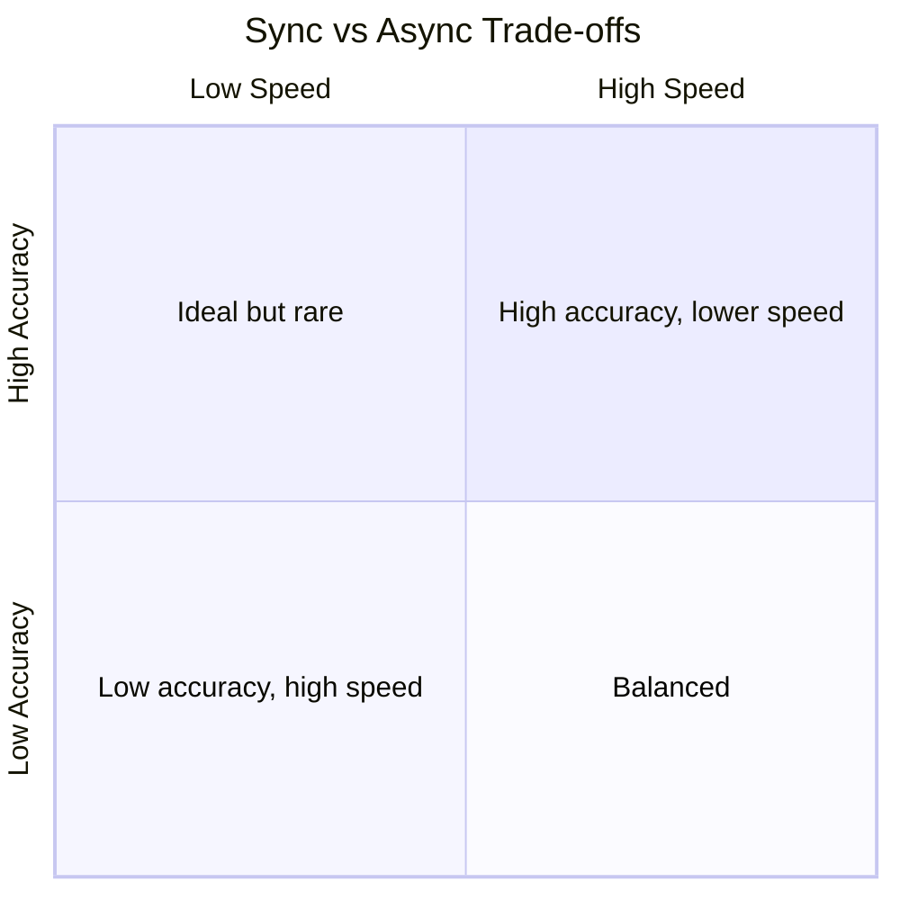
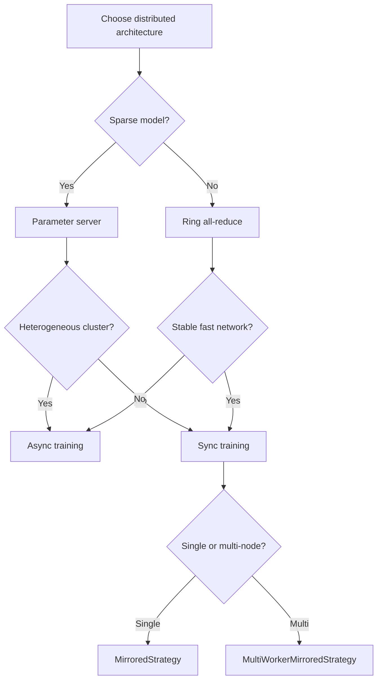

# Module Summary: Distributed ML Architectures in TensorFlow

## 1. Centralised vs Decentralised Learning

| Architecture | Weight storage | Best for | Bottleneck risk |
|-------------|---------------|----------|----------------|
| **Parameter server** (centralised) | Dedicated server(s) | Sparse models, recommendation embeddings | Yes — at scale |
| **Ring all-reduce** (decentralised) | No central store | Dense neural networks (CV, NLP) | No — bandwidth optimal |

**Key insight:** Parameter servers excel when only a small fraction of billions of parameters update per step. Ring all-reduce eliminates the central bottleneck for dense models with full parameter updates.

---

## 2. Synchronous vs Asynchronous Training

| Mode | Utilisation | Accuracy | Key risk |
|------|------------|----------|----------|
| **Synchronous** | ~70% (straggler overhead) | Higher (~98%) | Straggler problem |
| **Asynchronous** | ~95%+ | Lower or slower convergence | Stale gradients |

- **Synchronous**: barrier ensures mathematical equivalence to single-machine training
- **Asynchronous**: maximum hardware utilisation at cost of convergence quality

---

## 3. TensorFlow Strategy API

| Strategy | Scope | Communication | Configuration |
|----------|-------|--------------|---------------|
| **MirroredStrategy** | Single node, multi-GPU | NCCL (on-device) | Automatic |
| **MultiWorkerMirroredStrategy** | Multi-node cluster | All-reduce over network | `TF_CONFIG` required |

- MirroredStrategy: gold standard for 2–8 GPU workstations
- MultiWorkerMirroredStrategy: industry-scale training on dozens to hundreds of GPUs
- `TF_CONFIG` JSON defines cluster topology and each machine's unique index

---

## 4. Computational Graphs and Device Placement

Under the hood, TensorFlow:
1. **Partitions** the main DAG into per-device subgraphs
2. **Places** operations on specific CPUs/GPUs (auto or manual via `tf.device`)
3. **Inserts** send/receive nodes for inter-device communication
4. Uses **NCCL** (same machine) or **gRPC/MPI** (cross-worker) for data transfer

Understanding these mechanics enables debugging of GPU idle time and network bottlenecks.

---

## 5. Decision Framework

---

## 6. Scaling Intelligence Is a Requirement

Scaling intelligence across nodes is no longer an optional feature — it is a **requirement for modern AI development**. Billion-parameter models and petabyte datasets demand distributed architectures as a baseline capability.

---

## Common Pitfalls / Exam Traps

- **Using parameter servers for dense CNN/Transformer training** — ring all-reduce is bandwidth optimal for dense models.
- **Forgetting TF_CONFIG for multi-node training** — MultiWorkerMirroredStrategy requires cluster topology on every machine.
- **Assuming async is always better** — sync achieves higher final accuracy; async wins on steps/second only.
- **Confusing MirroredStrategy with MultiWorkerMirroredStrategy** — single-node vs multi-node are different strategies with different setup.
- **Ignoring send/receive nodes when debugging** — GPU idle time often traces to blocked inter-device transfers.

## Quick Revision Summary

- **Parameter server** for sparse models; **ring all-reduce** for dense models
- **Synchronous** = consistency + straggler risk; **asynchronous** = speed + stale gradients
- **MirroredStrategy**: single-node multi-GPU via NCCL — minimal setup
- **MultiWorkerMirroredStrategy**: multi-node cluster — requires `TF_CONFIG`
- Graph **partitioning** and **device placement** are the low-level mechanics under strategies
- **Send/receive nodes** handle inter-device communication automatically
- Scaling across nodes is a **requirement**, not an option, for modern AI
- Choose architecture based on **model sparsity, cluster homogeneity, and network quality**
