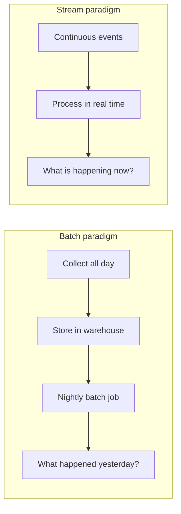

# The Shift to Real-Time Intelligence

## 1. From Batch to Stream: A Paradigm Shift

Data engineering was historically built around **historical analysis**: collect data all day, store it in a warehouse, run a batch job at night to see what happened.

The modern digital landscape demands something more immediate — **architecting real-time data intelligence at scale**.

| Question era | Batch answer | Stream answer |
|-------------|-------------|--------------|
| Business insight | What happened yesterday? | What is happening right now? |
| Response time | Hours to days | Milliseconds to seconds |
| Action type | Retrospective analysis | Immediate intervention |

---

## 2. Three Core Drivers of the Shift

### Driver 1: Velocity Is the New Volume

The focus has moved from **how much data** we have to **how fast we can act on it**. Acting on data in **milliseconds or microseconds** is now the competitive benchmark.

### Driver 2: Operational Efficiency

The questions we ask have shifted:
- Old: "What happened yesterday?"
- New: "What is happening right now?"

This enables **immediate intervention and monitoring** — catching problems before they escalate.

### Driver 3: Competitive Advantage

In a world of instant gratification, responding immediately to market fluctuations or user triggers provides a massive edge:
- Sudden stock price drops → automated trading response
- User clicking a specific product → instant personalised recommendation
- Server health anomaly → automatic alert and remediation

---

## 3. Module Learning Objectives

| Objective | Detail |
|-----------|--------|
| Contrast batch vs stream | Latency and data velocity differences |
| Identify streaming use cases | Financial services, e-commerce |
| Evaluate processing guarantees | Exactly-once vs at-least-once reliability |
| Architect streaming solutions | Kafka, Storm, and related tools |

---

## 4. Why This Matters for Data Engineers

Understanding the batch-to-stream transition is not a technical upgrade — it is a **critical requirement for modern data engineering**.

| Role | Batch-era skill | Stream-era skill |
|------|----------------|-----------------|
| Data engineer | ETL pipelines, nightly jobs | Real-time ingestion, windowing |
| Data scientist | Historical model training | Online learning, real-time scoring |
| Architect | Data warehouse design | Streaming backbone + processing topology |

**Real-world example:** A bank that detects fraud only in nightly batch jobs loses money all day before the batch runs. A streaming fraud detection system blocks fraudulent transactions in the milliseconds between card swipe and authorisation.

---

## 5. What Comes Next in Stream Processing

The stream processing stack builds on concepts that will be covered in subsequent topics:

1. **What is a stream?** — unbounded data, low latency, actionability
2. **Windowing vs global state** — how to compute on infinite data
3. **Use cases** — fraud detection, dynamic pricing, personalisation
4. **Architecture** — Kafka as backbone, Storm as processing engine
5. **Reliability** — exactly-once vs at-least-once guarantees

---

## Common Pitfalls / Exam Traps

- **Treating streaming as just "faster batch"** — streams are architecturally different (unbounded data, state management, messaging systems).
- **Assuming batch processing is obsolete** — batch remains essential for historical analysis; streaming complements it.
- **Ignoring latency requirements in use case selection** — not every problem needs millisecond response; choose the right paradigm.
- **Confusing velocity with volume** — velocity (speed of data arrival and processing) is distinct from volume (total data size).
- **Underestimating operational complexity** — streaming systems require dedicated messaging infrastructure (Kafka), not just faster Spark jobs.

## Quick Revision Summary

- Data engineering is shifting from **periodic batch** to **continuous real-time** processing
- **Velocity is the new volume** — speed of action matters more than data size
- Questions changed from "what happened yesterday?" to **"what is happening now?"**
- Three drivers: velocity, operational efficiency, competitive advantage
- Streaming enables **immediate intervention** — fraud blocking, dynamic pricing, live monitoring
- Module covers: batch vs stream contrast, use cases, processing guarantees, Kafka/Storm architecture
- Batch processing remains important; streaming is a **complementary paradigm**, not a replacement
- Real-time intelligence is a **critical requirement** for modern data engineering roles
