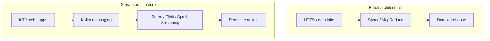

# Processing for Velocity: What Is a Stream?

## 1. Defining a Data Stream

A **stream** is a continuous, unbounded sequence of events that must be processed as they arrive — not after collection is complete. Stream processing is architecturally distinct from batch processing in three fundamental ways.

---

## 2. Three Pillars of Stream Processing

### Pillar 1: Low Latency

In batch systems, waiting hours for results is acceptable. In stream systems, results must be generated in **milliseconds or seconds**.

This enables **immediate automated decisions** — authorising a credit card transaction before the user puts their phone away.

### Pillar 2: Unbounded Data

This is the most important conceptual shift:

| Property | Batch data | Stream data |
|----------|-----------|-------------|
| Boundaries | Has a start and end | No end — continuous flow |
| Size | Finite, known upfront | Infinite, ever-growing |
| Sources | Files, databases | IoT sensors, web logs, clickstreams |
| Processing model | Process entire dataset | Process event-by-event |

A stream is a **continuous flow of events** from sources like IoT sensors or web logs that, for all practical purposes, **never ends**.

### Pillar 3: Actionability

Streams are not designed for storage alone — they are built to be **acted upon the moment an event arrives**:
- Real-time server health monitoring → automatic alert
- E-commerce clickstream → instant product recommendation
- Transaction event → fraud score and block/approve decision

---

## 3. Batch vs Stream: Architectural Comparison

| Dimension | Batch processing | Stream processing |
|-----------|-----------------|-------------------|
| **Data scope** | Bounded, static datasets | Unbounded, continuous events |
| **Latency** | Hours to days | Milliseconds to seconds |
| **Infrastructure** | Commodity clusters, HDFS | Dedicated messaging systems (Kafka) |
| **Complexity driver** | High **volume** of data | High **velocity** + dynamic state |
| **State management** | Process all, then discard | Maintain state while new data flows in |
| **Output** | Reports, models | Triggers, alerts, real-time decisions |

---

## 4. The State Management Challenge

In batch processing, complexity comes from the **high volume** of data. In streaming, the challenge shifts to **high velocity and maintaining dynamic state**.

**Maintaining state** — remembering what happened a few seconds ago while new data is flying in — is one of the biggest challenges in stream engineering.

| State type | Example | Challenge |
|-----------|---------|-----------|
| Per-event | Fraud score for one transaction | Low — stateless |
| Per-window | Average price in last 5 minutes | Medium — windowed state |
| Global | Cumulative sales since year start | High — ever-growing state |
| Per-user | Shopping cart contents | High — keyed state per user |

---

## 5. The Windowing Problem

If a stream is infinite, how do you compute aggregates like sums or averages? You cannot wait for the "end" of the data.

**Solution: windowing** — temporal segmentation that groups events into finite chunks for computation. This is covered in the next topic.

---

## Common Pitfalls / Exam Traps

- **Calling batch data "unbounded"** — batch data is bounded (has start and end); streams are unbounded.
- **Assuming streams don't need storage infrastructure** — Kafka provides persistent, durable event storage; streams are not ephemeral.
- **Ignoring state management complexity** — maintaining dynamic state on infinite data is harder than processing finite batch files.
- **Confusing low latency with high throughput** — streams optimise for latency (speed per event); batch optimises for throughput (total data processed).
- **Using HDFS for stream ingestion** — streams require messaging systems (Kafka), not file systems.

## Quick Revision Summary

- A **stream** is an unbounded, continuous flow of events processed as they arrive
- Three pillars: **low latency** (ms–s), **unbounded data** (no end), **actionability** (triggers on arrival)
- Batch = bounded static data, hours/days latency, HDFS; Stream = unbounded events, ms/s latency, Kafka
- Stream complexity comes from **velocity and dynamic state**, not volume
- **State management** on infinite data is the core engineering challenge
- Streams require **dedicated messaging systems** (Kafka), not commodity file systems
- **Windowing** solves the problem of computing aggregates on infinite streams
- Streams enable immediate decisions: fraud blocking, live monitoring, instant personalisation
