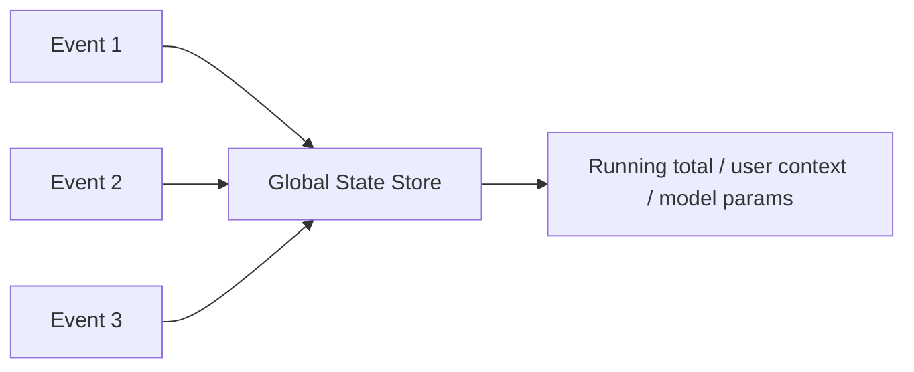
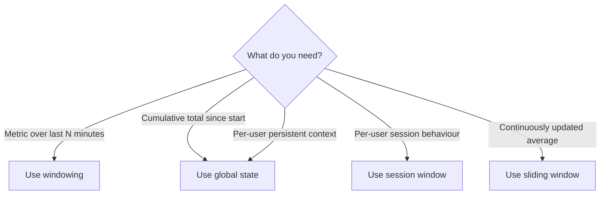

# Technical Differences: Windowing vs Global State

## 1. The Infinite Stream Problem

Streams are unbounded — they never end. Yet applications need to compute metrics like sums, averages, and counts. You cannot wait for the "end" of the data to aggregate.

Two complementary mechanisms solve this: **windowing** (temporal segmentation) and **global state** (persistent memory).

---

## 2. Windowing: Temporal Segmentation

**Windowing** places a frame over a specific section of the timeline to group events for processing. Think of it as slicing infinite time into finite, computable chunks.

```mermaid
timeline
    title Tumbling 5-minute windows
    12:00 : Window 1
    12:05 : Window 2
    12:10 : Window 3
    12:15 : Window 4
```

### Type 1: Tumbling Windows

- **Fixed size, non-overlapping**
- Process data from 12:00–12:05, then clear buffers and start fresh for 12:05–12:10

| Property | Value |
|----------|-------|
| Size | Fixed (e.g. 5 minutes) |
| Overlap | None |
| Buffer behaviour | Cleared after each window |
| Use case | Hourly sales totals, periodic metrics |

### Type 2: Sliding Windows

- **Fixed size, overlapping**
- Example: average price over the last 10 minutes, updated every minute

| Property | Value |
|----------|-------|
| Size | Fixed (e.g. 10 minutes) |
| Slide interval | Shorter than window size (e.g. 1 minute) |
| Overlap | Yes — events appear in multiple windows |
| Use case | Smoother, continuously updated metrics |

### Type 3: Session Windows

- **Dynamic, activity-based**
- Window stays open as long as data is arriving; closes after a gap of inactivity (session timeout)

| Property | Value |
|----------|-------|
| Size | Dynamic — depends on activity |
| Trigger | Gap of inactivity (e.g. 30 minutes no events) |
| Use case | User behaviour during a single website visit |

---

## 3. Window Types Comparison

| Window type | Size | Overlap | Trigger | Example use case |
|------------|------|---------|---------|-----------------|
| **Tumbling** | Fixed | No | Time boundary | Hourly transaction count |
| **Sliding** | Fixed | Yes | Time + slide interval | 10-min moving average, updated every minute |
| **Session** | Dynamic | N/A | Activity gap | Single browsing session analysis |

---

## 4. Global State: Persistent Memory Across the Stream

While windowing looks at **chunks of time**, **global state** maintains a **persistent in-memory store** that grows across the entire lifecycle of the stream.

Unlike windowing, global state **does not clear periodically** — it accumulates.



### Three Critical Uses of Global State

| Use | Description | Why windows fail |
|-----|-------------|-----------------|
| **Running totals** | Cumulative sum of all sales since year start | Window clears data; need persistent accumulator |
| **User context** | Logged-in status, shopping cart, last 5 clicks | Must persist across many events per user |
| **Online ML updates** | Continuously update model parameters as data arrives | Model state must evolve, not reset per window |

**Real-world example:** A recommendation engine needs to know a user's shopping cart contents (global state) AND the average click rate in the last 5 minutes (tumbling window) simultaneously.

---

## 5. Windowing vs Global State: When to Use Which

| Criterion | Windowing | Global State |
|-----------|-----------|-------------|
| Data lifecycle | Cleared periodically | Persists indefinitely |
| Scope | Time-bounded chunk | Entire stream lifetime |
| Memory growth | Bounded per window | Grows with stream |
| Best for | Periodic aggregates, trends | User context, running totals, ML state |
| Complexity | Lower | Higher (state store management) |



---

## 6. Processing Guarantees Preview

With windowing and global state defined, the next concern is **reliability**: how do you ensure data is processed correctly when systems fail? This leads to processing guarantees — exactly-once vs at-least-once.

---

## Common Pitfalls / Exam Traps

- **Using tumbling windows for per-user session analysis** — session windows are activity-based, not time-fixed.
- **Confusing sliding and tumbling windows** — tumbling has no overlap; sliding overlaps by design.
- **Using windows for running totals since year start** — windows clear data; use global state for cumulative metrics.
- **Assuming global state is unlimited** — memory grows with stream; production systems need state store eviction/compaction strategies.
- **Treating windowing and global state as mutually exclusive** — production systems use both simultaneously (e.g., cart contents in global state + click rate in window).

## Quick Revision Summary

- **Windowing** solves aggregation on infinite streams by slicing time into finite chunks
- **Tumbling**: fixed, non-overlapping (e.g. 5-min windows)
- **Sliding**: fixed, overlapping (e.g. 10-min window updated every 1 min)
- **Session**: dynamic, closes after inactivity gap
- **Global state**: persistent in-memory store that never clears — for running totals, user context, online ML
- Use **windows** for time-bounded metrics; **global state** for lifetime accumulators and per-user context
- Production systems combine both: windowed metrics + persistent user state
- Next concern: **processing guarantees** (exactly-once vs at-least-once) for reliability
