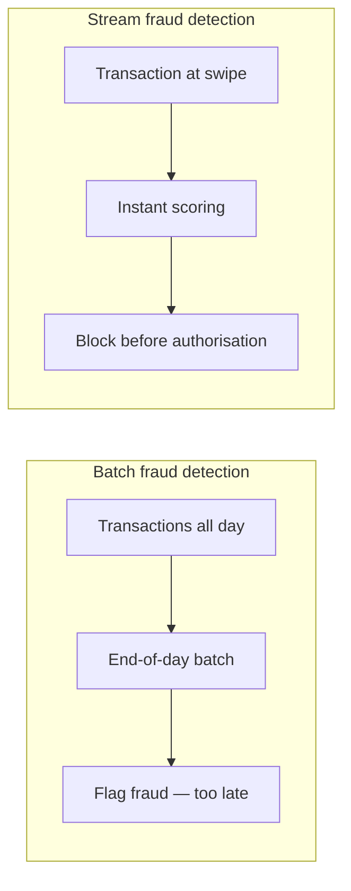
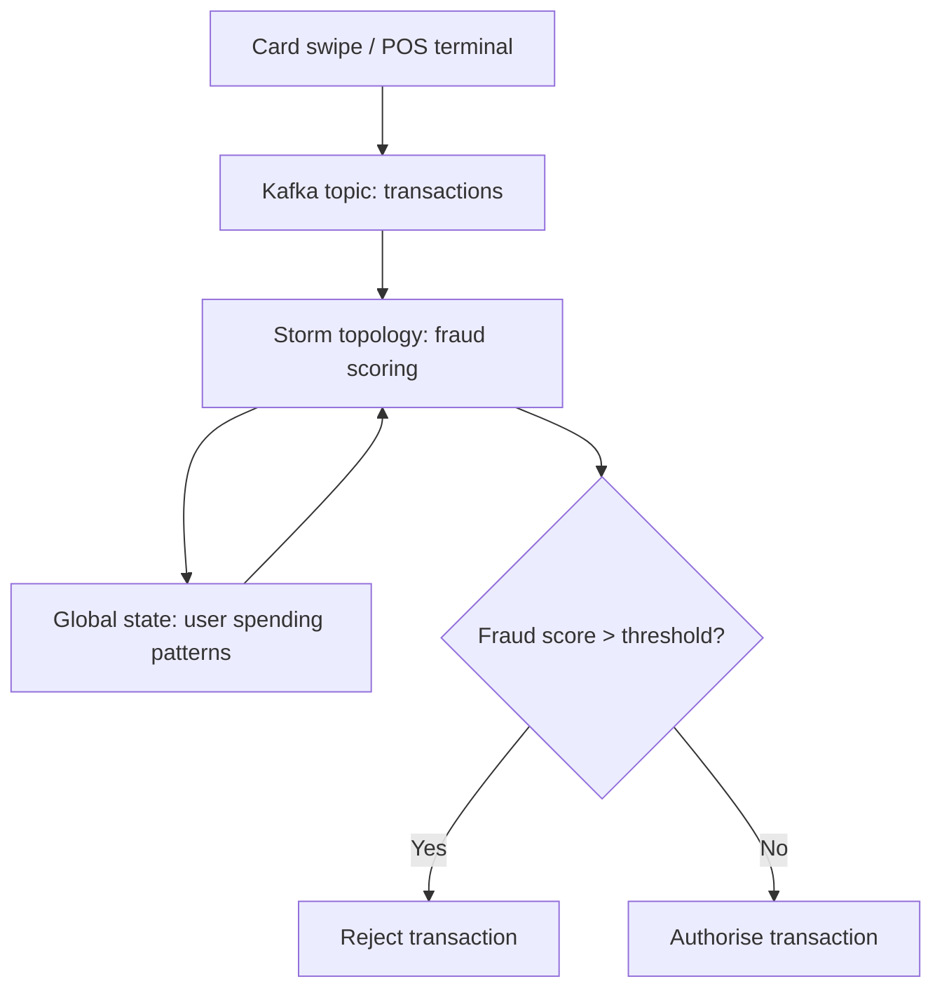

# Financial Services: Real-Time Fraud Detection

## 1. Why Batch Fails for Fraud Detection

In the batch processing world, a bank might analyse card transactions at the end of the day. The problem: by the time the batch job identifies a fraudulent transaction, **the money is gone** and the attacker has moved on.

Stream processing transforms fraud detection from **retrospective analysis** to **preventive action**.

---

## 2. How Real-Time Fraud Detection Works

### Step 1: Instant Scoring

As soon as a card is swiped, the transaction data is streamed into a processing engine. It is immediately scored against the cardholder's **historical patterns** — maintained in global state (spending locations, typical amounts, merchant categories).

### Step 2: Immediate Rejection

If the score indicates high fraud probability — e.g., a large purchase in a country the cardholder has never visited — the system triggers an **immediate rejection** before the transaction is authorised.

| Signal | Risk indicator |
|--------|---------------|
| Unusual location | Purchase in country never visited |
| Amount anomaly | 10× typical transaction size |
| Velocity spike | 5 transactions in 2 minutes |
| Merchant mismatch | Luxury goods from known grocery-only user |

---

## 3. Architecture Requirements

Fraud detection is one of the most demanding streaming use cases:

| Requirement | Target | Why |
|------------|--------|-----|
| **Uptime** | 99.999% | System failure = transactions cannot be processed |
| **Latency** | Sub-second (milliseconds) | Must not slow checkout for legitimate users |
| **Accuracy** | High precision + recall | False positives annoy customers; false negatives lose money |
| **State** | Per-cardholder global state | Historical patterns needed for instant comparison |

---

## 4. Batch vs Stream for Fraud: Comparison

| Aspect | Batch (end-of-day) | Stream (real-time) |
|--------|-------------------|-------------------|
| Detection timing | Hours after fraud | Milliseconds at swipe |
| Money at risk | Full day's losses | Single transaction at most |
| Customer experience | No interruption | Must be invisible to legitimate users |
| Infrastructure | Data warehouse + nightly ETL | Kafka + Storm + in-memory state |
| State management | Historical tables | Global per-user state store |

---

## 5. The Business Case

Fraud detection is about **preventing loss through speed**, not analysing loss after the fact.

**Real-world impact:**
- A bank processing 10 million transactions/day loses an average of $0.07 per transaction to fraud in batch-only systems
- Real-time streaming detection reduces fraud losses by 40–60% by blocking before settlement
- Sub-second latency ensures legitimate customers experience no checkout delay

---

## Common Pitfalls / Exam Traps

- **Claiming batch fraud detection is sufficient** — money is gone before batch identifies fraud.
- **Ignoring latency requirements** — fraud check must complete in milliseconds, not seconds, to avoid slowing checkout.
- **Forgetting global state for historical patterns** — instant scoring requires per-user spending history in memory.
- **Assuming 99.9% uptime is enough** — financial systems require 99.999%; downtime means transactions cannot process.
- **Confusing fraud detection with fraud analytics** — detection is real-time prevention; analytics is retrospective pattern analysis (batch).

## Quick Revision Summary

- Batch fraud detection is **too late** — money is gone before end-of-day analysis
- Stream fraud detection scores transactions **at the moment of swipe**
- Uses **global state** to maintain per-cardholder spending patterns
- High-risk signals: unusual location, amount anomaly, velocity spike
- Architecture requires **99.999% uptime** and **sub-second latency**
- Must not slow checkout experience for legitimate users
- Fraud prevention is about **speed**, not retrospective analysis
- Kafka + Storm + in-memory state store is the typical architecture
