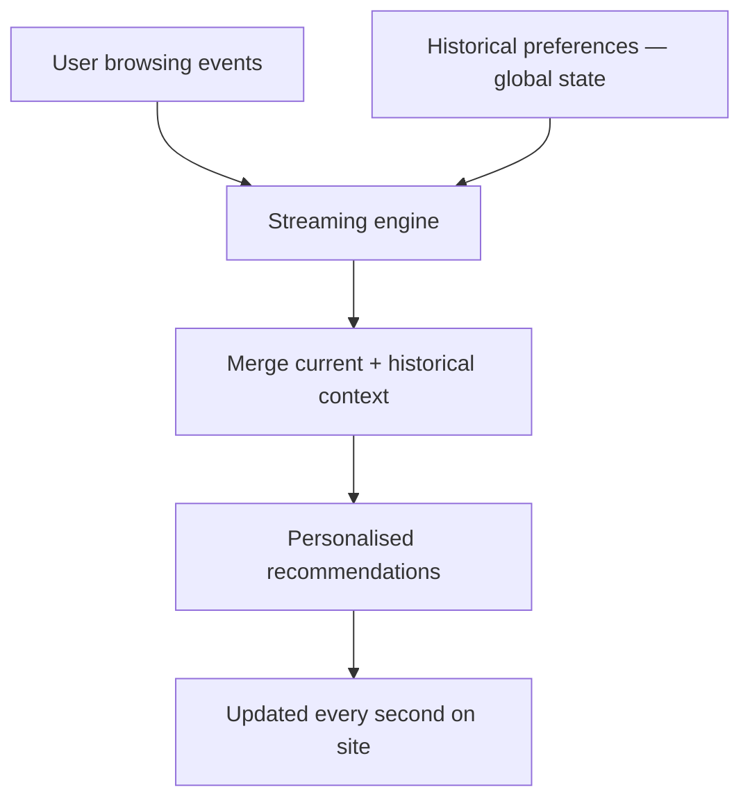

# E-Commerce: Dynamic Pricing and Personalization

## 1. Streaming for Revenue, Not Just Security

While financial services use streaming to **prevent loss**, e-commerce uses it to **actively drive revenue**. E-commerce optimisation through real-time streaming delivers an average **15% revenue lift**.

---

## 2. Dynamic Pricing

In modern marketplaces, prices are no longer static — they respond instantly to supply, demand, and competitor data.

### Surge Pricing

Logistics platforms (Uber, Lyft) use a continuous stream of **location data and ride requests** to adjust prices in real time based on current demand.

| Input stream | Pricing action |
|-------------|---------------|
| High demand in area | Price multiplier increases |
| Low demand / excess drivers | Price returns to baseline |
| Special events nearby | Predictive surge before demand spike |

### Inventory-Based Discounts

Retailers trigger **instant price drops** when sensor or sales data shows stock isn't moving fast enough in a specific region.

### User Intent Scoring

Real-time coupons issued to a customer **while they are still on the site** based on immediate browsing behaviour — not yesterday's visit.

---

## 3. Real-Time Personalization: The Amazon Effect

The goal: match **user intent while they are still browsing**. A recommendation engine that influences purchase decisions cannot rely on what a user liked last week — it must be **near-instant**.

### Contextual Awareness

Real-time personalisation combines two data sources:

| Source | Data | Storage mechanism |
|--------|------|------------------|
| **Current events** | Products viewed right now, clicks, cart additions | Stream (real-time) |
| **Historical context** | Past purchases, preferences, browsing history | Global state (persistent) |

By merging current events with historical context, the streaming engine creates a **unique personalised experience for every user**, updated every second.

---

## 4. Dynamic Pricing vs Personalization

| Aspect | Dynamic pricing | Real-time personalisation |
|--------|----------------|--------------------------|
| Goal | Optimise price point | Optimise product/content shown |
| Input | Supply, demand, inventory | User behaviour + history |
| Output | Price change | Recommendation, coupon, layout |
| Latency | Seconds | Sub-second |
| Revenue impact | Margin optimisation | Conversion rate lift |

---

## 5. Architecting for Individualised Responses

The data scientist's goal is to move past **generic top-seller lists** toward truly individualised real-time responses.

| Generic (batch) | Individualised (stream) |
|----------------|------------------------|
| "Top 10 bestsellers" | "Based on your last 3 clicks, you might like..." |
| Static price for all users | Surge/discount price for this user in this location |
| Weekly email recommendations | In-session coupon while user is browsing |
| Segment-level targeting | Per-user, per-session targeting |

**Real-world example:** Amazon's product recommendation bar updates as you browse — each click triggers a streaming event that recomputes recommendations using your session context (windowed state) and purchase history (global state) within milliseconds.

---

## Common Pitfalls / Exam Traps

- **Using batch recommendations for in-session personalisation** — last week's preferences are irrelevant to current browsing intent.
- **Ignoring global state for historical context** — current events alone are insufficient; past preferences must persist.
- **Confusing dynamic pricing with personalisation** — pricing adjusts the cost; personalisation adjusts the content shown.
- **Assuming 15% revenue lift comes from pricing alone** — personalisation and intent scoring contribute equally.
- **Treating surge pricing as simple threshold rules** — effective surge pricing uses continuous stream of location + demand data.

## Quick Revision Summary

- E-commerce streaming drives **revenue** (15% average lift), not just loss prevention
- **Dynamic pricing**: surge pricing, inventory discounts, user intent coupons — all real-time
- **Personalisation** must be near-instant — based on current browsing, not last week's data
- Combines **current events** (stream) with **historical context** (global state)
- Move from generic top-seller lists to **individualised per-user responses**
- Surge pricing uses continuous location + demand streams (Uber/Lyft model)
- Updated **every second** as user browses — the "Amazon effect"
- Kafka + streaming engine architecture supports both pricing and personalisation pipelines
