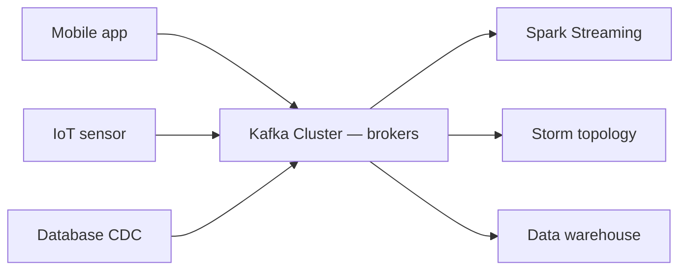
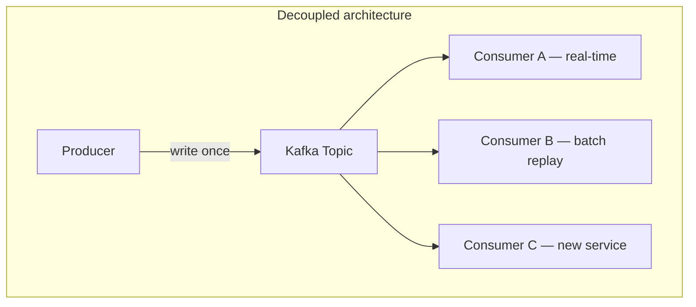

# Kafka as the Streaming Backbone

## 1. The Spaghetti Problem

In a modern data ecosystem, dozens of data sources (web logs, IoT sensors, databases) need to feed dozens of destinations (processing engines, databases, dashboards). Without a backbone, you end up with a **spaghetti of point-to-point connections** — unmaintainable at scale.

**Apache Kafka** solves this by acting as a **persistent, fault-tolerant log of events** between producers and consumers.

---

## 2. Kafka Architecture

### Producers

Applications that **push data into** the system:
- Mobile app sending clickstream events
- Thermometer in a shipping container sending temperature readings
- Database change-data-capture (CDC) streams

### Kafka Cluster (Brokers)

The heart of the system. Kafka does not just pass messages — it **stores them on disk** in a scalable cluster of brokers.

| Property | Benefit |
|----------|---------|
| Disk persistence | Messages survive broker restarts |
| Replication | Copies across brokers for fault tolerance |
| Partitioning | Parallel reads and writes at scale |
| Retention | Consumers can replay historical events |

Because messages are written to disk and replicated, Kafka provides the **durability** required for production streaming. If a processing engine fails, data remains safe in the Kafka broker.

### Consumers

Systems that **read data** to do actual work:
- Spark Streaming job
- Apache Storm topology
- Database sink
- Real-time dashboard

---

## 3. The Decoupling Advantage

The key architectural benefit: Kafka **decouples sources from targets**.

| Without Kafka | With Kafka |
|--------------|-----------|
| Producer must know all consumers | Producer writes to topic; unaware of consumers |
| Consumer must handle producer failures | Consumer reads at its own pace from durable log |
| Adding a new consumer requires producer changes | New consumer subscribes to existing topic |
| No replay capability | Consumers can re-read from any offset |

This decoupling enables scaling real-time intelligence to **millions of events per second**.

---

## 4. Kafka Core Concepts

| Concept | Definition |
|---------|-----------|
| **Topic** | Named category/feed of messages (e.g. `transactions`, `clickstream`) |
| **Partition** | Ordered, immutable sequence of messages within a topic |
| **Offset** | Position of a message within a partition |
| **Broker** | Kafka server that stores topic partitions |
| **Consumer group** | Set of consumers that jointly consume a topic |

**Partitioning for parallelism:** Multiple partitions allow multiple consumers to read in parallel — one consumer per partition for maximum throughput.

---

## 5. Kafka vs Traditional Message Queues

| Aspect | Traditional MQ (RabbitMQ) | Kafka |
|--------|--------------------------|-------|
| Message lifecycle | Deleted after consumption | Retained for configurable period |
| Replay | Not possible | Consumers re-read from any offset |
| Throughput | Thousands/sec | Millions/sec |
| Use case | Task queues, RPC | Event streaming, data pipelines |
| Durability | Variable | Disk-persisted, replicated |

---

## 6. Kafka in the Streaming Pipeline

Kafka is where data **lives while in motion** — the durable backbone between ingestion and processing.

| Layer | Component | Role |
|-------|-----------|------|
| Ingestion | Producers | Push events into Kafka |
| Storage | Kafka brokers | Persist and replicate events |
| Processing | Storm / Flink / Spark Streaming | Transform events into intelligence |
| Action | Downstream systems | Fraud block, price update, recommendation |

**Real-world example:** LinkedIn processes **7 trillion messages/day** through Kafka, feeding real-time analytics, search indexing, and monitoring systems — all decoupled via topics.

---

## Common Pitfalls / Exam Traps

- **Calling Kafka a message queue** — it is an **event log** (messages persist, consumers can replay); traditional queues delete after consumption.
- **Assuming Kafka processes data** — Kafka stores and delivers; processing is done by Storm, Flink, or Spark Streaming.
- **Ignoring partitioning strategy** — poor partitioning causes skew (one partition overloaded, others idle).
- **Confusing topics with partitions** — a topic is split into partitions for parallelism; consumers in a group read one partition each.
- **Forgetting replication for fault tolerance** — production Kafka requires replication factor ≥ 3 for durability.

## Quick Revision Summary

- **Kafka** is the industry-standard streaming backbone — persistent, fault-tolerant event log
- **Producers** push events; **brokers** store on disk with replication; **consumers** read at their own pace
- **Decouples** sources from targets — no spaghetti connections
- Messages **persist** (not deleted after consumption) — consumers can replay from any offset
- Scales to **millions of events per second** via topic partitioning
- Kafka **stores** data in motion; **Storm/Flink** processes it
- Production requires **replication** and careful **partitioning strategy**
- LinkedIn-scale: trillions of messages/day through Kafka topics
