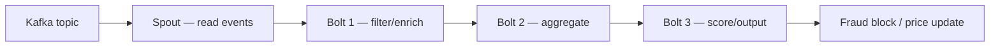
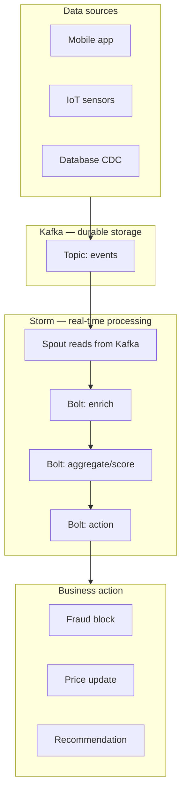

# Real-Time Topology with Apache Storm

## 1. Storage Is Half the Battle

Kafka stores and delivers events reliably. But to drive business value, raw events must be **transformed into intelligence** — fraud scores, price updates, recommendations. This requires a **stream processing engine**.

**Apache Storm** is a distributed real-time computation system designed for ultra-low-latency processing of unbounded data streams.

---

## 2. Storm vs Hadoop: A Fundamental Difference

| Property | Hadoop (MapReduce) | Apache Storm |
|----------|-------------------|--------------|
| Job type | Batch jobs that **finish** | Topologies that **run forever** |
| Data | Bounded datasets | Unbounded streams |
| Latency | Minutes to hours | Milliseconds |
| Execution model | Map → Reduce → Done | Spout → Bolt → Bolt → ... (continuous) |
| Termination | Job completes | Runs until manually killed |

Storm runs **topologies** — permanent networks of processing logic ideal for the unbounded data streams discussed throughout this module.

---

## 3. Core Architecture: Spouts and Bolts



### Spouts

The **sources** of the stream within a Storm topology. A spout typically reads directly from Kafka topics and emits tuples into the topology.

| Responsibility | Detail |
|---------------|--------|
| Data ingestion | Read from Kafka, message queue, or custom source |
| Tuple emission | Convert raw events into Storm tuples |
| Acknowledgement | Track which tuples have been fully processed |

### Bolts

Where the **actual processing** happens. A bolt can:
- Filter data (drop irrelevant events)
- Aggregate data (compute windowed sums)
- Join with external databases (enrich with user profile)
- Invoke ML models (fraud scoring, recommendation)

| Bolt type | Example |
|-----------|---------|
| Filter bolt | Drop events with null fields |
| Aggregation bolt | Compute 5-minute tumbling window average |
| Enrichment bolt | Join transaction with user profile from DB |
| Scoring bolt | Apply ML model for fraud probability |

---

## 4. The Distributed DAG

Storm organises spouts and bolts into a **directed acyclic graph (DAG)** that defines exactly how data flows:

```
Spout (ingestion) → Bolt (transform) → Bolt (aggregate) → Bolt (output)
```

| DAG property | Detail |
|-------------|--------|
| Direction | Data flows one way — spout to bolts |
| Acyclic | No loops — each tuple processed once per path |
| Distributed | Components run in parallel across cluster nodes |
| Scalable | Add more bolt instances to handle higher throughput |

---

## 5. Performance Characteristics

Storm is designed for **high throughput and ultra-low latency**:

| Metric | Storm capability |
|--------|---------------|
| Throughput | Millions of tuples per second across a cluster |
| Latency | Sub-second, often milliseconds |
| Fault tolerance | Automatic replay of failed tuples |
| Scalability | Horizontal — add workers to scale |

**Preferred for:**
- High-frequency trading (microsecond decisions)
- Real-time network monitoring (instant anomaly detection)
- Fraud detection (sub-second scoring at card swipe)

---

## 6. Kafka + Storm: The Complete Pipeline



| Layer | Tool | Role |
|-------|------|------|
| Ingestion | Kafka producers | Push events to topics |
| Storage | Kafka brokers | Durable, replicated event log |
| Processing | Storm topology | Transform events into intelligence |
| Action | Downstream systems | Business decisions in real time |

**Real-world example:** A payment processor uses Kafka to ingest 500K transactions/second and a Storm topology to score each transaction for fraud in under 50ms — blocking fraudulent charges before authorisation completes.

---

## Common Pitfalls / Exam Traps

- **Calling Storm topologies "jobs"** — topologies run permanently until killed; Hadoop jobs finish.
- **Confusing spouts with bolts** — spouts ingest/read data; bolts process/transform data.
- **Assuming Storm stores data** — Storm processes data; Kafka (or another source) provides storage.
- **Ignoring tuple acknowledgement** — Storm's reliability depends on proper ack/fail handling in spouts and bolts.
- **Using Storm for batch analytics** — Storm is for real-time streaming; use Spark/Hadoop for batch.

## Quick Revision Summary

- **Apache Storm** transforms raw Kafka events into real-time intelligence
- Runs **topologies** (permanent processing graphs), not batch jobs
- **Spouts** = stream sources (read from Kafka); **Bolts** = processing (filter, aggregate, score)
- Topology is a **distributed DAG** — data flows spout → bolts → output
- **Ultra-low latency**: millions of tuples/sec, sub-second (often millisecond) response
- Ideal for: high-frequency trading, fraud detection, network monitoring
- **Kafka + Storm** = complete pipeline: durable storage + real-time processing
- Storm processes; Kafka stores — complementary, not competing tools
