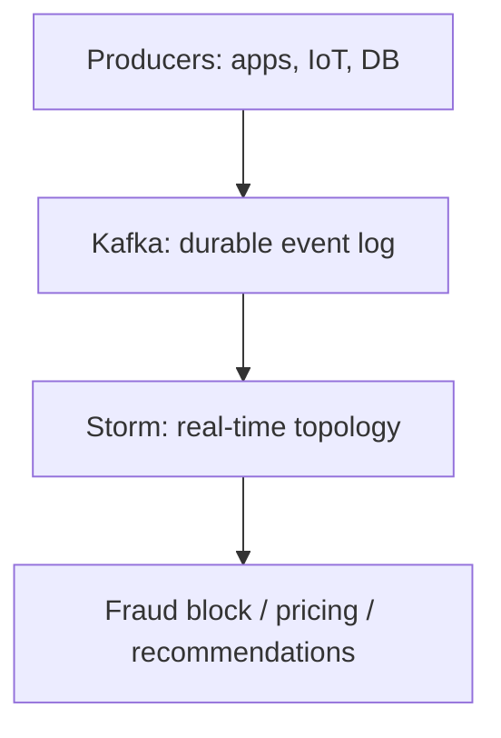
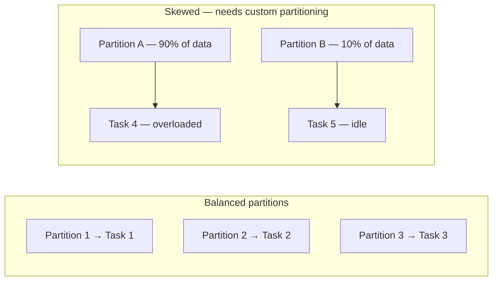

# Module Summary: Stream Processing Systems

## 1. The Paradigm Shift Recap

| Era | Paradigm | Question | Latency |
|-----|----------|----------|---------|
| Historical | Batch processing | What happened yesterday? | Hours to days |
| Modern | Stream processing | What is happening now? | Milliseconds to seconds |

Three drivers: **velocity is the new volume**, operational efficiency through immediate intervention, and competitive advantage from instant response.

---

## 2. Stream Fundamentals

| Pillar | Definition |
|--------|-----------|
| **Low latency** | Results in milliseconds to seconds |
| **Unbounded data** | Continuous flow with no end |
| **Actionability** | Events trigger immediate decisions |

**Windowing** (tumbling, sliding, session) handles time-bounded aggregates. **Global state** handles persistent accumulators, user context, and online ML updates.

---

## 3. Use Cases

| Domain | Application | Key mechanism |
|--------|------------|---------------|
| Financial services | Real-time fraud detection | Instant scoring + global state |
| E-commerce | Dynamic pricing + personalisation | Stream + global state merge |
| Infrastructure | Network monitoring | Storm topology, sub-second alerts |

---

## 4. Architecture Stack

- **Kafka**: persistent, fault-tolerant streaming backbone; decouples producers from consumers
- **Storm**: permanent topologies (spouts + bolts) for ultra-low-latency processing

---

## 5. Partitioning vs Replication

A fundamental distinction for streaming system design:

| Concept | Purpose | Effect |
|---------|---------|--------|
| **Partitioning** | Performance and parallelism | Split data so multiple nodes process simultaneously |
| **Replication** | Availability and fault tolerance | Maintain copies so system survives node failures |

**They solve different problems** — partitioning is about speed; replication is about reliability.

---

## 6. Task Granularity and Performance

In streaming systems, efficiency is tied to how data partitions align with processing tasks:

> **Ideal rule: one partition = one task**

When partitions are balanced, the cluster runs at peak performance. Imbalanced partitions create stragglers — one node overwhelmed while others sit idle.

---

## 7. Partitioning Strategy Selection

| Strategy | Best for | Distribution |
|----------|----------|-------------|
| **Hash partitioning** | High point lookups, deterministic routing | Uniform distribution via hash function |
| **Range partitioning** | Analytical queries on dates, alphabetical order | Data grouped by value ranges |
| **Custom partitioning** | Skewed real-world data | Manual override to fix imbalance |

**Overcoming skew:** Real-world data is rarely perfectly balanced. Custom partitioners solve the straggler problem where one node is overwhelmed by natural data imbalance.

---

## 8. Building Robust Real-Time Systems

Mastering these concepts enables building systems that are:
- **Fast** — millisecond latency via proper partitioning
- **Robust** — fault tolerant via replication
- **Scalable** — parallel via balanced partition-to-task alignment
- **Intelligent** — real-time decisions via Kafka + Storm pipeline

---

## Common Pitfalls / Exam Traps

- **Confusing partitioning with replication** — partitioning = parallelism; replication = fault tolerance.
- **Assuming one partitioning strategy fits all workloads** — hash for point lookups, range for analytical queries.
- **Ignoring data skew** — real-world data is imbalanced; custom partitioners are often necessary.
- **Violating one-partition-one-task rule** — misaligned partitions cause stragglers and idle nodes.
- **Treating stream processing as faster batch** — streams require fundamentally different architecture (Kafka, state management, topologies).

## Quick Revision Summary

- Shift from batch ("what happened?") to stream ("what is happening now?")
- Streams: **low latency**, **unbounded data**, **actionability**
- **Windowing** for time-bounded metrics; **global state** for persistent context
- **Kafka** = durable backbone; **Storm** = real-time processing (spouts + bolts)
- **Partitioning** = parallelism; **Replication** = fault tolerance — different purposes
- **One partition = one task** for peak cluster performance
- **Hash partitioning** for point lookups; **range partitioning** for analytical queries
- **Custom partitioners** fix data skew and straggler problems
- Real-time intelligence defines modern industry leaders in finance, e-commerce, and infrastructure
