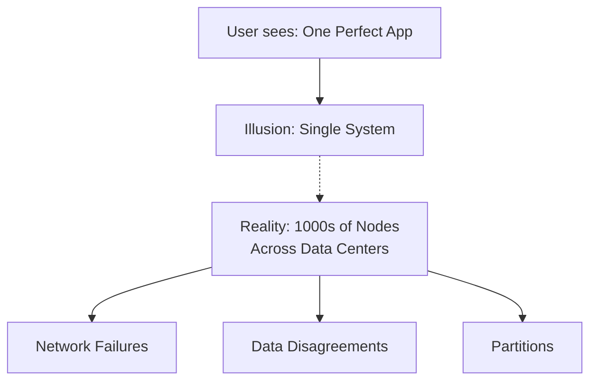
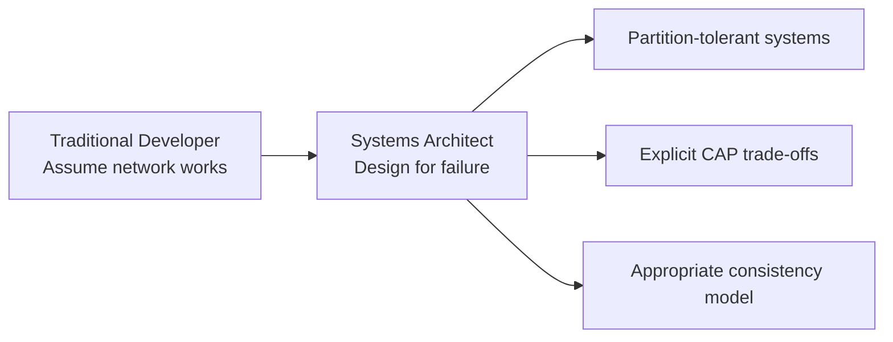

# Distributed Systems Challenges: Module Overview

## The Price of Scaling Out

Module 1 established that horizontal scaling with commodity hardware clusters is the only sustainable path for big data. Module 2 confronts the cost: **scaling out is not free**. Moving from one box to many introduces coordination complexity that every big data professional must master.

---

## The Illusion of a Single System

Banking apps and social media present a seamless experience — balance visible, photos loaded, everything in sync. This is the **single system image**: one perfect machine behind the UI.

In reality, thousands of computers across multiple data centers serve each request. The challenge is maintaining that illusion when:

- Networks fail
- Messages are lost or delayed
- Nodes disagree on data state

**The complexity lives in the space between machines** — wires, routers, and messages over unreliable networks.

---

## Real-World Partition Scenario: Amazon Inventory

| Step | Event |
|------|-------|
| 1 | Customer in New York buys the last pair of sneakers |
| 2 | New York server updates inventory to 0 |
| 3 | New York attempts to notify London server |
| 4 | Undersea cable glitch — message never arrives |
| 5 | Customer in London sees 1 item available and purchases |
| 6 | **Result**: Same item sold twice |

In a single-node system, this is impossible (one database, one truth). In a cluster, it is a **daily reality** without careful design.

---

## Module 2 Learning Objectives

| Concept | Core Question | Outcome |
|---------|---------------|---------|
| **Fallacies of distributed computing** | What false assumptions kill projects? | Design for failure, not perfection |
| **Partition tolerance** | What happens when nodes can't communicate? | P is mandatory in clusters |
| **CAP theorem** | What trade-off is unavoidable? | Choose C or A during partitions |
| **ACID vs BASE** | How is data integrity enforced? | Strict transactions vs eventual consistency |
| **Conflict resolution** | How do divergent copies merge? | LWW, vector clocks, semantic resolution |

---

## The Architectural Mindset Shift

| Mindset | Old Thinking | New Thinking |
|---------|-------------|-------------|
| Network | Reliable wire | Unreliable, will fail |
| Failure | Accident to prevent | Guarantee to design for |
| Consistency | Always perfect | Trade-off with availability |
| System design | Optimize for speed | Optimize for correct trade-off |

---

## Module Roadmap

1. **Fallacies** — dangerous assumptions about networks
2. **Partitions** — when communication breaks between node groups
3. **CAP theorem** — consistency vs availability under partition
4. **CP vs AP systems** — banking vs social media
5. **ACID** — strict rules for traditional databases
6. **BASE** — relaxed model for massive scale
7. **Conflict resolution** — merging divergent data after partition heals

---

## Common Pitfalls / Exam Traps

- Believing scaling out only adds **hardware complexity** — the real cost is **logical coordination**
- Assuming the single system image is maintained automatically — it requires deliberate consistency protocols
- Thinking network failures are rare — at scale (1000 nodes), failure is **statistically guaranteed**
- Confusing this module with hardware topics — Module 2 is about **software coordination theory**
- Underestimating CAP theorem — it is a **fundamental law**, not a guideline

---

## Quick Revision Summary

- Scaling out trades hardware limits for coordination complexity
- Single system image is an illusion maintained by distributed protocols
- Amazon inventory example: network partition → double sale
- Module covers: fallacies, partitions, CAP, ACID vs BASE, conflict resolution
- Mindset shift: design for failure, not for perfect networks
- Goal: think like a systems architect, not a single-machine developer
