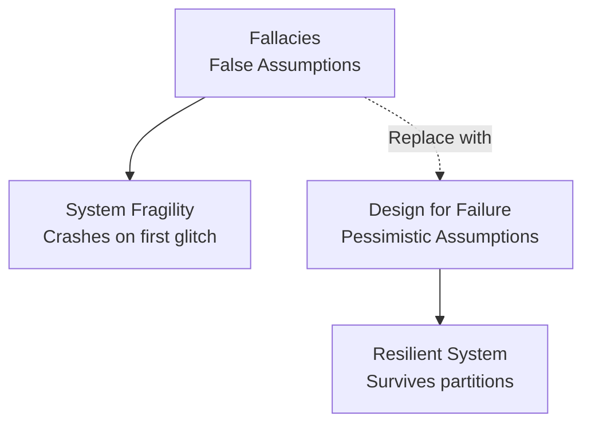

# The Fallacies of Distributed Computing

## Why Big Data Projects Fail Before They Start

Many distributed systems fail because developers apply single-machine intuition to clusters. The **fallacies of distributed computing** are a list of assumptions that feel like common sense but are dangerous lies in distributed environments. Identifying them is the first step toward designing resilient systems.

---

## The Core Problem

On a laptop, saving a file to a local disk works 99.999% of the time. In a cluster, every operation crosses **wires, routers, and switches** — each a potential failure point. Code that assumes perfection crashes at the first glitch.

**Design principle**: Be a constructive pessimist — assume the network will fail, latency will be high, and bandwidth will be limited.

---

## Fallacy 1: The Network Is Reliable

### The Myth
Messages sent between nodes always arrive intact and on time.

### The Reality
- Cables accidentally unplugged
- Switches overheat and drop packets
- Routers reboot mid-transmission
- Undersea cables damaged

**Analogy**: A delivery truck during a rainstorm — roads flood, traffic lights fail, the truck cannot reach its destination.

### Design Response
- Expect message loss; implement retries with idempotency
- Use heartbeat mechanisms to detect dead nodes
- Build timeout and circuit-breaker patterns

---

## Fallacy 2: Latency Is Zero

### The Myth
Remote operations are as fast as local memory access.

### The Reality
**Latency** is the round-trip time for a request-response between nodes.

| Operation | Approximate Latency |
|-----------|---------------------|
| L1 cache access | Nanoseconds |
| RAM access | ~100 nanoseconds |
| Same-datacenter network | ~0.5 milliseconds |
| Cross-continent network | ~100+ milliseconds |

**Analogy**: Asking someone in the same room for a pen (instant) vs sending a letter across the country (days).

### Design Response
- Minimize cross-node communication
- **Data locality**: compute where data resides
- Batch operations to amortize latency

---

## Fallacy 3: Bandwidth Is Infinite

### The Myth
Fiber optics mean unlimited data transfer capacity.

### The Reality
**Bandwidth** is the volume of data transferable per unit time. Even the largest pipe has finite capacity.

**Analogy**: A giant water pipe — no matter how wide, pushing the entire ocean through it at once will burst it.

In big data, moving a petabyte across the network for a simple calculation **clogs the entire cluster**. This is why data locality (Module 1) is non-negotiable.

### Design Response
- Never ship full datasets across the network
- Filter and aggregate locally before transfer
- Minimize shuffle data in MapReduce/Spark

---

## Additional Fallacies (Summary)

| # | Fallacy | Reality |
|---|---------|---------|
| 4 | The network is secure | Networks are constantly attacked; encryption and auth required |
| 5 | The topology doesn't change | Servers added/removed daily; topology is dynamic |
| 6 | There is one administrator | Multiple teams manage different network segments |
| 7 | Transport cost is zero | Every byte transferred has latency and bandwidth cost |
| 8 | The network is homogeneous | Mixed hardware, protocols, and configurations |

---

## Impact on System Design

| Assumption | Consequence if Wrong | Correct Design |
|------------|---------------------|----------------|
| Network reliable | Crash on packet loss | Retries, heartbeats, timeouts |
| Latency zero | Sequential remote calls | Data locality, batching |
| Bandwidth infinite | Network congestion | Minimize data movement |
| Topology static | Broken routing | Service discovery, dynamic config |

---

## Connection to Partition Tolerance

The fallacies directly motivate **partition tolerance** (next topic):

- If the network is unreliable (Fallacy 1) → partitions **will** occur
- If latency is non-zero (Fallacy 2) → nodes will be temporarily out of sync
- If bandwidth is finite (Fallacy 3) → nodes cannot instantly reconcile state

Therefore, distributed systems must be designed to **continue operating** when communication breaks — partition tolerance is not optional.

---

## Common Pitfalls / Exam Traps

- Listing only 3 fallacies — exams may ask for the full set (8 fallacies by Peter Deutsch / James Gosling)
- Confusing **latency** (time per operation) with **bandwidth** (volume per time) — they are distinct
- Believing data locality is a MapReduce-specific trick — it directly addresses Fallacies 2 and 3
- Stating "use faster network" as the solution — at petabyte scale, **avoiding network transfer** is the only viable approach
- Forgetting that fallacies apply to **all** distributed systems, not just big data

---

## Quick Revision Summary

- Fallacies = dangerous assumptions that single-machine developers make
- #1 Network reliable → false; design for message loss
- #2 Latency zero → false; remote calls take milliseconds+
- #3 Bandwidth infinite → false; petabyte transfers clog networks
- Solution: data locality, retries, heartbeats, minimize cross-node traffic
- Fallacies motivate partition tolerance as a mandatory design requirement
- Successful architects assume failure, not perfection
