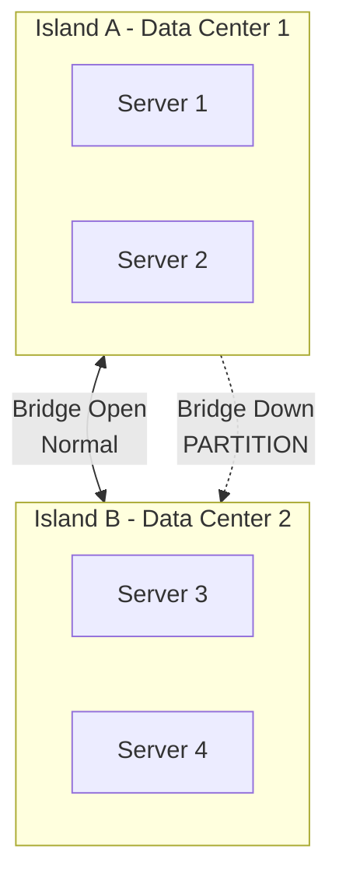
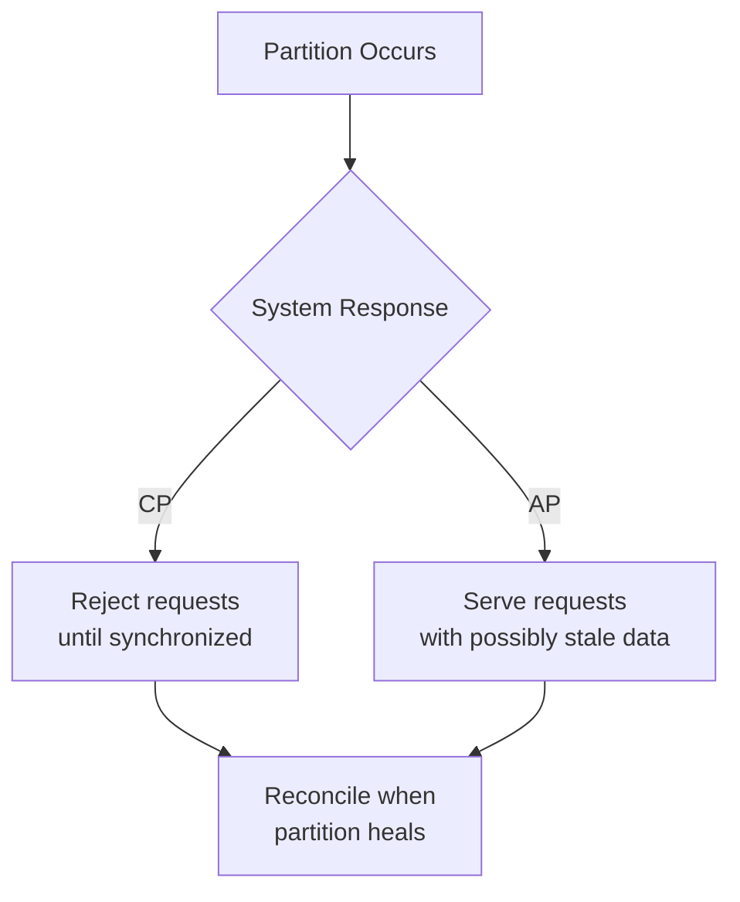

# Network Partitions and Partition Tolerance

## When Communication Breaks

A **network partition** occurs when nodes in a distributed system cannot communicate with each other — messages are dropped, delayed, or never delivered. Partitions are not rare edge cases; at cluster scale they are **statistical guarantees**.

---

## 1. What Is a Network Partition?

### The Island Analogy

Two groups of servers on separate "islands" normally communicate via a bridge. When the bridge collapses or fog blocks visibility, the islands are **partitioned** — each group continues operating but cannot coordinate with the other.

### Formal Definition

**Partition tolerance (P)**: The ability of a system to continue operating even when an arbitrary number of messages are dropped or delayed between nodes.

In simpler terms: if the bridge is down, can both islands still do their jobs, or does the entire world stop?

---

## 2. Real-World Partition Example: ATM Network

An ATM in a neighborhood loses connection to the bank's central headquarters in another city. This is a partition.

| System Type | Behavior During Partition |
|-------------|--------------------------|
| Non-partition-tolerant | ATM freezes, displays error, customer cannot transact |
| Partition-tolerant | ATM continues operating with local rules; reconciles when connection restores |

A partition-tolerant system **expects** the bridge will break and has a plan for when it does.

---

## 3. Partition Tolerance Is Mandatory

### Why P Is Not Optional

| Cause of Partition | Frequency at Scale |
|--------------------|-------------------|
| Hardware failure | Daily (1000 nodes → ~1 failure/day) |
| Router reboot | Weekly |
| Undersea cable cut | Rare but catastrophic |
| Data center network misconfiguration | Occasional |

In single-node computing, partitions don't exist. In a cluster spread across machines (and data centers), partitions **will happen**.

$\text{Big data cluster} \Rightarrow \text{Partitions are inevitable} \Rightarrow P \text{ is required}$

### Consequence of Ignoring P

A system that is not partition-tolerant will experience **catastrophic failure** — the entire global application freezes when a single wire is unplugged in one data center.

---

## 4. The Trade-Off: What Must Be Sacrificed?

When a partition occurs and Island A updates data while Island B cannot see the change:

1. Island A has version $v_1$
2. Island B still has version $v_0$
3. When the bridge repairs, they disagree

**How this disagreement is handled** defines the system's consistency model. This is the heart of the **CAP theorem**:

- Sacrifice **consistency** → stay available with stale data (AP)
- Sacrifice **availability** → refuse to serve until synchronized (CP)

---

## 5. Partition vs Failure

| Concept | Scope | Example |
|---------|-------|---------|
| **Node failure** | One machine dies | Worker node crash; task reassigned |
| **Network partition** | Groups of machines isolated | US-East and US-West cannot communicate |
| **Total outage** | Entire system down | All data centers offline |

Partition tolerance addresses the middle case — **partial** communication failure where some nodes remain operational but disconnected.

---

## Common Pitfalls / Exam Traps

- Treating partition tolerance as **optional** — in distributed clusters, P is a **requirement**, not a choice
- Confusing **partition** with **node failure** — a node can fail without partitioning the network; a partition can occur without any node dying
- Believing partitions are rare — at 1000+ nodes, they are **expected events**
- Stating P means "no data loss during partition" — P means the system **continues operating**; data consistency is a separate CAP trade-off
- Forgetting that partition tolerance leads directly to the **CAP theorem** — the next logical topic

---

## Quick Revision Summary

- Network partition = break in communication between node groups
- Partition tolerance (P) = system continues operating during partition
- ATM example: partition-tolerant systems handle disconnected nodes gracefully
- P is mandatory in big data clusters — not optional
- Partitions cause data divergence between isolated groups
- Resolving divergence = CAP theorem trade-off (consistency vs availability)
- Foundation for understanding CP vs AP system design
