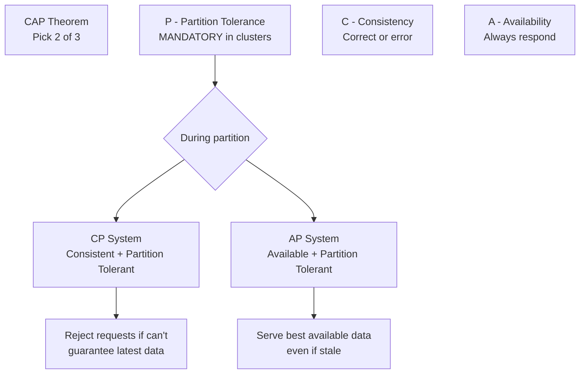

# The CAP Theorem: Consistency, Availability, and Partition Tolerance

## The Golden Rule of Distributed Systems

Proposed by Eric Brewer, the CAP theorem states a fundamental law: in a distributed system, you can provide **at most 2 of 3 guarantees** simultaneously during a network partition. Because partitions are inevitable in clusters, the real choice is always between **C** and **A**.

---

## The Three Guarantees Defined

### C — Consistency

**Definition**: Every read request receives the **most recent write** or an error.

**Analogy**: A group text message. If you send "lunch at 1:00 PM," a friend checking one second later **must** see "1:00 PM" — not an older "12:00 PM" message.

| Property | Behavior |
|----------|----------|
| Read sees latest write | Guaranteed |
| Stale data served | Never — returns error instead |
| Priority | Correctness over uptime |

**Consistency is about being correct.**

---

### A — Availability

**Definition**: Every request receives a **non-error response**, without guaranteeing it reflects the most recent write.

**Analogy**: Checking a cricket match score online. The server always returns a score — even if it's from 5 minutes ago because the live feed connection dropped.

| Property | Behavior |
|----------|----------|
| Request always answered | Guaranteed |
| Answer may be stale | Acceptable |
| Priority | Uptime over perfect correctness |

**Availability is about being fast and always on.**

---

### P — Partition Tolerance

**Definition**: The system continues operating even when messages are dropped or delayed between nodes.

| Property | Behavior |
|----------|----------|
| Operates during network break | Guaranteed |
| Optional in clusters | **No** — mandatory |
| Root cause | Unreliable networks (fallacies) |

**Partition tolerance is about being resilient.**

---

## The CAP Trade-Off

### Why Only 2 of 3?

During a partition, nodes in Group A and Group B cannot communicate:

1. A write occurs on Group A
2. Group B cannot see the write
3. A read on Group B would return **stale data**

The system must choose:
- **Refuse the read** (Consistency) → system appears down to Group B users
- **Serve stale data** (Availability) → system stays up but incorrect

$\text{During partition: } C \uparrow \Rightarrow A \downarrow \quad \text{or} \quad A \uparrow \Rightarrow C \downarrow$

---

## Summary Table

| Letter | Meaning | Analogy | Priority |
|--------|---------|---------|----------|
| **C** | Consistency | Group text shows latest message | Correctness |
| **A** | Availability | Cricket score always displayed | Uptime |
| **P** | Partition tolerance | System works when bridge is down | Resilience |

| Combination | Viable in Clusters? | Example |
|-------------|---------------------|---------|
| **CP** | Yes | Banking, inventory |
| **AP** | Yes | Social media, analytics |
| **CA** | No (partitions happen) | Single-node databases only |
| **CAP all three** | **Impossible** during partition | — |

---

## The Key Question

When a partition occurs:

> Do you choose to be **consistent** (perfect truth or nothing)?
> Or **available** (whatever answer you have, so the user isn't stuck)?

Because P is non-negotiable in distributed clusters, this is the **only** meaningful design decision.

---

## Common Pitfalls / Exam Traps

- Stating you can have **all three** during a partition — CAP explicitly forbids this
- Confusing **CAP Consistency** with **ACID Consistency** — CAP consistency means "reads see latest write"; ACID consistency means "data satisfies integrity rules"
- Believing **CA systems** exist in distributed clusters — CA only works without partitions (single-node)
- Thinking CAP is a runtime toggle — it's an **architectural design choice** made at system design time
- Forgetting that P is **mandatory** — the exam question is always CP vs AP, never "do we need P?"

---

## Quick Revision Summary

- CAP: pick 2 of 3 — Consistency, Availability, Partition Tolerance
- C = every read gets latest write or error (correctness)
- A = every request gets a response, possibly stale (uptime)
- P = system works during network partition (resilience)
- P is mandatory in clusters → real choice is CP vs AP
- CA systems only possible without partitions (single-node)
- CAP consistency ≠ ACID consistency — different definitions
