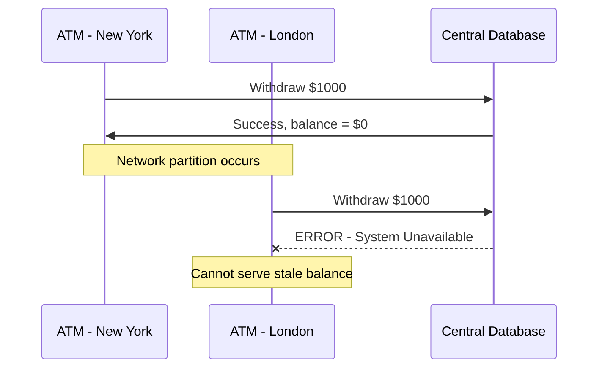
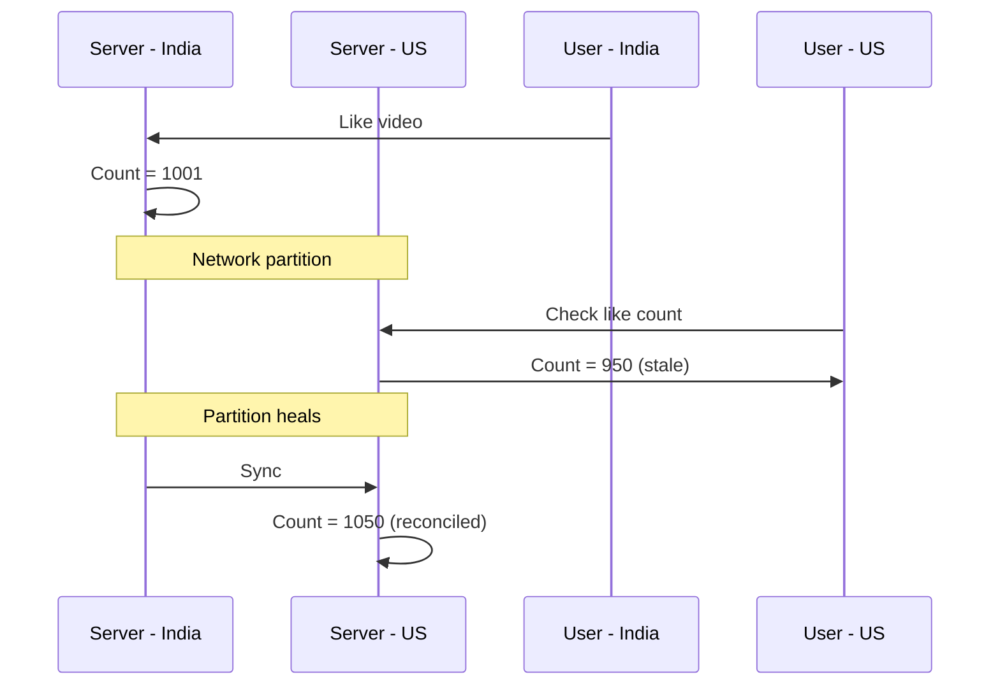
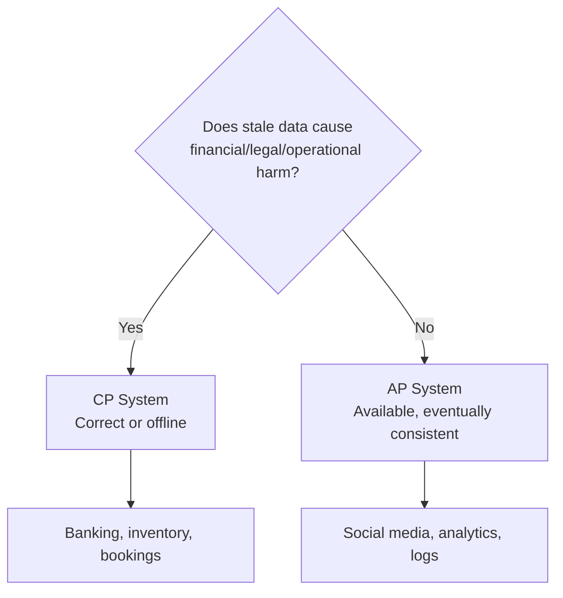

# CP vs AP Systems: Choosing the Right Trade-Off

## The Architect's Dilemma

Because partition tolerance is mandatory in distributed clusters, every system must choose between **CP** (Consistency + Partition Tolerance) and **AP** (Availability + Partition Tolerance) during a network break. The correct choice depends entirely on the **business problem**, not on technology preferences.

---

## CP Systems: Consistency Over Availability

### Behavior During Partition

When nodes cannot communicate, a CP system **refuses to serve requests** rather than return potentially stale data.

### Banking Example

| Event | CP System Response |
|-------|-------------------|
| Withdraw $1000 in New York | Balance updated to $0 on NY server |
| Spouse attempts withdrawal in London during partition | London ATM shows **"System Unavailable"** |
| Why? | Bank cannot guarantee both servers know the exact balance |

**Principle**: A bank would rather be **offline** than **wrong**. Financial integrity outweighs 100% uptime.

### When to Choose CP

| Domain | Why CP |
|--------|--------|
| Banking / financial transactions | Stale balance = financial loss |
| Inventory management | Overselling = customer dissatisfaction + logistics cost |
| Legal records | Incorrect records = compliance violation |
| Booking systems (flights, hotels) | Double-booking = operational chaos |

---

## AP Systems: Availability Over Consistency

### Behavior During Partition

When nodes cannot communicate, an AP system **continues serving requests** with the best locally available data, even if stale.

### Social Media Example

| Event | AP System Response |
|-------|-------------------|
| User in India likes a video | Local count increments to 1001 |
| User in US checks count during partition | Sees 950 (stale local copy) |
| Partition heals | Servers reconcile to 1050 |

**Principle**: Being fast and always on matters more than being perfectly accurate every microsecond.

### When to Choose AP

| Domain | Why AP |
|--------|--------|
| Social media (likes, views) | Slightly stale count acceptable |
| Analytics / logging | Approximate counts sufficient |
| Sensor data / IoT | Continuous ingestion > perfect accuracy |
| Content delivery (CDNs) | Serve cached content during outage |
| Search indexes | Stale results better than no results |

---

## Decision Framework

| Criterion | CP | AP |
|-----------|----|----|
| Stale data acceptable? | Never | Temporarily yes |
| User sees error during partition? | Yes | No |
| Reconciliation after partition? | Automatic (was offline) | Eventual consistency |
| Trust type | Trust in correctness | Trust in responsiveness |
| Example systems | HBase, ZooKeeper, traditional RDBMS | Cassandra, DynamoDB, CouchDB |

---

## Managing User Trust

The architect isn't just managing servers — they're managing **user trust**:

| System Type | User Expectation | Trust Model |
|-------------|-----------------|-------------|
| CP (banking) | "My balance is always exact" | Trust through accuracy |
| AP (social media) | "The app never feels broken" | Trust through responsiveness |

---

## Common Pitfalls / Exam Traps

- Choosing AP for banking because "users hate downtime" — financial **incorrectness** is worse than brief unavailability
- Choosing CP for analytics dashboards — approximate real-time counts are acceptable; CP would cause unnecessary outages
- Stating CP systems never reconcile — they go offline during partition, then serve correct data once healed
- Believing AP means "no consistency ever" — AP means **eventual** consistency after partition heals
- Forgetting that the choice is **per operation/feature**, not per entire company — Netflix uses CP for billing, AP for recommendations

---

## Quick Revision Summary

- CP: consistent or offline during partition (banking, inventory)
- AP: available with stale data during partition (social media, analytics)
- Banking: London ATM shows error rather than stale balance
- YouTube likes: slightly wrong count OK; button must always work
- Choose CP when stale data causes financial/legal harm
- Choose AP when responsiveness matters more than perfect accuracy
- CAP framework helps decide which user trust model to prioritize
