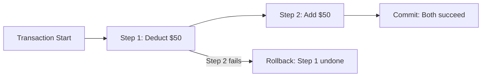

# ACID Properties in Distributed Contexts

## The Gold Standard for Data Integrity

ACID is a set of four properties that traditional relational databases enforce to guarantee data is never corrupted. For decades, ACID has been the foundation of banking, airline bookings, and any system where **the truth must be exact**.

---

## The Four ACID Properties

### A — Atomicity

**Definition**: A transaction is indivisible — either **all** operations succeed or **none** do.

**Analogy**: Transferring $50 to a friend involves two steps:
1. Deduct $50 from your account
2. Add $50 to friend's account

If power fails after step 1 but before step 2, the $50 must not vanish. Atomicity guarantees **all or nothing**.

| Outcome | Atomicity Guarantee |
|---------|---------------------|
| Both steps succeed | Committed |
| Any step fails | All steps rolled back |
| Partial completion | **Impossible** |

---

### C — Consistency

**Definition**: A transaction moves the database from one **valid state** to another valid state, obeying all defined rules.

**Note**: This is **ACID Consistency** (integrity constraints), not **CAP Consistency** (reads see latest write). They are different concepts.

| Rule Example | Consistency Enforcement |
|--------------|------------------------|
| Balance cannot be negative | Reject overdraft transaction |
| Age must be positive integer | Reject invalid insert |
| Foreign key must exist | Reject orphan record |

---

### I — Isolation

**Definition**: Concurrent transactions execute as if they were **serialized** — one at a time — even when running in parallel.

**Scenario**: Two people withdraw the last $100 from a joint account simultaneously.

| Without Isolation | With Isolation |
|-------------------|----------------|
| Both read balance = $100 | Transaction 1 locks, reads $100 |
| Both deduct $100 | Transaction 1 deducts → balance = $0 |
| Both succeed → balance = -$100 | Transaction 2 waits, then fails (insufficient funds) |

Isolation levels (Read Uncommitted → Serializable) control how strictly this is enforced.

---

### D — Durability

**Definition**: Once a transaction is committed, it **persists permanently** — even if the server crashes one second later.

| Storage | Durability |
|---------|------------|
| RAM only | Lost on crash |
| Committed to disk (WAL) | Survives crash, power loss |

The write-ahead log (WAL) ensures committed data survives any failure except total disk destruction.

---

## ACID Summary Table

| Property | Meaning | Guarantees | Failure Mode Prevented |
|----------|---------|------------|----------------------|
| **A** Atomicity | All or nothing | Complete transaction or full rollback | Partial updates, lost money |
| **C** Consistency | Valid state transitions | Business rules enforced | Invalid data (negative balance) |
| **I** Isolation | Serialized execution | No interference between concurrent transactions | Race conditions, dirty reads |
| **D** Durability | Permanent commit | Survives crashes | Data loss after commit |

---

## Why ACID Is Hard at Big Data Scale

ACID requires **massive coordination** across a global cluster:

| ACID Property | Distributed Cost |
|---------------|-----------------|
| Atomicity | Two-phase commit across nodes |
| Consistency | Global constraint checking |
| Isolation | Distributed locking |
| Durability | Synchronous replication to multiple nodes |

This coordination creates the **network tax** — nodes must communicate extensively, slowing the system dramatically.

$\text{ACID at scale} \Rightarrow \text{High coordination overhead} \Rightarrow \text{Low throughput}$

| System Scale | ACID Feasibility |
|--------------|-----------------|
| Single-node RDBMS | Full ACID, excellent performance |
| Small cluster (few nodes) | ACID with performance penalty |
| Global cluster (1000+ nodes) | ACID impractical for most workloads |

**Domains that still demand ACID**: Financial services, inventory management, legal record keeping — anywhere accuracy is non-negotiable.

---

## ACID vs CAP Consistency

| Term | Definition | Context |
|------|------------|---------|
| ACID Consistency | Data satisfies integrity constraints | Transaction design |
| CAP Consistency | Reads return most recent write | Distributed replication |

Exam questions frequently conflate these — they are **different concepts**.

---

## Common Pitfalls / Exam Traps

- Confusing **ACID Consistency** with **CAP Consistency** — most common exam trap
- Believing ACID scales easily to 1000-node clusters — coordination overhead makes it impractical for most big data workloads
- Stating atomicity means "one operation" — it means a **group** of operations is indivisible
- Forgetting **durability** requires disk persistence, not just RAM
- Assuming isolation means transactions literally run one at a time — they may run concurrently but **appear** serialized

---

## Quick Revision Summary

- ACID: Atomicity, Consistency, Integrity constraints, Isolation, Durability
- Atomicity: all-or-nothing; rollback on any failure
- Consistency (ACID): valid state transitions; business rules enforced
- Isolation: concurrent transactions don't interfere
- Durability: committed data survives crashes (WAL + disk)
- ACID is gold standard for banking/inventory but expensive at cluster scale
- ACID Consistency ≠ CAP Consistency — know both definitions
