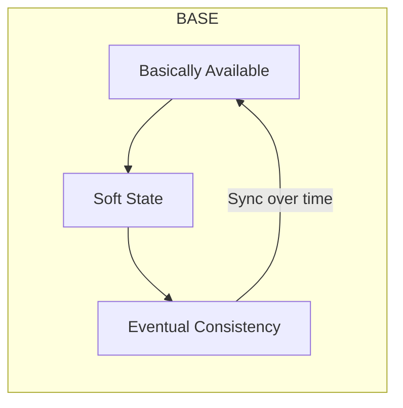
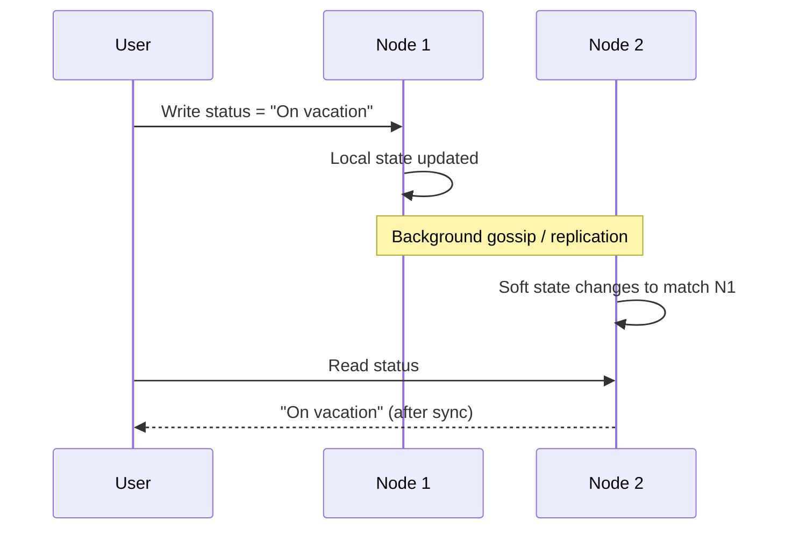
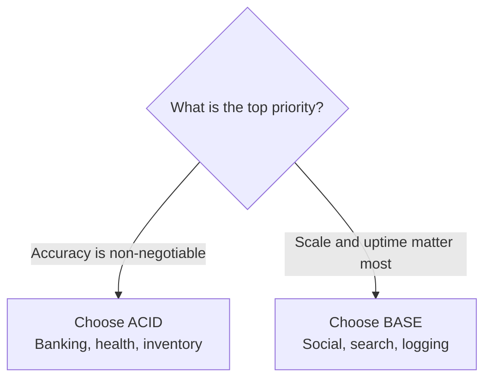

# BASE: Basically Available, Soft State, Eventual Consistency

## Why Strict ACID Breaks at Global Scale

ACID enforces a strict, rule-following model that keeps financial records exact. Maintaining that level of perfection across a global cluster of thousands of machines is **incredibly difficult and slow**. At the scale of social networks, search engines, and analytics pipelines, a different philosophy is required — one that prioritizes **flexibility and speed** over instantaneous correctness.

If ACID is a high-security bank vault, **BASE** is a busy neighborhood park: open, active, and occasionally messy — but it eventually settles down.

---

## The Three Properties of BASE

| Property | Core Idea | User Experience |
|----------|-----------|-----------------|
| **B** — Basically Available | Serve *some* data rather than nothing | Slightly stale page beats a crash |
| **S** — Soft State | State can change without new user input | Background sync updates replicas |
| **E** — Eventual Consistency | All nodes agree on the last value *eventually* | Temporary disagreement, then convergence |

---

## B — Basically Available

In an ACID system, a network glitch may return an **error page** because the system cannot guarantee perfect data. A basically available system says: *I'd rather give you some data than nothing at all.*

### Social Profile Example

You view a friend's profile on a social network. The server holding the latest status update is temporarily down.

| System Type | Behavior |
|-------------|----------|
| Strict consistency | Error page — system unavailable |
| Basically available | Shows last known update from 5 minutes ago |

The system stays **available** even when data is not 100% current. For the user, a slightly old status is far better than a system crash.

### Why This Matters at Scale

Serving cached or replica data keeps request latency low and avoids cascading failures when one shard is unreachable. Availability becomes a **first-class guarantee**, not a side effect of perfect synchronization.

---

## S — Soft State

In the ACID world, data state is **hard** — it changes only when you explicitly write to it. In the BASE world, data is in **soft state**: the system's view can change over time **even without new user input**.

### What Causes Soft State?

Different servers in a cluster constantly communicate behind the scenes to synchronize. One server may discover an update from another and change its local copy to match. In a BASE system, data is **consistently flowing toward the truth** rather than locked in place.

Soft state is not corruption — it is an **intermediate phase** on the path to convergence.

---

## E — Eventual Consistency

The most famous part of BASE: if **no new updates** are made to a piece of data, **eventually** all nodes in the cluster will agree on the last value.

### Like Counter Example

You click "like" on a photo. Your friend in London sees 1,000 likes; you see 1,001 for a few seconds. The system is temporarily inconsistent. Within a minute, the London server catches up and everyone sees 1,001.

$\text{No new writes} \Rightarrow \text{All replicas converge to the same value}$

This is not a bug — it is a **deliberate trade-off** that allows systems to scale to billions of users without grinding to a halt.

### Where Eventual Consistency Excels

| Domain | Why BASE Fits |
|--------|---------------|
| Social media feeds | Stale likes/views acceptable for seconds |
| Search indexes | Index lag of minutes is tolerable |
| Analytics / logging | Approximate counts sufficient for dashboards |
| CDN edge caches | Eventual sync from origin is standard |

---

## ACID vs BASE: The Architect's Decision

| Dimension | ACID | BASE |
|-----------|------|------|
| Priority | Accuracy | Scalability and availability |
| Consistency | Immediate, strict | Eventual |
| Availability during faults | May reject requests | Stays online with stale data |
| Write latency | Higher (coordination) | Lower (local writes) |
| Scale ceiling | Limited by coordination | Billions of users |
| Typical domains | Money, health records, inventory | Social media, search, analytics |

**Choose ACID** when accuracy is the top priority — money, health records, inventory counts that must never drift.

**Choose BASE** when scalability and availability are the top priorities — social media analytics, search, recommendation feeds.

---

## Common Pitfalls / Exam Traps

- Treating **eventual consistency** as "never consistent" — it guarantees convergence when writes stop, not permanent disagreement
- Confusing **soft state** with data corruption — soft state is temporary divergence during background sync
- Assuming BASE means **no consistency guarantees** — eventual consistency is still a formal guarantee, just weaker than linearizability
- Applying BASE to **financial transfers** — double-spend risk makes ACID mandatory
- Believing **basically available** means 100% uptime with perfect data — it explicitly allows stale reads
- Forgetting that BASE is the natural companion of **AP systems** in the CAP theorem

---

## Quick Revision Summary

- BASE trades strict ACID guarantees for scale, speed, and availability
- **B** (Basically Available): serve stale data rather than error pages
- **S** (Soft State): replicas change via background sync without new user writes
- **E** (Eventual Consistency): all nodes agree on the last value if writes stop
- Like counters and search indexes are classic eventual-consistency use cases
- ACID for money/health/inventory; BASE for social/search/analytics
- BASE pairs naturally with AP system design under CAP
- Soft state is flowing toward truth, not permanent incorrectness
