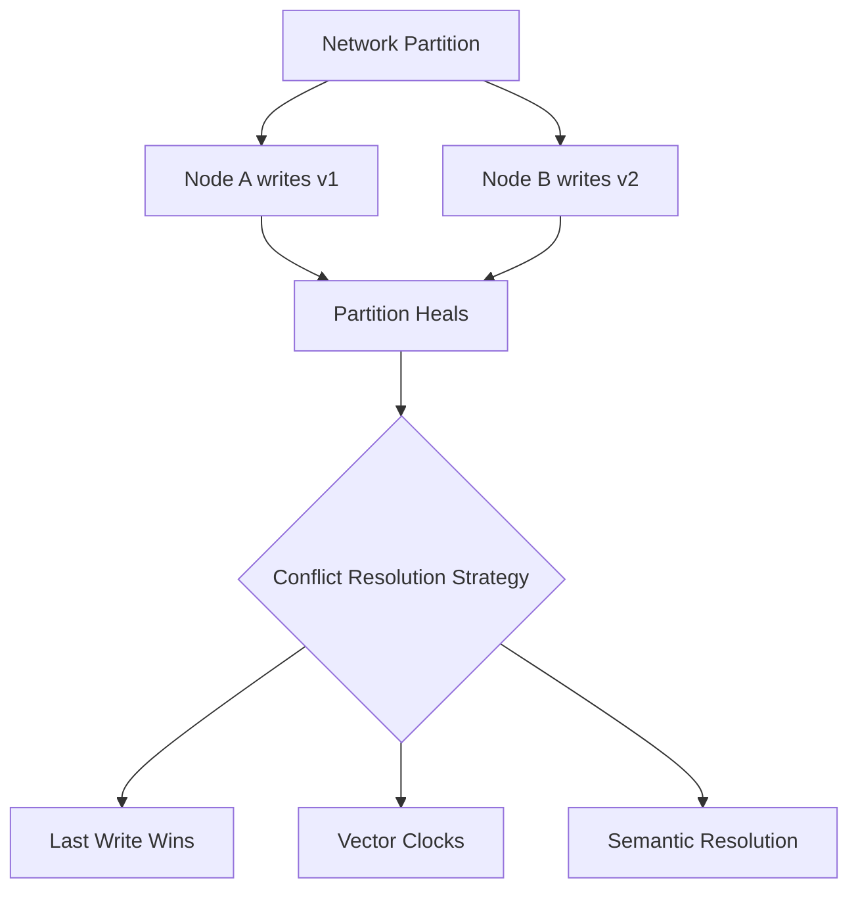
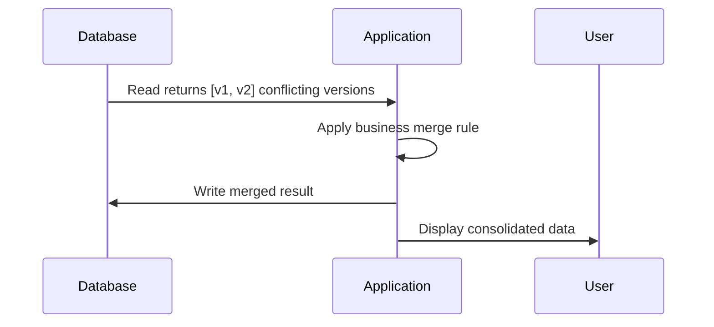

# Conflict Resolution in Eventually Consistent Systems

## The Problem: Divergent Copies After a Partition

In distributed AP systems, network partitions allow nodes to remain **available** and accept writes independently. Once connectivity is restored, the system must **reconcile divergent versions** of the same data object. Without a conflict resolution strategy, concurrent updates would leave the database in an undefined state.

This is the operational reality behind **eventual consistency**: convergence requires explicit rules for deciding the final state or merging concurrent updates.



---

## Strategy 1: Last Write Wins (LWW)

LWW is a **timestamp-based** resolution strategy. The system compares metadata of conflicting writes and retains only the update with the **most recent physical timestamp**.

| Aspect | Detail |
|--------|--------|
| Mechanism | Compare wall-clock timestamps; keep newest |
| Complexity | Low — single comparison per conflict |
| Performance | Computationally efficient |
| Risk | **Clock skew** can delete valid data |

### The Clock Skew Problem

Hardware clocks across nodes are **not perfectly synchronized**. A slower node's clock may assign an earlier timestamp to a write that actually happened *after* a faster node's write. LWW would then **accidentally discard the valid, newer data**.

$\text{LWW} = \arg\max_{w \in \text{conflicts}} \, t_{\text{wall-clock}}(w)$

LWW is acceptable only when clock synchronization (NTP, GPS) is reliable and approximate ordering is sufficient — e.g., session metadata, non-critical counters.

---

## Strategy 2: Vector Clocks (Logical Time)

To avoid physical clock inaccuracies, systems use **logical time** through vector clocks. This method tracks the **causal history** of an object across nodes.

### How Vector Clocks Work

Each node maintains a counter for every node that has modified the data. By comparing vectors, the system determines:

| Comparison Result | Meaning | Action |
|-------------------|---------|--------|
| $V_1 < V_2$ | Update 2 happened **after** update 1 | Keep update 2 (causally later) |
| $V_1 > V_2$ | Update 1 happened **after** update 2 | Keep update 1 |
| $V_1 \parallel V_2$ | Updates are **concurrent** | Mark as **conflict** — do not auto-overwrite |

```mermaid
flowchart LR
    N1[Node 1: write A] -->|vector [1,0]| N2
    N2[Node 2: write B] -->|vector [1,1]| N3
    N1 -->|concurrent write C<br/>vector [2,0]| CONFLICT[Conflict detected<br/>No auto-merge]
```

Vector clocks preserve **causal integrity**: the system knows whether one event caused another or whether they happened in parallel.

### Real-World Usage

Amazon Dynamo and its descendants (Cassandra, Riak) use vector clocks (or variants) to detect concurrent writes without relying on synchronized wall clocks.

---

## Strategy 3: Semantic (Application-Level) Resolution

In complex scenarios, the database delegates resolution to the **application layer** — also called client-side or semantic resolution.

### How It Works

1. Database stores **all conflicting versions**
2. On the next read, all versions are presented to application logic
3. Application performs a **merge or selection** based on business-specific rules

| Example Domain | Semantic Rule |
|----------------|---------------|
| Shopping cart | Union of items from both versions |
| Collaborative document | Merge non-overlapping edits; flag overlapping edits for user |
| Inventory | Take minimum count (conservative) or maximum (optimistic) |



Semantic resolution ensures data is consolidated **without unintended loss**, but pushes complexity to the developer.

---

## Comparing Resolution Strategies

| Strategy | Performance | Implementation Complexity | Data Precision | Best For |
|----------|-------------|---------------------------|----------------|----------|
| **Last Write Wins** | Highest | Lowest | Lowest (clock skew risk) | Low-stakes metadata |
| **Vector Clocks** | Medium | Medium | High (causal ordering) | Distributed key-value stores |
| **Semantic Resolution** | Lower (app logic) | Highest | Highest (domain-aware) | Carts, documents, custom merges |

---

## The Architectural Trade-Off

Conflict resolution is a **fundamental requirement** of eventual consistency. The choice between LWW, vector clocks, and semantic resolution is an architectural trade-off between:

- **System performance** — how fast conflicts are resolved
- **Implementation complexity** — who owns the merge logic
- **Data precision** — how much valid data is preserved

There is no universally correct answer — only the right fit for the business problem.

---

## Common Pitfalls / Exam Traps

- Assuming LWW is safe because it is simple — **clock skew** is a real failure mode, not theoretical
- Confusing **vector clocks** with **version numbers** — version numbers do not capture concurrency
- Believing eventual consistency **automatically merges** conflicts — a strategy must be explicitly chosen
- Using LWW for **financial balances** — concurrent debits can silently lose money
- Forgetting that semantic resolution requires the **application** to implement merge logic
- Stating vector clocks always pick a winner — **concurrent** updates are flagged as conflicts, not auto-resolved

---

## Quick Revision Summary

- AP systems accept concurrent writes during partitions; reconciliation is mandatory after heal
- **Last Write Wins**: keep newest timestamp — fast but vulnerable to clock skew
- **Vector clocks**: track causal history with per-node counters; detect concurrency without wall clocks
- Concurrent updates ($V_1 \parallel V_2$) are marked as conflicts, not silently overwritten
- **Semantic resolution**: database stores all versions; application merges by business rules
- Trade-off axes: performance, complexity, data precision
- LWW for low-stakes data; vector clocks for distributed KV; semantic for domain-specific merges
