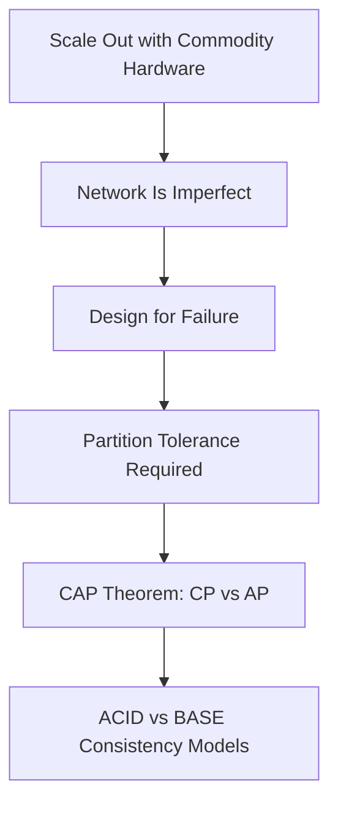

# Distributed Systems Fundamentals: Module Summary

## From Scale-Out to Coordination

Scaling out is the only viable path to handle big data — but it comes with a complex price. Moving from a single powerful machine to a fleet of commodity servers means learning how to keep all nodes coordinated when roads are blocked and radios fail. **Coordination is the real network tax of big data.**

---

## Takeaway 1: The Network Is Not a Perfect Wire

The **fallacies of distributed computing** expose assumptions that cause big data projects to fail in production:

| Fallacy | Reality |
|---------|---------|
| Network is reliable | Packets drop, cables fail, routers reboot |
| Latency is zero | Cross-datacenter round trips take milliseconds to seconds |
| Bandwidth is infinite | Shuffle phases saturate links |
| Topology doesn't change | Nodes join, leave, and fail constantly |

**Design for failure** means treating network glitches not as accidents but as **guarantees**. This mindset is the foundation of partition tolerance — the absolute requirement that a system stays alive when communication breaks down.

---

## Takeaway 2: The CAP Theorem

Because partition tolerance is **mandatory** in a cluster, architects are forced into a permanent trade-off between **consistency** and **availability**.

| System Type | Choice During Partition | Example |
|-------------|------------------------|---------|
| **CP** | Correct or offline | Banking — refuse stale balance reads |
| **AP** | Fast and always on | Social media — serve slightly stale feeds |

Understanding that you **cannot have all three** (C, A, and P simultaneously during a partition) is the mark of a professional. The job is no longer to find a perfect system, but to find the **right trade-off for the specific business problem**.

$\text{During partition: choose } CP \text{ or } AP \text{ — not both}$

---

## Takeaway 3: Consistency Models in Practice

### ACID — The Strict Golden Standard

Four properties ensure every transaction is atomic, consistent, isolated, and durable. ACID is the anchor of the financial world — where the truth must be exact.

| Property | One-Line Meaning |
|----------|------------------|
| Atomicity | All or nothing |
| Consistency | Data satisfies integrity rules |
| Isolation | Concurrent transactions don't interfere |
| Durability | Committed data survives crashes |

### BASE — The Distributed Sibling

By accepting **basically available** service and **eventual consistency**, systems scale to millions of users — something physically impossible with strict ACID at global scale.

| Property | One-Line Meaning |
|----------|------------------|
| Basically Available | Serve stale data rather than errors |
| Soft State | Replicas sync in the background |
| Eventual Consistency | All nodes agree when writes stop |

Knowing when to demand the **hard truth of ACID** versus the **flowing truth of BASE** is one of the most valuable architectural skills.

---

## Takeaway 4: Conflict Resolution Bridges Theory and Operations

AP systems that accept concurrent writes need explicit strategies after partitions heal:

- **Last Write Wins** — simple, clock-skew vulnerable
- **Vector clocks** — causal ordering without wall clocks
- **Semantic resolution** — application-level business merges

---

## The Professional Mindset

| Beginner Thinking | Professional Thinking |
|-------------------|----------------------|
| Find a system with no trade-offs | Choose the right trade-off for the problem |
| Network failures are bugs | Network failures are expected |
| Consistency is always required | Consistency level matches business need |
| More hardware = no problems | Coordination cost grows with scale |

---

## Common Pitfalls / Exam Traps

- Claiming you can have **C + A + P** during a partition — CAP forbids this
- Treating fallacies as theoretical — they cause **real production failures**
- Using ACID consistency and CAP consistency **interchangeably** — different definitions
- Assuming scale-out is "free" — coordination overhead is the hidden cost
- Choosing AP for banking or CP for like counters — mismatch domain to model
- Forgetting conflict resolution when discussing eventual consistency

---

## Quick Revision Summary

- Scale-out is necessary for big data but introduces coordination complexity
- Fallacies of distributed computing: never assume reliable, zero-latency, infinite-bandwidth networks
- Design for failure → partition tolerance is mandatory in clusters
- CAP: during partition, choose CP (correct/offline) or AP (stale/online)
- ACID = strict truth for finance, health, inventory
- BASE = eventual truth for social, search, analytics at billion-user scale
- Conflict resolution (LWW, vector clocks, semantic) is required for AP convergence
- Coordination is the real network tax of distributed big data
