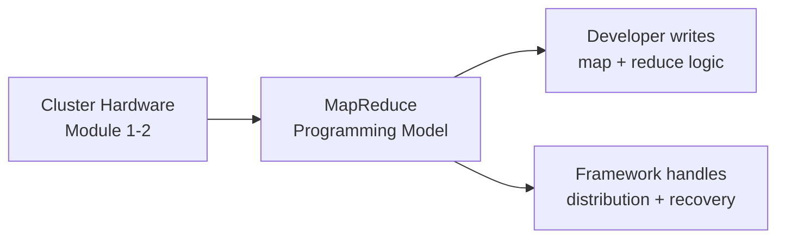

# MapReduce Programming Model: Introduction

## From Hardware Muscle to Software Brain

The first modules established the **muscle** of big data — commodity hardware clusters and the challenges of distributed coordination. This module addresses the **brain**: how do you write code that runs on 1,000 machines simultaneously without them tripping over each other?

The answer is **MapReduce** — a programming model that abstracts cluster complexity behind two simple functional operations.

---

## MapReduce as Functional Programming at Scale

MapReduce traces its roots to functional programming primitives — **map** and **fold/reduce** — found in Python, Java, Lisp, and other languages. The insight was taking these simple mathematical concepts and scaling them to process the entire internet.

MapReduce is not just a piece of software. It is a **specific way of thinking** about data as an immutable stream of transformations:

$\text{Input} \xrightarrow{\text{map}} \text{Intermediate pairs} \xrightarrow{\text{shuffle/sort}} \text{Grouped values} \xrightarrow{\text{reduce}} \text{Output}$

---

## What This Module Covers

### 1. Functional Foundations

Relating MapReduce to map and fold operations from functional programming — pure functions applied independently to every element, then aggregated.

### 2. Logical Data Flow

Tracing a single piece of data through every stage of the pipeline:

| Stage | Purpose |
|-------|---------|
| Input splits | Break petabytes into manageable chunks |
| Map phase | Transform raw data into key-value pairs |
| Shuffle and sort | Route same keys to same reducer |
| Reduce phase | Aggregate into final answers |

Understanding this sequence is the key to mastering **any** modern big data tool, including Apache Spark.

### 3. Parallelism and Fault Tolerance

MapReduce implements the **design for failure** mindset from distributed systems theory:

- Developer writes simple map/reduce logic
- Framework distributes work across the cluster
- Failed tasks are **automatically re-executed** on healthy nodes

This is **software-defined resilience** — reliability through smart software, not expensive unbreakable hardware.

### 4. Real-World Application

A web analytics case study: analyzing terabytes of server logs to find the most popular URLs on a site. This grounds the abstract theory in a concrete business problem.

---

## Why MapReduce Matters Today

| Legacy Problem | MapReduce Solution |
|----------------|-------------------|
| Single machine cannot hold petabytes | Split data across cluster |
| Manual parallelization is error-prone | Framework handles distribution |
| Node failures crash entire jobs | Deterministic re-execution |
| Complex coordination code per job | Two functions: map and reduce |

Even as Spark and other engines have evolved beyond MapReduce's disk-heavy model, the **logical data flow** (map → shuffle → reduce) remains the foundation of distributed data processing.

---

## Common Pitfalls / Exam Traps

- Treating MapReduce as just Hadoop MapReduce software — it is a **programming model** applicable beyond one implementation
- Believing developers manage node assignment — the **framework** handles distribution
- Skipping shuffle/sort when describing MapReduce — it is the critical bridge between map and reduce
- Assuming MapReduce requires mutable shared state — it relies on **immutable, independent** map operations
- Forgetting fault tolerance comes from **pure, deterministic** functions, not expensive hardware

---

## Quick Revision Summary

- MapReduce is the "brain" that coordinates distributed cluster computation
- Rooted in functional programming: map (transform) + reduce (aggregate)
- Data treated as immutable stream of transformations
- Pipeline: splits → map → shuffle/sort → reduce
- Framework abstracts distribution, parallelism, and failure recovery
- Design for failure: re-execute failed tasks on healthy nodes
- Web log URL popularity is the canonical case study
- Logical flow applies to Spark and all modern batch processors
