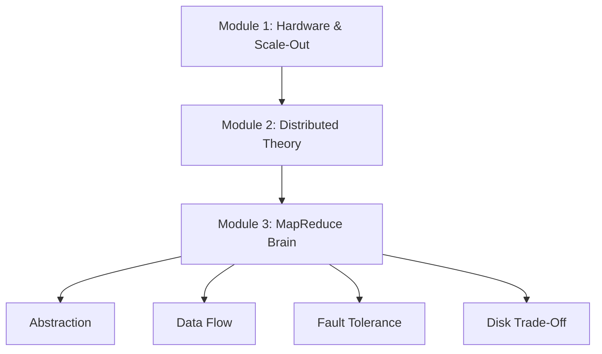

# MapReduce Module Summary

## From Hardware to Coordination

The first two modules built the **muscle** of the big data platform — clusters and distributed hardware. This module mastered the **brain** — how to coordinate those machines to solve massive problems through the MapReduce programming model.

---

## Takeaway 1: The Power of Abstraction

The primary goal of MapReduce is to **hide the messiness of the cluster**. As a developer, you do not worry about network protocols, data replicas, or which node carries which split.

| Developer Writes | Framework Handles |
|------------------|-------------------|
| Map function (transform) | Input splits, task scheduling |
| Reduce function (aggregate) | Shuffle, sort, failure recovery |
| Business logic only | Distribution across 1000+ nodes |

MapReduce turns a complex hardware problem into a **simple functional programming task**.

---

## Takeaway 2: Complete Data Flow Lifecycle

| Step | Phase | Key Concept |
|------|-------|-------------|
| 1 | Input splits | 64-128 MB chunks aligned with HDFS blocks |
| 2 | Map | Parallel transformation with data locality |
| 3 | Shuffle & sort | `hash(key) mod R` routing + key grouping |
| 4 | Reduce | Global aggregation — noise to signal |

The **shuffle and sort phase** is the critical performance bottleneck because it requires moving data across the entire network — paying the network tax at scale.

---

## Takeaway 3: Resilience Through Software

| Mechanism | How |
|-----------|-----|
| Heartbeat monitoring | Master detects failed workers |
| Task reassignment | Failed tasks rerun on healthy nodes |
| HDFS 3x replication | Backup data always available |
| Pure functions | Re-execution produces identical results |

Fault tolerance comes from **smart software on commodity hardware**, not expensive unbreakable machines.

---

## Takeaway 4: The Resilience vs Speed Trade-Off

MapReduce writes every intermediate step to disk for safety — the **3x write penalty** (HDFS replication). This makes it:

| Property | Rating |
|----------|--------|
| Stability | Incredibly stable |
| Speed (multi-stage / iterative) | Inherently slower than memory-based systems |
| Fit for one-pass batch analytics | Excellent |
| Fit for ML training loops | Poor — motivated Spark |

Understanding this trade-off separates a beginner from a professional data architect.

---

## Takeaway 5: Real-World Application

The web log URL popularity case study demonstrated three wins:

1. **Scalability** — 10 TB handled by adding nodes
2. **Simplicity** — developer wrote extract-and-sum logic only
3. **Resilience** — failed mappers restarted without killing the job

---

## MapReduce in the Broader Ecosystem

| Era | Engine | Key Innovation |
|-----|--------|----------------|
| 2004 | Google MapReduce | Programming model for batch analytics |
| 2006 | Hadoop MapReduce | Open-source cluster implementation |
| 2014+ | Apache Spark | In-memory pipelining, same logical flow |

The map → shuffle → reduce pattern remains the **fundamental language** of distributed data processing, even as engines evolve.

---

## Common Pitfalls / Exam Traps

- Describing MapReduce without mentioning shuffle — it is the **critical bridge** and bottleneck
- Claiming developers manage distribution — the **framework** abstracts it
- Forgetting pure functions are required for fault tolerance — impure maps break re-execution
- Stating MapReduce is always slow — it is slow for **multi-stage/iterative** jobs, fast enough for single-pass batch
- Ignoring the 3x write penalty when discussing performance limits
- Believing MapReduce is obsolete — its **logical model** underpins all modern batch processors

---

## Quick Revision Summary

- MapReduce abstracts cluster complexity behind map + reduce functions
- Developer writes business logic; framework handles splits, shuffle, recovery
- Pipeline: input splits → map → shuffle/sort → reduce
- Shuffle is the network bottleneck — `hash(key) mod numReducers` routes keys
- Fault tolerance: heartbeats + reassignment + HDFS replicas + pure functions
- Disk-based intermediate state = 3x write penalty = resilience vs speed trade-off
- Web log case study: 10 TB → megabytes of ranked URLs
- This disk overhead motivated Apache Spark's in-memory architecture
- Map → shuffle → reduce is the universal pattern for distributed batch processing
