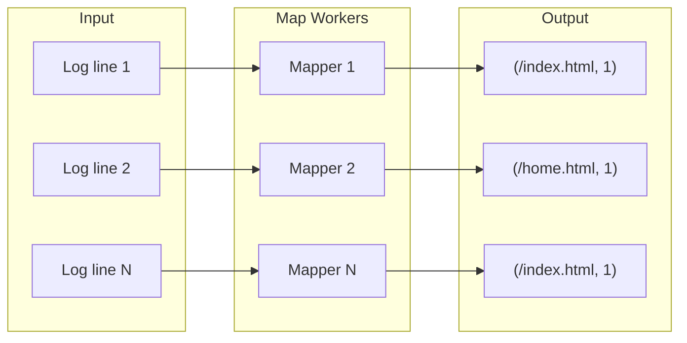

# The Map Operation: Transforming Raw Data

## The First Half of Distributed Processing

If big data is a mountain of raw, messy material, the **map phase** is where processing begins — sorting through that mountain to find the specific pieces that matter. Mapping transforms data from its raw state into a **structured format** the system can aggregate.

---

## Formal Definition

**Map** is a transformation function applied **independently** to every single element in a dataset.

$\text{map}: (key, value) \rightarrow [(key_1, value_1), (key_2, value_2), \ldots]$

| Input | Output |
|-------|--------|
| One raw record (key, value) | Zero or more structured (key, value) pairs |

The function takes raw input and **emits** a new list of structured pairs. Each input element is processed in isolation — no dependency on other elements.

### The Chef Analogy

A chef must peel 1,000 potatoes. The map instruction is simple: take one potato, peel it, place it in the bowl. The chef does this one potato at a time. Each map invocation produces one peeled potato. The results are independent.

---

## Concrete Example: Extracting URLs from Web Logs

A text file contains a billion lines of server logs. Each line has an IP address, timestamp, and URL (e.g., `/index.html`).

**Goal**: Count how many times each page was visited.

**Map logic** (per line):
1. Ignore IP address and timestamp
2. Extract the URL
3. Emit `("/index.html", 1)`

| Raw Log Line | Map Output |
|--------------|------------|
| `192.168.1.1 2024-01-15 /index.html Chrome` | `("/index.html", 1)` |
| `10.0.0.5 2024-01-15 /home.html Firefox` | `("/home.html", 1)` |
| `192.168.1.1 2024-01-15 /index.html Chrome` | `("/index.html", 1)` |

After the map phase completes, a messy text file becomes a clean list of URL-count pairs — billions of `(url, 1)` entries ready for aggregation.

---

## Why Map Enables Native Parallelism

Map operations can run on hundreds, thousands, or even millions of nodes **at the same time** without communicating with each other. Each worker processes its own data split independently.

| Scaling Strategy | Traditional | MapReduce |
|------------------|-------------|-----------|
| 2x data volume | Buy faster CPU | Add 2x nodes, same wall-clock time |
| Communication | Shared state, locks | None during map phase |
| Bottleneck | Single machine | Network (only at shuffle) |

**The secret to scaling**: if you have twice as much data, you do not need a faster computer — you add more nodes and mapping finishes in the same amount of time. This is **perfectly distributed logic**.

---

## Properties of a Good Map Function

| Property | Why It Matters |
|----------|----------------|
| **Pure** | Same input always produces same output — enables safe re-execution on failure |
| **Stateless** | No shared mutable state between invocations |
| **Independent** | No communication with other mappers |
| **Side-effect free** | Only emits key-value pairs; does not modify external state |

These properties are what make MapReduce fault-tolerant. A failed mapper can be rerun on a different node with identical results.

---

## What Map Does Not Do

Map **transforms** — it does not **aggregate**. A billion pairs like `("/index.html", 1)` are useless until summed. That is the job of the **reduce** operation, which groups all values sharing the same key and combines them.

---

## Common Pitfalls / Exam Traps

- Writing aggregation logic in the map phase — map **emits** pairs; reduce **sums** them
- Assuming mappers communicate — they are fully independent until shuffle
- Returning a single pair instead of a **list** of pairs — one input can emit zero, one, or many outputs
- Making map functions impure (random IDs, timestamps) — breaks deterministic re-execution
- Confusing map's key with reduce's grouping key — the emitted key determines shuffle routing

---

## Quick Revision Summary

- Map transforms each raw element into zero or more (key, value) pairs
- Signature: `map(key, value) → list of (key, value)` pairs
- Web log example: extract URL, emit `(url, 1)` per line
- Mappers run in parallel with **no inter-node communication**
- 2x data → add 2x nodes, same completion time (embarrassingly parallel)
- Map functions must be pure, stateless, and deterministic
- Map produces intermediate pairs; reduce aggregates them
