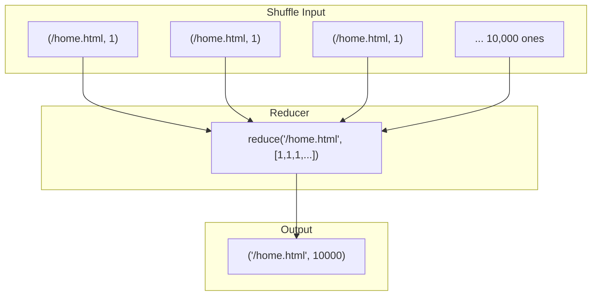

# The Reduce Operation: Aggregating State

## From Billions of Ones to Actionable Totals

The map phase produces thousands of independent key-value pairs like `("/index.html", 1)`. A billion ones do not help a business make decisions — you need a **final total**. The **reduce operation** is the second half of the processing brain: it consolidates parallel streams into a single summarized answer.

| Phase | Verb | Purpose |
|-------|------|---------|
| Map | Transform | Raw → structured pairs |
| Reduce | Aggregate | Pairs → summarized result |

---

## Formal Definition

**Reduce** is an aggregation function that combines multiple values sharing the **exact same key**. In functional programming, this is called a **fold** — folding a long list into one representative value.

$\text{reduce}: (key, [value_1, value_2, \ldots]) \rightarrow (key, result)$

### Critical Difference from Map

| Phase | Input | Scope |
|-------|-------|-------|
| Map | One value | Single record |
| Reduce | **List of values** | All values for one key across the cluster |

The framework gathers every value associated with a key and hands the **entire list** to the reducer. The developer does not manually collect values — that is the framework's job after shuffle and sort.

---

## URL Popularity Example

The map phase produced 10,000 pairs of `("/home.html", 1)`. The framework groups them. The reducer receives:

- **Key**: `/home.html`
- **Values**: `[1, 1, 1, \ldots]` (10,000 entries)

**Reduce logic**: iterate through the list, sum all values, emit one final pair:

$\text{Output: } (\texttt{/home.html},\ 10000)$

Individual clicks (noise) become a total visit count (signal).

---

## Massive Data Reduction

| Stage | Data Volume (10 TB log example) |
|-------|--------------------------------|
| Raw input | 10 terabytes |
| After map | ~10 terabytes (one pair per line) |
| After reduce | Few megabytes (ranked top URLs) |

The output is a much smaller, summarized set of key-value pairs. A real-world web log of 10 TB might yield only a few megabytes — a simple ranked list of the top 100 URLs. This compression from overwhelming volume to actionable insight is why MapReduce is powerful for big data analytics.

---

## Reduce Is Not Always Sum

While summing is the most common operation, reduce can perform any associative aggregation:

| Business Need | Reduce Logic |
|---------------|-------------|
| Total page views | Sum |
| Average response time | Sum + count, then divide |
| Maximum temperature | Max |
| Distinct users | Set union |
| Top-N items | Custom comparator |

The reducer has a **complete view** of every instance of a key across the entire cluster, so its result is the **absolute global truth** for that key.

---

## The Missing Bridge: Shuffle and Sort

A critical question remains: how did the ones from 1,000 different mappers find their way to the **same exact reducer**? That magic happens in the **shuffle and sort phase** — the bridge connecting map to reduce.

---

## Common Pitfalls / Exam Traps

- Treating reduce input as a single value — it is always a **list** of values for one key
- Performing filtering in reduce that should happen in map — push work left to minimize shuffle volume
- Assuming reduce runs on all data globally at once — each reducer handles **one key's partition**
- Using non-associative operations without care — sum and max are safe; average needs sum+count pattern
- Forgetting reduce output is the **final business answer** written to distributed storage

---

## Quick Revision Summary

- Reduce aggregates all values sharing the same key into one result
- Signature: `reduce(key, list of values) → (key, result)`
- Functional programming equivalent: **fold**
- Framework groups values after shuffle; developer writes aggregation logic
- URL example: 10,000 ones → single count of 10,000
- 10 TB input can compress to megabytes of ranked insights
- Reduce operations: sum, average, max, set union, custom
- Shuffle/sort is the bridge that delivers grouped values to reducers
