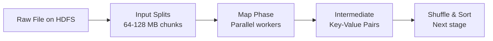
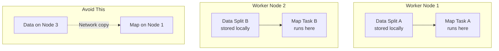

# MapReduce Data Flow: Input Splits and Map Phase

## From Hard Drive to Intermediate Pairs

Map and reduce functions exist in isolation as logic, but in a real cluster they are part of a **highly coordinated lifecycle**. The data journey begins the moment raw files sit on distributed storage and ends with structured intermediate results ready for shuffle.

This note covers **steps 1 and 2**: input splits and the map phase.

---

## Step 1: Input Splits

A single 10 terabyte log file cannot be handed to one computer — it is too large for memory and would create a single point of failure. The MapReduce framework automatically breaks the file into **manageable, executable chunks**.

| Parameter | Typical Value | Why |
|-----------|---------------|-----|
| Split size | 64 MB or 128 MB | Aligns with HDFS block size |
| Number of splits | $\lceil \text{file size} / \text{split size} \rceil$ | One map task per split |
| 10 TB file | ~80,000 splits at 128 MB | 80,000 parallel map tasks |

### The Encyclopedia Analogy

A massive encyclopedia is divided — one chapter per student — so everyone reads simultaneously. Splits create thousands of small tasks that individual workers can handle in parallel.

### Relationship to HDFS

Because HDFS stores data in fixed-size blocks (typically 128 MB) with 3x replication, split boundaries align with block boundaries. This alignment is critical for **data locality** in the next step.

---

## Step 2: Map Phase

Once data is split, the framework assigns each split to a **worker node**. That node processes its local split in parallel with all other nodes.

### Data Locality — Avoiding the Network Tax

The framework tries to run the map task on the **exact same server** where the 128 MB split is already stored. This avoids shipping data across the network — the dominant cost in distributed systems.

| Strategy | Network Cost | Performance |
|----------|-------------|-------------|
| Data-local map | Zero (read from local disk) | Optimal |
| Rack-local map | One hop within rack | Acceptable |
| Remote map | Cross-rack transfer | Expensive |

### What Each Worker Does

Each worker applies the custom map logic independently:
1. Read its assigned split line by line
2. Apply transformation (e.g., extract URL from log line)
3. Emit key-value pairs to local intermediate buffer

Workers **do not communicate** with each other during the map phase. They focus on their small piece of the puzzle.

---

## Map Output: Intermediate Data

By the time the map phase finishes, the cluster has thousands of workers producing intermediate key-value pairs. These are **not the final answer** — they are structured, sorted pieces of information ready for the most complex part of the journey: **shuffle and sort**.

| Property | Map Output |
|----------|------------|
| Format | (key, value) pairs |
| Location | Local disk on each worker |
| Size | Often similar to input size |
| Final? | No — requires reduce aggregation |

---

## End-to-End So Far

| Step | Action | Parallelism |
|------|--------|-------------|
| 1. Input splits | Divide 10 TB into 128 MB chunks | N/A (metadata operation) |
| 2. Map phase | Transform each chunk independently | Thousands of parallel tasks |

The open question: how do all the count values for the same URL end up in one place? That is answered by **partitioning, shuffle, and sort** — covered in the next note.

---

## Common Pitfalls / Exam Traps

- Confusing **HDFS block size** with **MapReduce split size** — they are aligned but configurable independently
- Assuming one map task per file — large files produce **many** map tasks
- Ignoring data locality — remote map tasks pay the full network tax
- Believing map outputs are final results — they are **intermediate** data requiring shuffle
- Setting split size too small — creates excessive task overhead; too large — limits parallelism

---

## Quick Revision Summary

- Input splits break massive files into 64-128 MB executable chunks
- Split size aligns with HDFS block size for efficient I/O
- Map phase assigns one task per split to worker nodes
- Data locality: run map where data lives to avoid network transfer
- Mappers work independently with no inter-node communication
- Map output = intermediate key-value pairs on local disk
- Next stage (shuffle/sort) groups same keys for reduce
