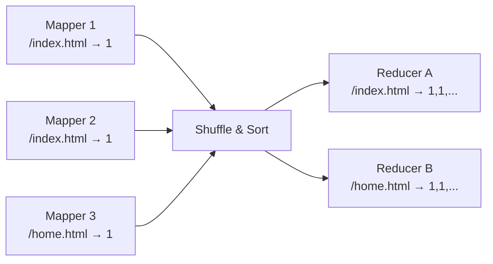
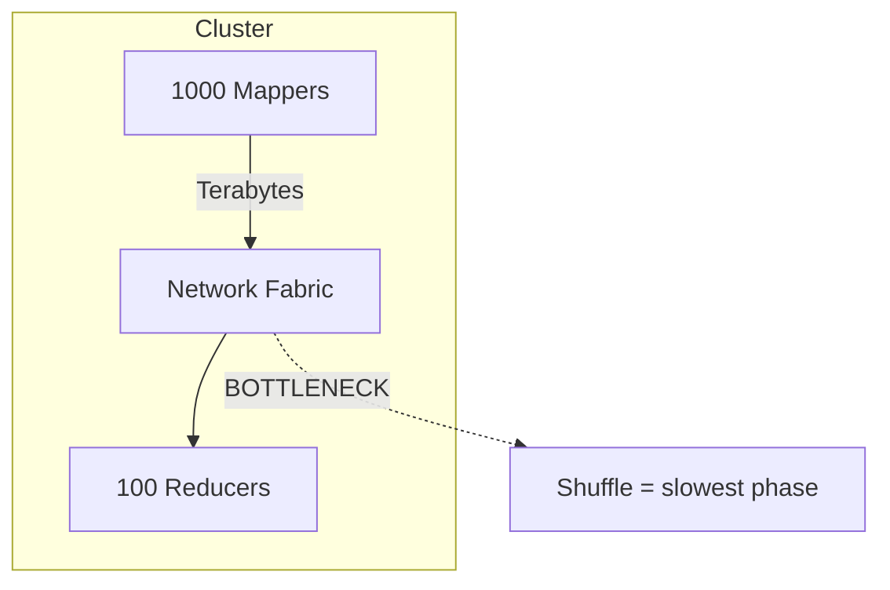

# Shuffle and Sort: The Bridge from Map to Reduce

## The Coordination Problem

After the map phase, thousands of independent workers each hold partial results. Mapper A has some data for `/index.html` and Mapper B has other data for `/index.html`. How do both get those results to the **exact same reducer**?

The answer is **step 3** of the logical data flow: the **shuffle and sort phase** — often called the magic of MapReduce because it bridges transformation logic (map) to aggregation logic (reduce).

---

## Partitioning: Routing Keys to Reducers

**Partitioning** decides which reducer node receives which key. The framework uses a simple but powerful formula:

$\text{reducer\_id} = \text{hash}(key) \bmod R$

where $R$ is the number of reducer nodes.

### Example with 3 Reducers

| Key | hash(key) mod 3 | Destination |
|-----|-----------------|-------------|
| `/index.html` | 0 | Reducer A |
| `/home.html` | 1 | Reducer B |
| `/about.html` | 2 | Reducer C |
| `/index.html` (from another mapper) | 0 | Reducer A (same!) |

Every single instance of `/index.html` from across the entire cluster is sent to the **exact same destination**. Without partitioning, each reducer would have only a partial view of the truth.

### Uniform Hashing Matters

If hashing is skewed, some reducers receive far more keys than others — creating **stragglers** that slow the entire job. Uniform hash distribution is critical for balanced load.

---

## Sorting: Organizing Values by Key

Once data arrives at the reducer node, the framework does not dump it in a random pile. It **groups all values by their key** — hence "shuffle **and sort**."

| Before Sort | After Sort |
|-------------|------------|
| `(/home.html, 1), (/index.html, 1), (/index.html, 1), (/home.html, 1)` | `(/home.html, [1, 1]), (/index.html, [1, 1])` |

Sorting ensures that when the reducer starts, all the ones for `/index.html` are lined up together in a single list. The reducer reads a **perfectly organized stream** of values, one key at a time — no searching through a messy database.

---

## The Network Tax: Shuffle as Bottleneck

This phase is the **most network-intensive** part of any MapReduce job.

| What Happens | Cost |
|--------------|------|
| Thousands of mappers send data simultaneously | Massive cross-cluster traffic |
| Data crosses racks, switches, and NICs | Bandwidth saturation |
| Intermediate data often equals input size | Terabytes over the wire |

In distributed systems terms, this is where you **pay the network tax** discussed in hardware constraints. Because so much data moves across wires and switches, shuffle is often the **bottleneck** that slows the entire job.

### Performance Tuning Implication

Performance tuning in big data **almost always focuses on minimizing shuffle data**:

- Filter early in map (emit fewer pairs)
- Use combiners to pre-aggregate locally
- Choose better partition keys to avoid skew
- Reduce number of shuffle stages in multi-pass jobs

---

## Shuffle vs Sort: Two Distinct Operations

| Operation | What It Does | Who Benefits |
|-----------|-------------|--------------|
| **Shuffle** | Physically move data from mappers to correct reducers | Correct grouping |
| **Sort** | Order values by key at each reducer | Efficient sequential reduce |

Both happen between map and reduce. Together they transform distributed noise into organized piles ready for aggregation.

---

## Common Pitfalls / Exam Traps

- Describing shuffle as "optional" — it is **mandatory** whenever reduce groups by key
- Forgetting the hash formula — exam questions often test `hash(key) mod numReducers`
- Ignoring shuffle as the performance bottleneck — it is the #1 tuning target
- Confusing shuffle with map output writing — shuffle is the **network transfer** phase
- Assuming sorting is only for ordering results — its primary purpose is **grouping values by key**
- Believing more reducers always help — too many creates small, inefficient shuffle overhead

---

## Quick Revision Summary

- Shuffle routes all values for the same key to the same reducer
- Partitioning formula: `hash(key) mod numReducers`
- Sorting groups values by key into organized lists per reducer
- Shuffle + sort = the bridge between map and reduce phases
- Shuffle is the most network-intensive phase — the network tax
- Performance tuning focuses on minimizing shuffle data volume
- Data skew in partitioning creates reducer stragglers
- After shuffle/sort, reducers receive complete key-grouped lists
