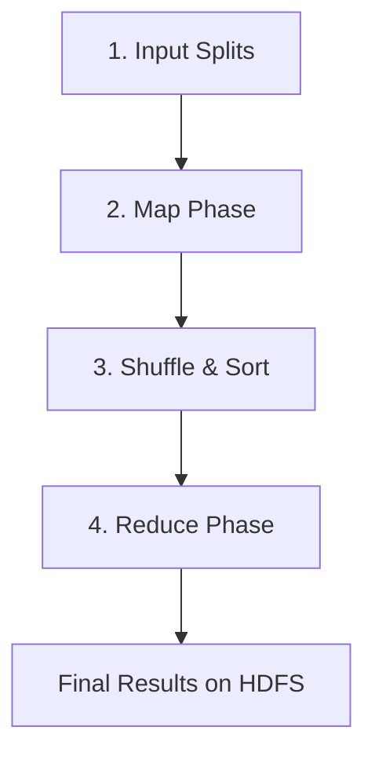
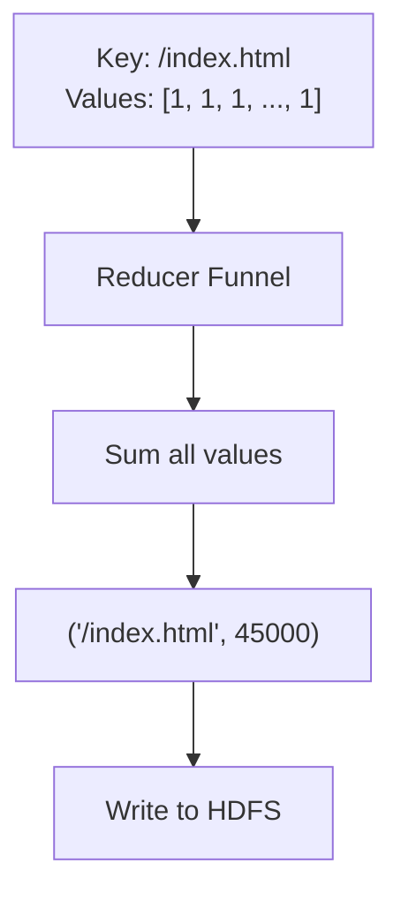

# Final Aggregation: The Reduce Phase in the Data Flow

## The Last Stop in the Pipeline

The data journey began with raw files, split them into chunks, transformed them with mappers, and organized billions of results through shuffle and sort. **Step 4 — the reduce phase** — is where all parallel streams finally meet to produce the definitive answers the business needs.

---

## Reduce as the Functional Core

The reduce phase is rooted in the mathematical concept of **fold** (or reduce). Imagine data as a long unfolded piece of paper representing every single click on a website. The reduce phase **folds** that paper down until only the total sum remains.

| Concept | MapReduce Equivalent |
|---------|---------------------|
| Fold / reduce (FP) | Reduce phase |
| Accumulator | Running sum, max, average |
| Base case | Empty list → identity value |
| Combine | Merge partial results |

---

## The Aggregation Funnel

Each reducer node acts like a **funnel**. It receives:
- A **key** (e.g., `/index.html`)
- A **list of all values** associated with that key (e.g., `[1, 1, 1, \ldots]`)

The developer writes the logic that aggregates the list. Common operations:

| Operation | Logic | Example Output |
|-----------|-------|----------------|
| Sum | Add all values | `("/index.html", 45000)` |
| Average | Sum / count | `("/index.html", 2.3s avg)` |
| Maximum | Pick largest | `("server-7", 99.9% uptime)` |
| Filter | Keep matching | Top-N URLs only |

Because a reducer has a **complete view** of every instance of a key across the entire cluster, the result it produces is the **absolute global truth** for that key.

---

## Data Reduction: Noise to Signal

| Phase | Volume (10 TB log example) |
|-------|---------------------------|
| Raw input | 10 terabytes |
| Map phase output | ~10 terabytes (one pair per line) |
| Reduce phase output | Few megabytes (ranked insights) |

The reduce phase performs **massive compression of information** — turning the noise of billions of individual events into the signal of a few megabytes of ranked insights. Once the reducer finishes, it writes final results directly to the distributed file system. The job is complete and data is ready for business analysts.

---

## Complete Logical Data Flow

| Step | Phase | What Happens |
|------|-------|-------------|
| 1 | Input splits | Divide massive data into 64-128 MB chunks |
| 2 | Map | Transform data in parallel on worker nodes |
| 3 | Shuffle & sort | Organize and move data to correct reducers |
| 4 | Reduce | Final aggregation into business answers |

This four-step lifecycle is the complete mechanics of how data moves through a distributed cluster.

---

## Reduce Phase vs Reduce Function

| Term | Meaning |
|------|---------|
| **Reduce function** | The pure logic you write: `(key, values) → result` |
| **Reduce phase** | The framework stage that invokes your function on grouped data |

The framework handles grouping (shuffle/sort), invocation, and writing output. The developer only supplies the aggregation logic.

---

## Common Pitfalls / Exam Traps

- Stating reduce runs before shuffle — order is always **map → shuffle → reduce**
- Believing each reducer sees all keys — each reducer sees only **its partition** of keys
- Confusing combiner with reducer — combiner is optional local pre-aggregation before shuffle
- Forgetting reduce output goes to **HDFS** (or equivalent), not back to mappers
- Assuming reduce always means sum — it can be any associative aggregation
- Missing that reduce produces the **final, globally correct** count per key

---

## Quick Revision Summary

- Reduce phase is step 4: final aggregation after shuffle and sort
- Each reducer receives one key and a complete list of its values
- Developer writes aggregation logic; framework handles grouping and I/O
- Operations: sum, average, max, filter — any associative fold
- 10 TB input compresses to megabytes of ranked business insights
- Results written to distributed file system — job complete
- Full pipeline: splits → map → shuffle/sort → reduce
- Reducer has global view of its keys → produces definitive truth
